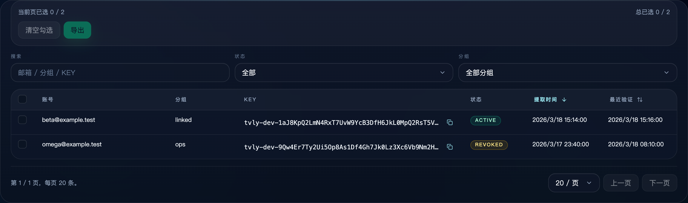
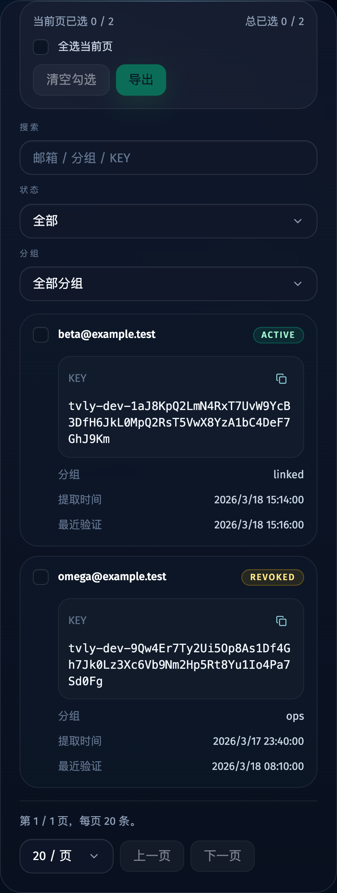
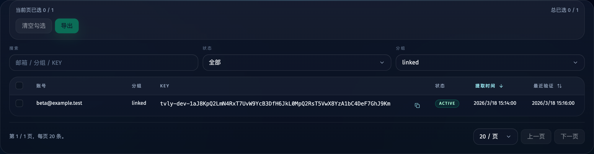
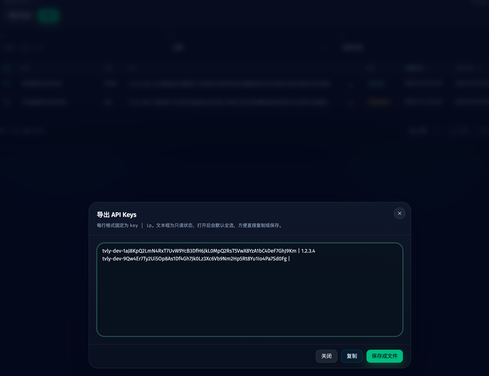

# API Keys 批量选择与导出（`key | ip`）（#2dkks）

## 状态

- Status: 已完成
- Created: 2026-03-20
- Last: 2026-04-15

## 背景 / 问题陈述

- 当前 Web 管理台的 API Keys 页只有筛选与分页，没有批量选择能力。
- 现有列表接口只返回遮罩 key，用户无法从管理台直接导出明文 key。
- 业务上需要导出 `key | ip`，其中 `ip` 必须是“该 key 被提取成功那次对应的 IP”，不能用最近一次任务 IP 事后猜测。
- 微软账号已经支持分组，API Keys 页也必须继承对应账号分组，支持展示与按分组筛选。

## 目标 / 非目标

### Goals

- 为 API Keys 页增加跨分页批量选择、当前页全选、清空勾选与选中统计。
- 新增导出能力，弹出只读多行文本窗口展示导出内容，并支持复制与保存成文件。
- 为 `api_keys` 记录新增“提取时 IP”字段，仅对新提取的数据保证精确写入。
- Tavily Keys 常规列表改为直接显示完整明文 KEY，并提供行内复制按钮。
- API Keys 记录实时继承所属微软账号的分组，用于列表展示与筛选。

### Non-goals

- 不对历史 API key 记录做提取 IP 回填。
- 不提供“按当前筛选结果直接全量导出未勾选项”的快捷能力。
- 不新增 reveal/解锁流程或额外敏感操作弹窗。

## 范围（Scope）

### In scope

- SQLite `api_keys` schema 迁移，新增 nullable `extracted_ip`。
- 成功提 key 路径写入 `extracted_ip`，优先取 `signupTask.proxy_ip`，缺失时回落 `job_attempts.proxy_ip`。
- 新增 API key 导出接口，按选中 id 返回明文 key 与提取 IP，并由服务端生成 `key | ip` 文本。
- Tavily Keys 列表在桌面与移动布局统一收敛为单列 `KEY`，正文显示完整 key 原文，按钮位于文本右侧。
- `ApiKeysView` 与 `App` 的勾选状态、导出弹窗、复制与文件下载动作。
- API Keys 列表按账号实时继承 `group_name`，并支持分组筛选与展示。
- 相关测试、故事和规格索引更新。

### Out of scope

- 历史数据修复脚本或批量回填工具。
- 新增 CSV/JSON 等其他导出格式。
- 账号页或代理页的交互重构。

## 需求（Requirements）

### MUST

- API Keys 页必须支持跨分页保留勾选状态。
- API Keys 页必须展示所属账号分组，并支持按分组筛选。
- API Keys 页必须直接显示完整 `KEY`，且桌面与移动布局都提供行内复制按钮。
- 导出按钮在未勾选任何记录时必须禁用。
- 导出弹窗中的文本框必须为只读、多行，并在打开时自动全选当前内容。
- 导出文本格式固定为每行一条 `key | ip`。
- `api_keys` 的 `extracted_ip` 仅代表该 key 提取成功那次对应的 IP；若历史记录没有该值，导出时允许为空。
- `/api/api-keys` 必须返回明文 `apiKey` 供 Tavily Keys 页面展示与复制；批量导出格式与接口保持不变。

### SHOULD

- 导出接口对输入 id 去重并保持请求顺序稳定，避免导出顺序抖动。
- 保存文件默认命名为 `tavily-api-keys-<timestamp>.txt`。
- 复制失败时前端应给出明确错误信息。

## 功能与行为规格（Functional/Behavior Spec）

### Core flows

- 用户在 API Keys 页勾选若干 key，可跨分页累积选择。
- 用户可按账号分组筛选 API key；当账号分组被修改后，API Keys 页下次刷新必须反映最新分组。
- 用户可在 Tavily Keys 列表直接查看完整 KEY，并点击行内复制按钮将该条 key 写入剪贴板。
- 点击“导出”后，前端请求导出接口并打开 Dialog，显示只读文本内容。
- Dialog 打开时自动聚焦文本框并选中全部文本。
- 用户可点击“复制”把文本写入剪贴板，或点击“保存成文件”下载同内容的文本文件。
- 当主流程成功提取 key 时，后端同步把提取时 IP 写入 `api_keys.extracted_ip`。

### Edge cases / errors

- 若导出请求没有有效 id，接口返回 400。
- 若部分 id 不存在，接口忽略不存在项，只返回实际存在的记录。
- 若浏览器剪贴板权限失败，前端保留弹窗内容并展示错误，不关闭窗口。
- 若 KEY 很长，列表允许换行展示完整内容，不再通过遮罩或省略保留部分片段。

## 接口契约（Interfaces & Contracts）

- DB: `api_keys.extracted_ip TEXT NULL`
- Internal API:
  - `recordApiKey(accountId, apiKey, extractedIp?)`
  - `listApiKeysForExport(ids)`
- HTTP API:
- `POST /api/api-keys/export`
  - request: `{ ids: number[] }`
  - response: `{ items: Array<{ id, apiKey, extractedIp }>, content: string }`
- `GET /api/api-keys`
  - response rows include inherited `groupName` and plaintext `apiKey`
  - response payload includes `groups`

## 验收标准（Acceptance Criteria）

- Given 用户跨两页勾选多条 key，When 返回第一页，Then 已勾选状态仍然保留。
- Given 当前没有勾选项，When 查看 API Keys 页工具区，Then 导出按钮为禁用态。
- Given 某个微软账号已经属于分组 `team-a`，When 查看其 API key 记录，Then 该记录显示为 `team-a`，且可通过分组筛选命中。
- Given 用户进入 Tavily Keys 页，When 查看桌面表格或移动卡片，Then 页面只展示单列 `KEY`，不再出现“Key 前缀 / Key 遮罩”；桌面端 KEY 列会自动吃满剩余宽度，并在宽度不足时以省略号截断，同时复制按钮始终紧贴在文本尾部。
- Given 用户点击某条记录的 `KEY` 复制按钮，When 剪贴板可用，Then 完整 key 原文被写入剪贴板，且按钮出现成功反馈。
- Given 已勾选 key，When 点击导出，Then 打开只读多行文本弹窗，并自动全选文本内容。
- Given 弹窗已经打开，When 点击复制，Then 剪贴板内容与文本框内容完全一致。
- Given 弹窗已经打开，When 点击保存成文件，Then 下载 `.txt` 文件，文件内容与文本框内容完全一致。
- Given 新提取的 key 成功写入，When 查询数据库或导出该 key，Then `extracted_ip` 与提取成功当次 IP 一致。

## 非功能性验收 / 质量门槛（Quality Gates）

### Testing

- `bun test`
- `bunx tsc --noEmit`
- `bun run build-storybook`

### Quality checks

- 明文 key 允许出现在 Tavily Keys 列表接口与页面正文中，批量导出格式仍固定为 `key | ip`。
- 历史记录无 `extracted_ip` 时，导出格式仍保持稳定。

## 文档更新（Docs to Update）

- `docs/specs/README.md`
- `docs/specs/2dkks-api-key-batch-export/SPEC.md`

## Visual Evidence

- source_type: storybook_canvas
  target_program: mock-only
  capture_scope: element
  sensitive_exclusion: N/A
  submission_gate: approved
  story_id_or_title: `Views/ApiKeysView/Default`
  state: `desktop key column`
  evidence_note: 验证 Tavily Keys 桌面列表已经收敛为单列 `KEY`，列宽会自动吃满剩余空间，key 文本在宽度不足时以省略号截断，复制按钮固定贴近文本尾部。
  image:
  

- source_type: storybook_canvas
  target_program: mock-only
  capture_scope: element
  sensitive_exclusion: N/A
  submission_gate: approved
  story_id_or_title: `Views/ApiKeysView/Default`
  state: `mobile key card`
  evidence_note: 验证 Tavily Keys 移动卡片已经改为 `KEY` 区块，完整显示 key 内容，并提供行内复制按钮。
  image:
  

- source_type: storybook_canvas
  target_program: mock-only
  capture_scope: element
  sensitive_exclusion: N/A
  submission_gate: approved
  story_id_or_title: `Views/ApiKeysView/Linked Group`
  state: `group filter applied`
  evidence_note: 验证 API Keys 列表会继承微软账号分组，支持按分组筛选，并在表格中展示分组列。
  image:
  

- source_type: storybook_canvas
  target_program: mock-only
  capture_scope: element
  sensitive_exclusion: N/A
  submission_gate: approved
  story_id_or_title: `Views/ApiKeysView/Export Dialog`
  state: `export dialog open`
  evidence_note: 验证导出弹窗会展示只读多行 `key | ip` 内容，并保留复制与保存成文件动作入口。
  image:
  

## 变更记录（Change log）

- 2026-03-20: 初始化规格，定义 API Keys 批量导出、提取时 IP 与弹窗交互边界。
- 2026-03-20: 完成 `api_keys.extracted_ip` 写入、批量勾选导出弹窗、复制/文件下载与相关测试。
- 2026-03-20: API Keys 列表改为实时继承账号分组，补充分组展示、分组筛选与 Storybook 场景。
- 2026-04-15: Tavily Keys 列表改为单列 `KEY` 明文展示，桌面与移动布局统一增加行内复制按钮，并补充 Storybook 视觉证据。
