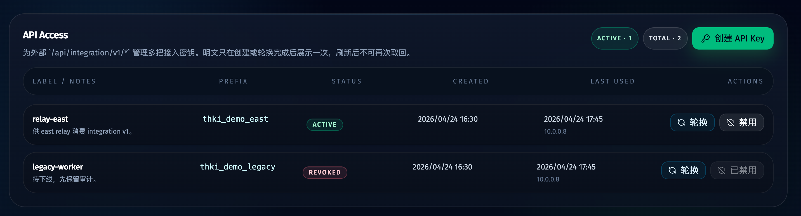
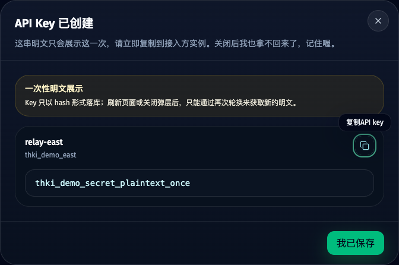
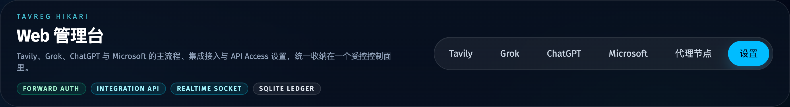

# HTTP 外部接入与鉴权收口（v1）（#3aqn8）

> 当前有效规范以本文为准；实现覆盖与当前状态见 `./IMPLEMENTATION.md`，关键演进原因见 `./HISTORY.md`。

## 状态

- Lifecycle: active
- Created: 2026-04-24
- Last: 2026-04-24

## 背景 / 问题陈述

- 当前 Bun 单体的路由分发前没有统一鉴权 middleware，既有 contract 仍把内部 HTTP API 描述为 `Auth: none（localhost only）`。
- 运行时 `WEB_HOST` 可以改写监听地址，因此“仅靠 localhost 约定”不足以构成真实的访问控制边界。
- 现在需要给另一个实例提供可版本化、可稳定消费的 HTTP integration API，但外部接入不能与内部控制面复用同一套无鉴权入口。
- Microsoft 账号现在已有 Tavily 登录与 Microsoft Mail Inbox 能力，但缺少服务接入快照、可消费的只读聚合视图，以及统一的验证码解析层。

## 目标 / 非目标

### Goals

- 为管理台建立明确的三类访问边界：`public / internal / integration`。
- 让内部 SPA、内部 API、SSE、WebSocket upgrade 全部收口到 `internal` Forward Auth gate。
- 新增 `/api/integration/v1/*` 只读外部 API，v1 只开放 Microsoft 账号、Tavily、Microsoft Mail 与 proof mailbox 验证码能力。
- 新增多 API Key 管理能力：创建、一次性明文展示、轮换、禁用、备注、last used 追踪。
- 为 Microsoft 账号持久化 Tavily 服务接入快照，包括 cookies、提取 IP、浏览器指纹与最近成功时间，并在账号详情里返回已成功登录服务摘要。
- 为 Microsoft Inbox 与 proof mailbox API 统一补齐验证码解析结果。
- 新增 `/settings` → `API Access` 专区，并从 `AppShell` 提供入口。

### Non-goals

- 不在 v1 暴露 Grok / ChatGPT 的 external integration API。
- 不引入多租户用户系统、RBAC、scope 级细粒度权限。
- 不自动化云侧反向代理、IdP、部署脚本或 Infra 配置。
- 不迁移现有 Microsoft Graph 设置页与 ChatGPT 补号设置入口。

## 范围（Scope）

### In scope

- HTTP request 分类器与统一鉴权 middleware。
- `Forward Auth` 头映射的 env/config contract。
- `integration_api_keys` 与 `account_service_access` 持久化模型。
- `/api/settings/api-access/keys*` 内部管理接口。
- `/api/integration/v1/*` 外部只读接口。
- Microsoft Inbox / cfmail proof mailbox 的验证码解析层。
- `/settings` 页面中的 `API Access` 专区、相关 Storybook stories 与视觉证据。
- README、`.env.example`、spec/contracts 文档同步。

### Out of scope

- Grok / ChatGPT external integration API。
- 反向代理透传配置脚本。
- 非 cfmail proof mailbox provider。
- 公开开放无需鉴权的更多页面或静态资源。

## 需求（Requirements）

### MUST

- 所有请求必须先被分类为 `public | internal | integration`，再进入对应 gate。
- `internal` gate 必须覆盖内部 SPA 静态资源、内部 HTTP API、SSE 与 WebSocket upgrade；loopback 直连默认不豁免。
- `internal` gate 必须使用受信任的 Forward Auth 头，默认读取 `X-Forwarded-User`、`X-Forwarded-Email` 与 `X-Forwarded-Auth-Secret`，并允许通过 env 改写头名。
- `integration` gate 只能接受 API Key，不得回落到 Forward Auth。
- `public` allowlist 在 v1 只能保留：`/api/health`、`/api/microsoft-mail/oauth/callback` 与 `/api/integration/v1/*` namespace。
- `integration_api_keys` 只能存 `hash/prefix` 与元数据，明文 key 只允许在创建/轮换响应里返回一次。
- API Key 管理必须支持多个 key、label、notes、status、createdAt、lastUsedAt、lastUsedIp、rotatedAt/revokedAt 之类的审计字段。
- 已禁用或已轮换的旧 key 必须被拒绝。
- Microsoft 账号详情必须返回账号主信息、proof mailbox、安全摘要、session/IP 摘要、已成功登录服务摘要，以及 Tavily / Microsoft Mail 的服务详情。
- Tavily 服务接入快照必须至少持久化：cookies 快照、提取 IP、浏览器指纹快照、最后成功时间。
- Microsoft Inbox 列表、详情与 proof mailbox codes API 都必须返回 `parsedVerificationCodes`。
- proof mailbox v1 只支持 `cfmail`，其它 provider 必须显式拒绝。
- `/settings` 中的 API Access UI 必须支持创建、复制一次性明文、轮换、禁用和 last used 可视化。

### SHOULD

- `integration` gate 应同时兼容 `Authorization: Bearer <key>` 与 `X-API-Key: <key>` 两种传递方式，方便实例间接入。
- Microsoft 账号列表与 Mailbox 列表接口应返回分页摘要，不在列表接口返回大体积 cookies / fingerprint 载荷。
- 外部 API 的错误语义应稳定收敛为 `401/403/404/409/422` 与统一 `{ error }` 结构。
- 账号详情里的“已成功登录哪些服务”在 v1 至少覆盖 `tavily` 与 `microsoftMail`。

### COULD

- 为 integration API 响应附带轻量分页元信息（`page/pageSize/total/hasMore`）。

## 功能与行为规格（Functional/Behavior Spec）

### Auth boundary

- `public`
  - `GET /api/health`
  - `GET /api/microsoft-mail/oauth/callback`
- `integration`
  - `/api/integration/v1/*`
- `internal`
  - 除上述之外的全部 HTTP / SSE / WebSocket / SPA 静态资源请求

### Forward Auth

- 默认读取：
  - `X-Forwarded-User`
  - `X-Forwarded-Email`
  - `X-Forwarded-Auth-Secret`
- 允许 env 改写头名。
- `internal` 请求若缺少有效用户标识或缺少可信代理共享密钥，必须返回拒绝，不得再尝试 localhost 特判。
- 若 `FORWARD_AUTH_SECRET` 未配置，`internal` gate 必须 fail closed。

### Integration API Key lifecycle

- `POST /api/settings/api-access/keys`
  - 创建新 key，返回一次性明文 `plainTextKey` 与非敏感 record。
- `POST /api/settings/api-access/keys/:id/rotate`
  - 生成新 secret，覆盖旧 hash，旧 secret 立即失效。
- `POST /api/settings/api-access/keys/:id/revoke`
  - 将 key 标记为禁用；禁用后 integration auth 必须拒绝。
- `GET /api/settings/api-access/keys`
  - 仅返回非敏感元数据。

### Integration v1 resources

- `GET /api/integration/v1/microsoft-accounts`
  - 返回分页摘要；包含基础账号信息、proof mailbox 摘要、session 摘要、服务登录摘要。
- `GET /api/integration/v1/microsoft-accounts/:id`
  - 返回账号详情；包含 Tavily 服务接入明细、最新 Tavily API key、Microsoft Mail 摘要与 proof mailbox 摘要。
- `GET /api/integration/v1/microsoft-accounts/:id/proof-mailbox/codes`
  - 仅在 proof mailbox provider=`cfmail` 时可用；返回消息摘要与解析出的验证码列表。
- `GET /api/integration/v1/mailboxes`
  - 返回 mailbox 分页摘要与每个 mailbox 的未读、状态、授权、账号关联信息。
- `GET /api/integration/v1/mailboxes/:mailboxId/messages`
  - 返回消息分页摘要与 `parsedVerificationCodes`。
- `GET /api/integration/v1/messages/:messageId`
  - 返回单条消息详情与 `parsedVerificationCodes`。

### Verification code parsing

- 必须复用/扩展统一解析器，从 `subject/bodyPreview/bodyContent` 和 cfmail detail payload 中提取验证码。
- 每条消息可返回多个候选 code，但必须去重，并尽量附带来源字段、匹配片段或类型。
- 列表与详情接口对同一条消息的解析结果字段保持同构。

## 接口契约（Interfaces & Contracts）

### 接口清单（Inventory）

| 接口（Name） | 类型（Kind） | 范围（Scope） | 变更（Change） | 契约文档（Contract Doc） | 负责人（Owner） | 使用方（Consumers） | 备注（Notes） |
| --- | --- | --- | --- | --- | --- | --- | --- |
| Auth boundary / gate classifier | HTTP | internal\|integration\|public | New | `./contracts/http-apis.md` | server | web app / external instance | 统一请求分类与 gate |
| API Access keys management | HTTP | internal | New | `./contracts/http-apis.md` | server | internal SPA | 明文只在 create/rotate 响应返回 |
| Integration v1 read APIs | HTTP | integration | New | `./contracts/http-apis.md` | server | external instance | v1 仅开放 Microsoft/Tavily/Mail |
| Integration API keys persistence | DB | internal | New | `./contracts/db.md` | storage | server | hash-at-rest |
| Account service access snapshots | DB | internal | New | `./contracts/db.md` | storage | server | Tavily cookies / fingerprint / IP |

### 契约文档（按 Kind 拆分）

- `./contracts/http-apis.md`
- `./contracts/db.md`

## 验收标准（Acceptance Criteria）

- Given 未携带有效 Forward Auth 头的内部 HTTP / SSE / WebSocket / SPA 请求
  When 请求到达服务端
  Then 统一被拒绝，且不会因为监听在 loopback 而自动放行。

- Given 携带合法 integration API Key 的外部请求
  When 访问 `/api/integration/v1/*`
  Then 请求成功，并返回稳定的 v1 资源结构。

- Given 携带禁用、已轮换或伪造的 API Key
  When 访问 `/api/integration/v1/*`
  Then 服务端返回拒绝，且更新逻辑不会把该 key 记为有效 last used。

- Given 某个 Microsoft 账号已经成功完成 Tavily 登录并提取 API key
  When 查询 `/api/integration/v1/microsoft-accounts/:id`
  Then 响应包含最新 Tavily API key、提取 IP、cookies 快照、浏览器指纹快照与最后成功时间。

- Given 某个 Microsoft Mail mailbox 已同步到消息
  When 查询 mailbox 列表、消息列表或单条消息详情
  Then 响应包含解析后的 `parsedVerificationCodes`。

- Given 某个账号配置了 cfmail proof mailbox
  When 调用 `/api/integration/v1/microsoft-accounts/:id/proof-mailbox/codes`
  Then 响应返回 proof mailbox 消息与解析后的验证码结果。

- Given owner 打开 `/settings`
  When 进入 `API Access` 专区
  Then 可以创建、轮换、禁用多个 integration API key，并查看 prefix、label、status、createdAt、lastUsedAt、lastUsedIp。

## 验收清单（Acceptance checklist）

- [ ] 三类 auth boundary 与 allowlist 已写清楚。
- [ ] integration v1 接口清单、边界与错误语义已冻结。
- [ ] API key at-rest contract 已写清楚。
- [ ] Tavily 服务接入快照与验证码解析范围已写清楚。
- [ ] `/settings` → `API Access` 的 owner-facing 范围已写清楚。

## 非功能性验收 / 质量门槛（Quality Gates）

### Testing

- Unit tests: auth classifier、API key hash/auth、验证码解析、DB migration/repository。
- Integration tests: internal/integration/public gate、integration v1 只读接口、settings API key lifecycle。
- E2E tests (if applicable): Storybook `play` 覆盖 API Access 的关键交互。

### UI / Storybook (if applicable)

- Stories to add/update: `AppShell`、新的 API Access settings 视图/弹层。
- Docs pages / state galleries to add/update: 依现有 autodocs / stories 同步。
- `play` / interaction coverage to add/update: create / rotate / revoke / one-time reveal。
- Visual regression baseline changes (if any): none。

### Quality checks

- `bun test`
- `bunx tsc --noEmit`
- `bun run web:build`
- `bun run build-storybook`

## Visual Evidence

- `storybook_canvas` · `Views/ApiAccessSettingsView/Default`
  - 证明 `/settings` → `API Access` 默认列表态已具备多 key 审计摘要、状态徽标与 create / rotate / revoke 入口。
  - PR: include
  - 

- `storybook_canvas` · `Views/ApiAccessSettingsView/RevealDialogVisible`
  - 证明 API key create / rotate 后的一次性明文展示弹层、复制入口与“关闭后不可再次取回”的提示已落地。
  - PR: include
  - 

- `storybook_canvas` · `Shell/AppShell/SettingsActive`
  - 证明壳层新增“设置”导航入口，且 Forward Auth / integration api 标识已出现在 owner-facing 顶栏。
  - PR: include
  - 

## Related PRs

- None

## 风险 / 开放问题 / 假设（Risks, Open Questions, Assumptions）

- 风险：internal gate 改为强制 Forward Auth 后，本地直连开发默认将被拒绝；需要通过明确的代理/头映射接入。
- 风险：cookies / fingerprint 快照属于重载荷字段，必须只在详情接口返回，避免列表接口膨胀。
- 假设：integration API key 可同时兼容 `Authorization: Bearer` 与 `X-API-Key`，以降低实例接入成本。
- 假设：Microsoft Mail 的服务登录摘要可由现有 mailbox 授权与同步状态聚合，不需要额外 OAuth provider 表。

## 参考（References）

- `docs/specs/5nkhw-tavreg-hikari-web-control/SPEC.md`
- `docs/specs/m1sso-microsoft-login/SPEC.md`
- `docs/specs/jg53e-microsoft-mail-inbox/SPEC.md`
- `docs/specs/wht6n-persistent-account-browser-sessions/SPEC.md`
- `docs/specs/8qyzh-nav-keys-mailbox-consolidation/SPEC.md`
