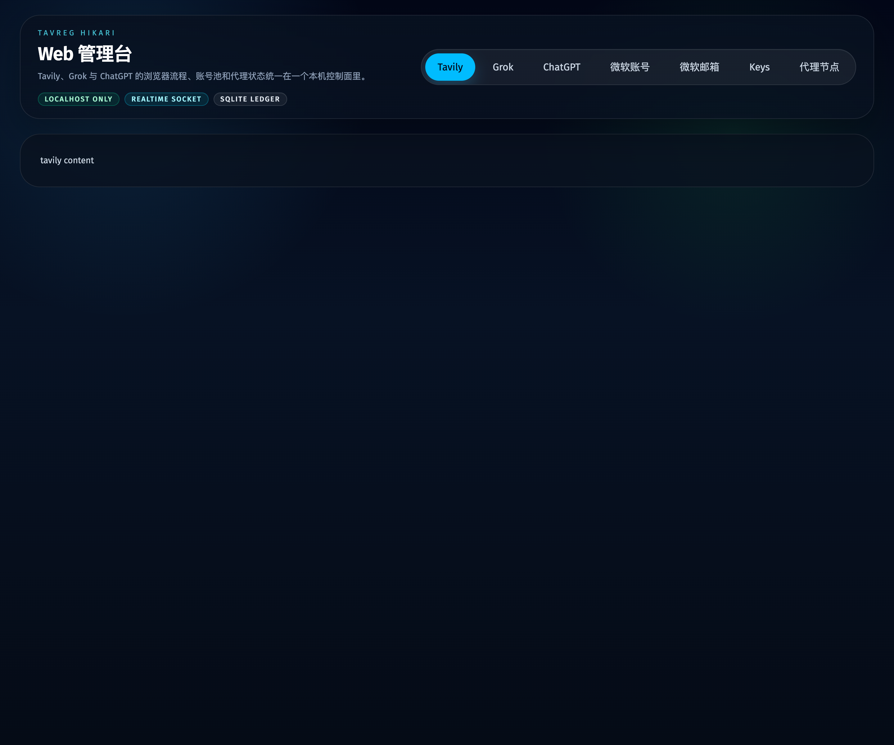
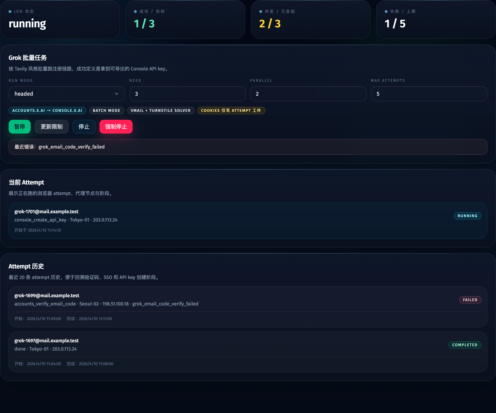
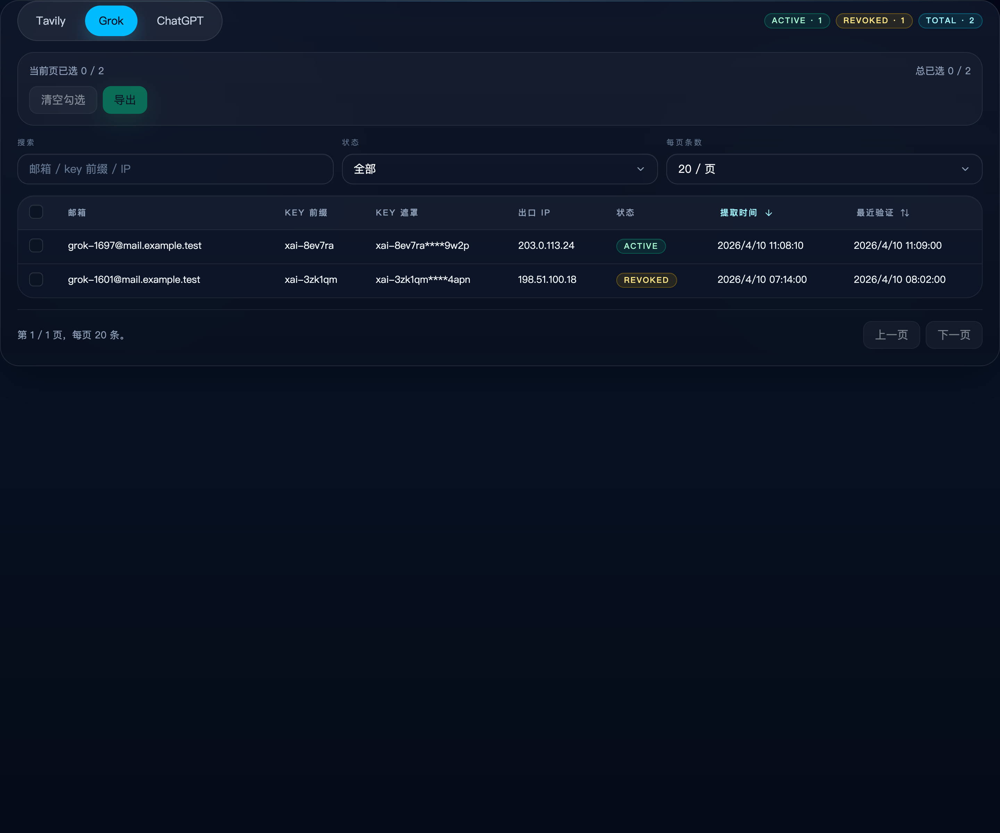
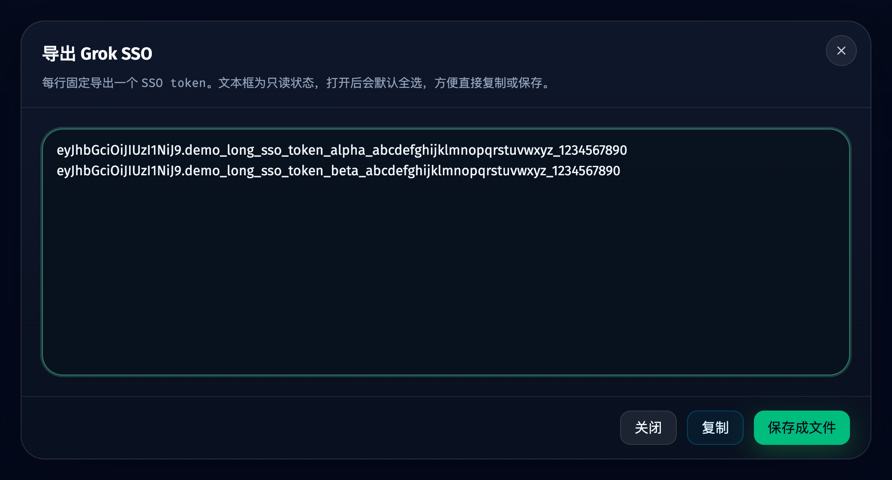

# Grok 第三站点接入现有 Web 管理台（#3hrx4）

## 状态

- Status: 已实现待评审
- Created: 2026-04-10

## 背景

- 当前管理台已经支持 Tavily 与 ChatGPT 两个站点，但 Grok 仍缺少独立入口、独立调度与独立 keys 数据源。
- Grok 的注册链路与 Tavily 的微软账号池模型不同，不能直接复用 Tavily 的 `api_keys` 表或自动补号控制区。
- 若继续把 Grok 混在现有站点里，当前 job、attempt 输出、keys 导出与 UI 文案都会变得不清晰。

## 目标

- 新增顶层 `Grok` 页面与 `/grok` 路由，按批量模式运行 `runMode / need / parallel / maxAttempts`。
- 新增 Grok 专属 scheduler / worker / keys 接口 / SQLite 表，并保持与 Tavily、ChatGPT 的 current job 隔离。
- 在 Keys 页新增 `Grok` tab，默认直接展示邮箱、密码与 SSO 原文，长值按列宽省略，批量导出时每行输出一个 `SSO token`。

## 非目标

- 不复用 Tavily 的微软账号池与自动补号 UI。
- 不把 `api_keys` 改造成跨站点总表。
- 不在管理台内接入人工验证码接管。

## 需求

### MUST

- 顶部导航顺序固定为 `Tavily / Grok / ChatGPT / 微软账号 / 微软邮箱 / Keys / 代理节点`。
- `GET /api/jobs/current?site=grok` 与 `POST /api/jobs/current/control` 必须支持 `site=grok`。
- Grok 成功链路必须以“拿到并可导出 SSO bundle”为准，批量导出默认只输出 `sso`。
- Grok UI 主数据持久化 `grok_api_keys` 中的账号与 SSO 信息，额外 cookies 仍只保留在 attempt 工件。
- Keys > Grok tab 默认展示邮箱、密码、SSO、出口 IP、状态、提取时间、最近验证时间。

### SHOULD

- Grok worker 对齐 ChatGPT 邮箱生成方案：由服务端先 provision `cfmail + mailboxId`，worker 只消费受控邮箱与 mihomo 代理租约。
- Grok worker 在 `accounts.x.ai` 注册成功后提取 SSO 与相关会话信息，并生成可复用的 SSO bundle 工件。
- Storybook 至少覆盖 Grok idle / running / failed、导航新增 Grok、Keys > Grok。

## 接口与数据

- 新增 HTTP 接口：`GET /api/grok/keys`、`POST /api/grok/keys/export`、`GET /api/grok/keys/:id?includeSecret=1`。
- `JobSite` 与 `PageKey` 扩展为 `tavily | grok | chatgpt`。
- 新增表 `grok_api_keys`，字段包含 `job_id / attempt_id / email / password / sso / sso_prefix / status / extracted_ip / extracted_at / last_verified_at / created_at`。

## 验收标准

- 打开首页后可以看到 `Grok` 顶部导航，且 `/grok` 页面可正常渲染。
- `site=grok` 的 start / pause / resume / stop / force_stop / update_limits 只影响 Grok current job。
- Grok key 列表默认直接显示邮箱、密码与 SSO 原文，批量导出可以稳定输出“每行一个 SSO token”。
- `bun run typecheck` 与相关 Bun tests 通过。

## Visual Evidence

- source_type: `storybook_canvas`
  story_id_or_title: `shell-appshell--default`
  state: `top-level navigation`
  evidence_note: 顶部导航已经扩展为 `Tavily / Grok / ChatGPT / 微软账号 / 微软邮箱 / Keys / 代理节点`。
  

- source_type: `storybook_canvas`
  story_id_or_title: `views-grokview--running`
  state: `grok running`
  evidence_note: Grok 页面展示批量运行控制、当前 attempt 与最近 attempt 历史，不包含 Tavily 的微软自动补号区。
  

- source_type: `storybook_canvas`
  story_id_or_title: `views-keysview--grok-tab`
  state: `keys grok tab`
  evidence_note: Keys 页新增 Grok tab，默认展示邮箱、密码、SSO、出口 IP、状态与时间信息。
  

- source_type: `storybook_canvas`
  story_id_or_title: `views-grokapikeysview--export-dialog`
  state: `keys grok export dialog`
  evidence_note: Grok 批量导出弹窗改为每行只输出一个 SSO token，避免把密码与其他会话字段混入导出文本。
  
