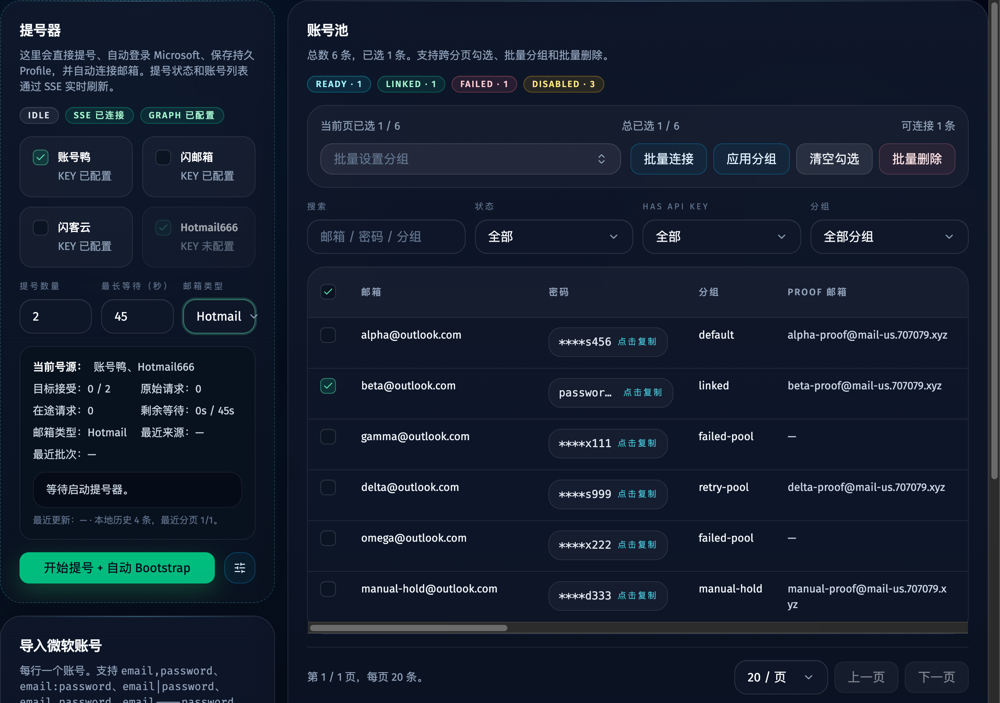
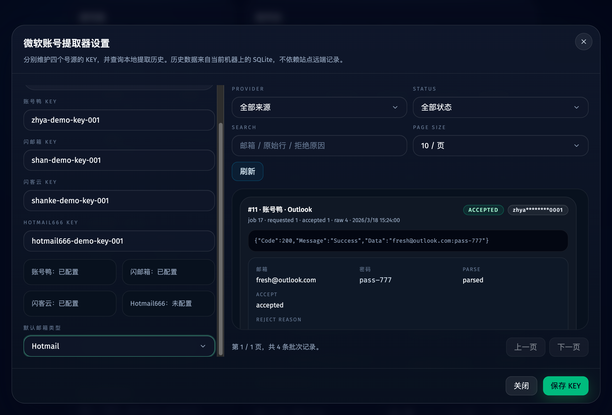
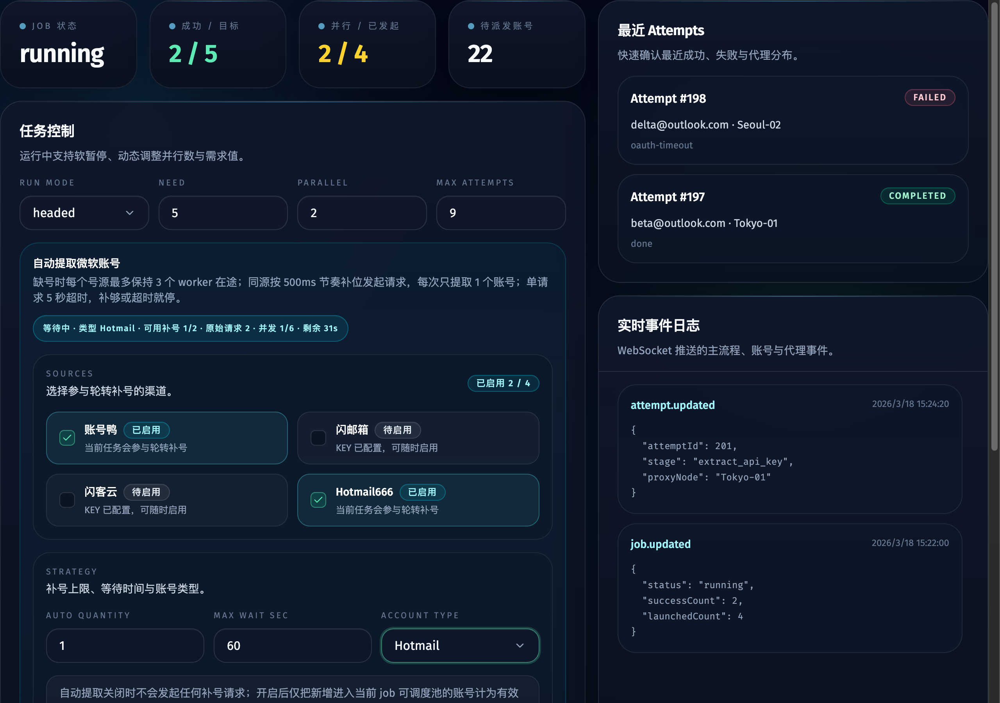

# 提号器 Outlook/Hotmail 类型全链路支持（#3jg3v）

## 状态

- Status: 已完成
- Created: 2026-04-04
- Last: 2026-04-04

## 背景 / 问题陈述

- 现有提号器和主流程自动补号只支持单值 `outlook`，即使 UI 后续暴露类型切换，服务端入口和调度链路也会把值静默回退为 `outlook`。
- `hotmail666` 的请求体、`shankeyun` / `zhanghaoya` / `shanyouxiang` 的 query 参数，以及作业和提号 runtime 状态都依赖统一的账号类型值；单点修复会导致展示、落库和上游请求不一致。
- 已完成的 `svjx5` 规格明确排除了 `hotmail` 选择，因此本次需要 follow-up spec 记录新的行为口径，而不是回写历史结论。

## 目标 / 非目标

### Goals

- 把共享类型扩展为 `outlook | hotmail`，覆盖设置、手动提号、主流程自动补号、job/runtime snapshot 和本地历史展示。
- 后端控制入口接受并返回 `hotmail`，不再在服务端或调度层静默回退到 `outlook`。
- 让四个号源的请求参数按各自字段名原样透传账号类型。
- 在账号页和 Dashboard 提供稳定的类型选择入口，并补齐对应 Storybook 覆盖与视觉证据。

### Non-goals

- 不增加 mixed/auto-detect 类型。
- 不新增号源站点或库存/余额接口。
- 不修改 Microsoft 登录、Bootstrap 或邮箱连接主流程语义。
- 不引入数据库 schema 变更；现有 `TEXT` 字段继续承载类型值。

## 接口与数据口径

- 共享枚举：`AccountExtractorAccountType = "outlook" | "hotmail"`
- 扩展入口：
  - `POST /api/account-extractors/run`
  - `POST /api/account-extractors/settings`
  - `POST /api/jobs/current/control` 的 `start` / `update_limits`
- 上游请求映射：
  - `zhanghaoya.type`
  - `shanyouxiang.leixing`
  - `shankeyun.type`
  - `hotmail666.mailType`
- 默认值规则：
  - 未显式指定时继续默认 `outlook`
  - 手动提号默认值跟随提号器设置中的 `defaultAutoExtractAccountType`
  - 自动补号默认值跟随当前 job draft / persisted settings

## 行为规格

### 手动提号器

- 账号页提号器卡片新增“邮箱类型”选择器，支持 `Outlook` 与 `Hotmail`。
- 运行中禁用类型切换，避免当前轮次请求参数漂移。
- 运行态摘要必须显示本轮账号类型；历史批次继续展示落库的 `accountType`。

### 提号器设置

- 提号器设置弹窗新增“默认邮箱类型”选择器，并与四个 KEY 一起保存。
- 保存成功后，后续自动补号与手动提号默认值都基于该设置回填。

### 主流程自动补号

- Dashboard 自动补号策略区把只读类型字段改为可编辑选择器。
- `start` 和 `update_limits` 都必须透传所选类型，并写入 job snapshot / auto extract state。
- 调度器在创建和更新自动补号配置时保留当前类型，不再固定写死 `outlook`。

## 验收标准（Acceptance Criteria）

- Given 手动提号器选择 `hotmail`，When 发起提号，Then 请求体中的 `accountType` 为 `hotmail`，runtime 摘要和本地历史批次都保留 `hotmail`。
- Given Dashboard 自动补号选择 `hotmail`，When 启动 job 或更新 limits，Then job snapshot、auto extract state 和调度器提号调用都保留 `hotmail`。
- Given 四个号源分别发起 `outlook` 与 `hotmail` 请求，When 单元测试检查请求 URL/Body，Then 每个 provider 都使用正确字段名和值。
- Given 旧数据或未显式设置类型，When 读取设置、job 或历史，Then 默认值仍为 `outlook`，且无需数据库迁移。
- Given Storybook 构建通过，When 打开账号页与 Dashboard 相关 stories，Then 可以稳定展示并交互验证 Outlook/Hotmail 切换。

## Visual Evidence

- source_type: `storybook_canvas`
- story_id_or_title: `views-accountsview--extractor-account-type-play`
- scenario: 账号页手动提号器切换到 `Hotmail` 后，摘要和选择器保持同步。

- source_type: `storybook_canvas`
- story_id_or_title: `views-accountsview--extractor-settings-compact`
- scenario: 提号器设置弹窗展示“默认邮箱类型”选择器，并回显 `Hotmail`。

- source_type: `storybook_canvas`
- story_id_or_title: `views-dashboardview--account-type-selector-play`
- scenario: Dashboard 自动补号策略区把账号类型切换为 `Hotmail`，运行态提示与策略表单保持一致。

