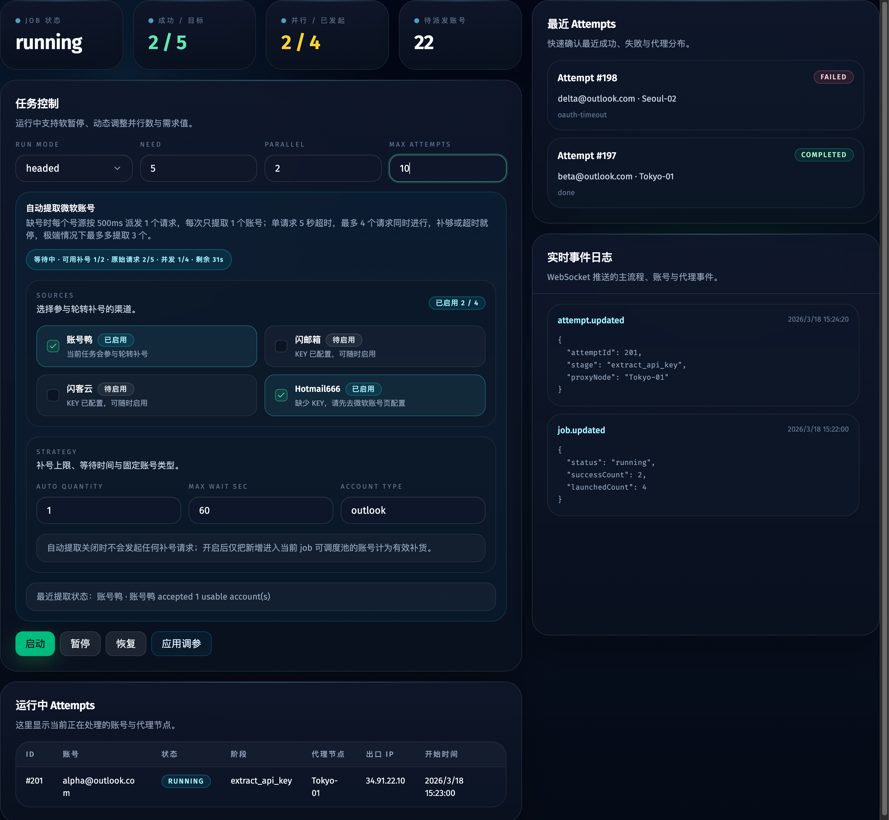
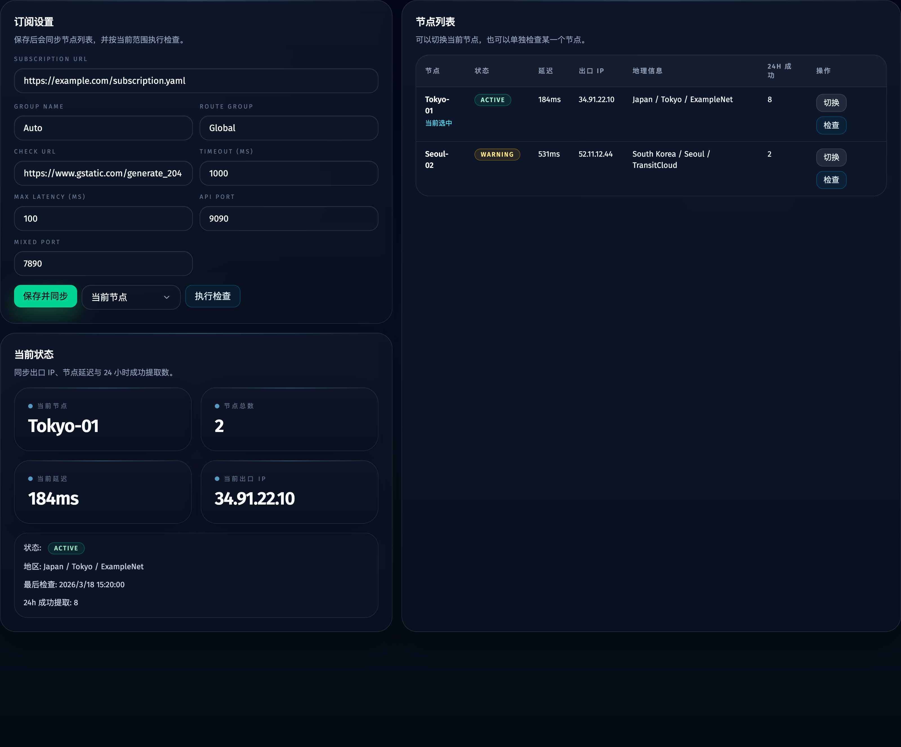
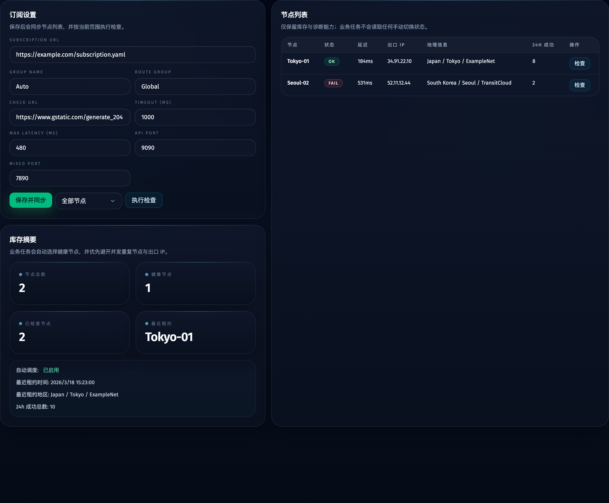
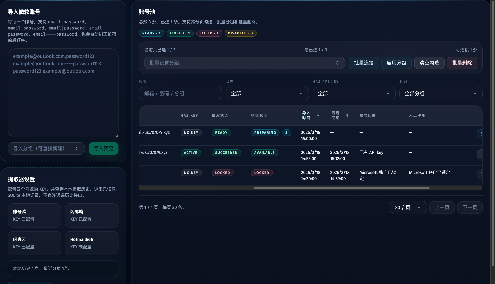
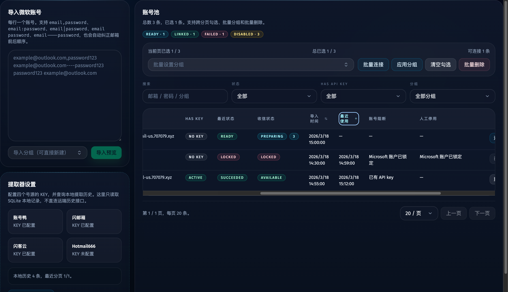
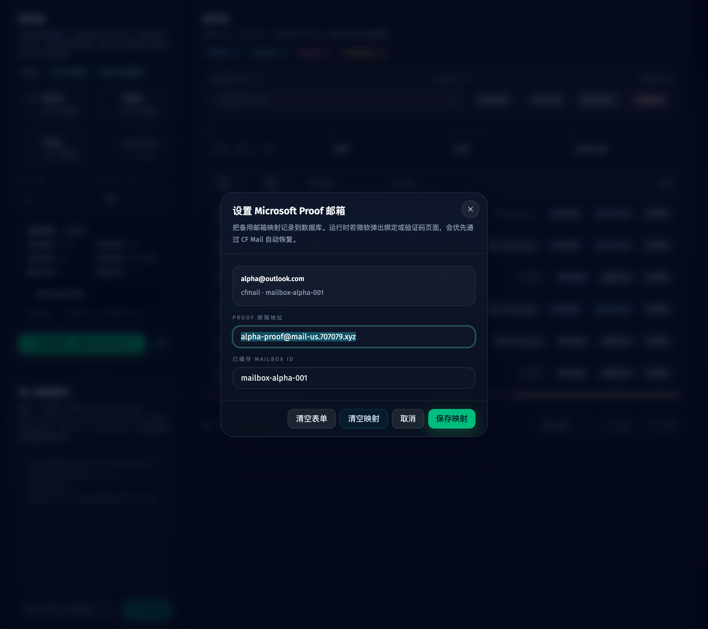
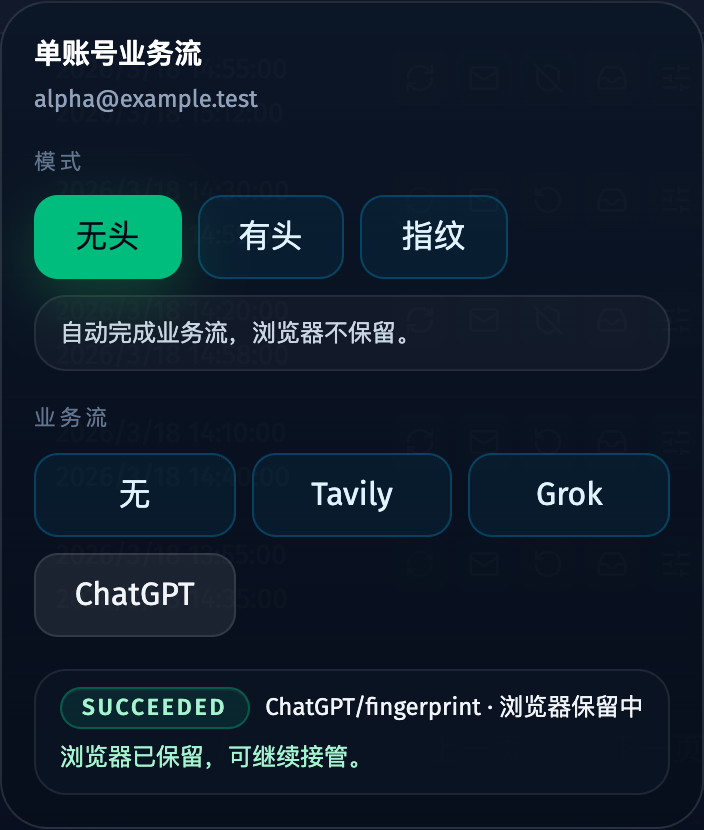
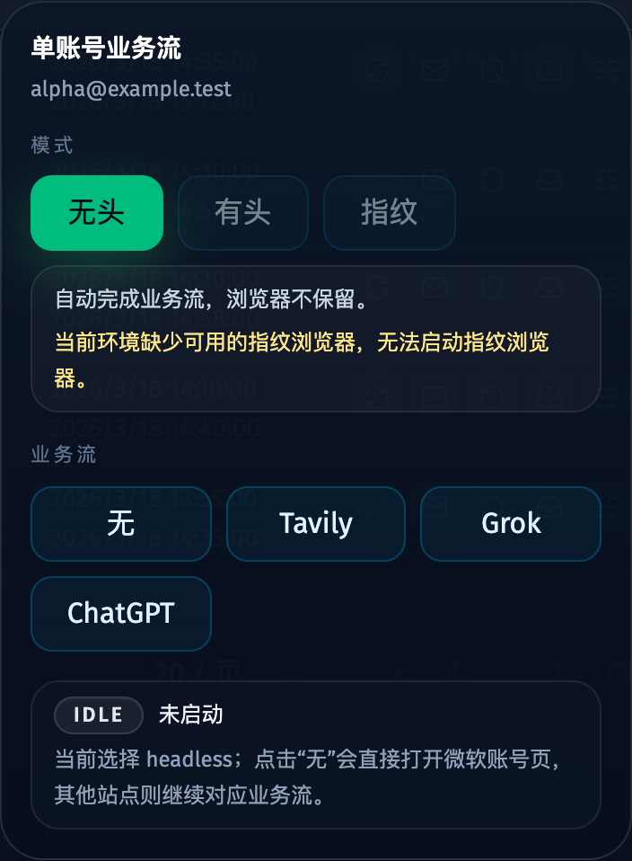
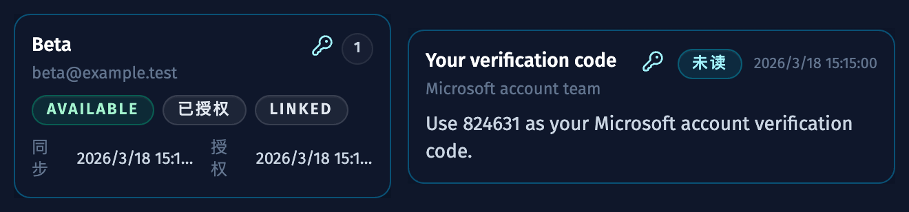
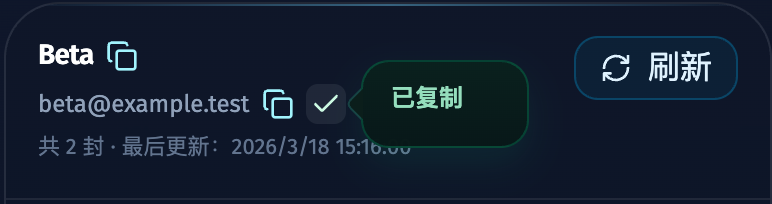

# Tavreg Hikari Web 管理台（#5nkhw）

## 状态

- Status: 已完成
- Created: 2026-03-18
- Last: 2026-04-23

## 背景 / 问题陈述

- 当前项目以 CLI 为唯一控制入口，虽然已经具备 Microsoft 登录、Tavily Home 落地、API key 提取、SQLite ledger 与代理节点检查能力，但账号导入、批量控制、代理状态和历史查询都只能通过命令行与散落的 JSON/SQLite 工具完成。
- 号池和主流程已经出现“账号池管理”“跳过已有 key”“动态调整并行”“代理状态面板”“运行中实时观察”的明确产品需求，现有 CLI 结构无法支撑。
- 现有自动化主逻辑高度集中在 `src/main.ts`，需要在不破坏既有流程的前提下，补一层 Web 控制台与可复用服务边界。

## 目标 / 非目标

### Goals

- 提供 `localhost` Web 管理台作为主入口，支持微软账号导入、主流程控制、账号查询、API key 查询和代理节点管理。
- 保留现有 Bun/TypeScript + SQLite + Playwright + Mihomo 技术方向，避免引入额外重型运行时。
- 将主流程改造成单活任务编排器，支持软暂停、动态调整 `parallel` / `need` / `maxAttempts`，并实时回传运行状态。
- 复用现有自动化逻辑完成 Microsoft 第三方登录与 Tavily API key 提取，不做人工接管流程。
- 将“已有 API key 的账号跳过”“账号去重导入”“代理节点 24h 成功统计”等业务规则做成结构化数据与可查询界面。
- 账号页支持导入前预解析确认、账号分组、跨分页勾选与批量操作，避免误导入与误删。

### Non-goals

- 不支持公网部署与多用户权限控制。
- 不支持 Google/GitHub/LinkedIn 等其他第三方登录提供商。
- 不实现代理节点的手工增删改，只处理 Mihomo 订阅配置、节点同步、自动分配与检查。
- 不抓取 Tavily 配额、套餐、usage 等更深层账号信息。

## 技术选型

- 服务端：`Bun.serve`
- 持久化：`bun:sqlite`（与现有 `TASK_LEDGER_DB_PATH` 共用同一 SQLite 文件）
- 前端：`Vite + React + TypeScript`
- 样式：`Tailwind CSS`
- 实时通道：`WebSocket`
- 自动化执行：保留现有 `src/main.ts` 单账号运行能力，通过服务端调度器按账号子进程复用，并补必要的环境变量与 ledger 关联字段

### 选型理由

- 与现有项目快照保持一致：`Tavreg Hikari` 已是 `Bun/TypeScript + SQLite + browser automation` 单体。
- `Vite + React` 适合高频交互控制台，不需要引入 SSR。
- `Tailwind CSS` 能快速实现响应式管理台，并与后续组件抽象兼容。
- `WebSocket` 比 SSE 更适合多类型事件与后续控制命令扩展。

## 范围（Scope）

### In scope

- 新增业务数据表：`microsoft_accounts`、`api_keys`、`jobs`、`job_attempts`、`proxy_nodes`、`proxy_checks`、`app_settings`
- 扩展 `signup_tasks` 以关联 `job_id` / `account_id`
- 新增 Web API 与前端管理台
- 新增导入规则、调度规则、代理检查与同步逻辑
- 保持现有 CLI 脚本与输出产物兼容

### Out of scope

- 改写现有所有自动化细节为插件式架构
- 重写 Playwright/Mihomo 核心实现
- 更换数据库或拆分为多服务部署

## 数据模型

### microsoft_accounts

- `id`
- `microsoft_email`（唯一）
- `password_plaintext`
- `proof_mailbox_provider`
- `proof_mailbox_address`
- `proof_mailbox_id`
- `has_api_key`
- `api_key_id`
- `imported_at`
- `updated_at`
- `last_used_at`
- `last_result_status`
- `last_result_at`
- `last_error_code`
- `skip_reason`
- `disabled_at`
- `group_name`

### api_keys

- `id`
- `account_id`
- `api_key`
- `api_key_prefix`
- `status`
- `extracted_at`
- `last_verified_at`

### jobs

- `id`
- `status`
- `run_mode`
- `need`
- `parallel`
- `max_attempts`
- `success_count`
- `failure_count`
- `skip_count`
- `launched_count`
- `started_at`
- `paused_at`
- `completed_at`

### job_attempts

- `id`
- `job_id`
- `account_id`
- `run_id`
- `status`
- `stage`
- `proxy_node`
- `proxy_ip`
- `error_code`
- `error_message`
- `started_at`
- `completed_at`
- `duration_ms`

### proxy_nodes

- `id`
- `node_name`（唯一）
- `last_status`
- `last_latency_ms`
- `last_egress_ip`
- `last_country`
- `last_region`
- `last_city`
- `last_org`
- `last_checked_at`
- `last_leased_at`

### proxy_checks

- `id`
- `node_name`
- `status`
- `latency_ms`
- `egress_ip`
- `country`
- `city`
- `org`
- `error`
- `checked_at`

### app_settings

- `key`
- `value_json`
- 用于保存 Mihomo 订阅参数、默认任务参数、Web 监听配置

## API 合约

- `POST /api/accounts/import`
- `POST /api/accounts/import-preview`
- `POST /api/accounts/group`
- `PATCH /api/accounts/:id`
- `DELETE /api/accounts`
- `GET /api/accounts`
- `POST /api/accounts/:id/business-flow/start`
- `GET /api/api-keys`
- `GET /api/proxies`
- `POST /api/proxies/settings`
- `POST /api/proxies/check`
- `POST /api/proxies/check` supports `scope=all|node`; no manual node switch API exists.
- `GET /api/jobs/current`
- `POST /api/jobs/current/control`
- `GET /api/events/ws`

## 行为规格

### 账号导入

- 前端点击导入后先在浏览器侧解析内容，再调用预览接口展示确认弹窗
- 前端导入格式支持 `email,password`、`email:password`、`email|password`、`email password`、`email----password`
- 若导入行为微软消费者邮箱（如 `outlook.com`、`outlook.co.uk`、`hotmail.com.br`、`live.*`、`msn.*`）常见的 `email----password----uuid----M...$$` 多段格式，则只取前两段作为邮箱与密码，后续 UUID / token / SSO 等字段全部忽略
- 账号池列表返回 proof 邮箱映射字段，支持单账号设置或清空 Microsoft proof 备用邮箱
- proof 邮箱映射只支持 `cfmail`，地址与已缓存的 mailbox id 一并持久化到数据库
- 支持“密码在前、邮箱在后”的格式纠正
- 空行忽略
- 同一批次重复邮箱以最后一条为准
- 预览弹窗需要标记：新增、更新密码、保持原值、输入重复、无效行
- 落库时按邮箱唯一 upsert
- 重复导入已存在账号时保留首个 `imported_at`，仅更新密码、分组、最近导入来源与 `updated_at`
- 导入时可同时指定分组；若指定分组，则新导入账号归入该分组
- 若账号已有有效 API key，则保留 `has_api_key=true` 与 `skip_reason=has_api_key`

### 账号页交互

- 密码默认以明文显示，便于人工校验
- 支持跨分页勾选账号，并展示总记录数与已勾选数量
- 每个账号操作列都提供单账号业务流 launcher，使用浮层展示 `无 / Tavily / Grok / ChatGPT` 四个业务流按钮与 `headless / headed / fingerprint` 模式切换；其中 `无` 会直接打开微软账号页。
- 业务流模式保存在前端本地存储中；当当前环境实际无法启动有头浏览器或指纹浏览器时，`headed / fingerprint` 必须自动回退为 `headless`，并在 launcher 内明确展示真实禁用原因。
- `headless / headed` 会直接完成单账号业务流并回收浏览器；`fingerprint` 只负责把浏览器带到目标站点的已登录可接管状态，并保留浏览器窗口。
- 支持批量设置分组与批量删除
- 导入成功后自动勾选刚刚新增或更新的账号
- 分组选择器使用可搜索、可直接新建的组合框
- 桌面表格中的“导入时间”“最近使用”列支持三态排序：降序、升序、恢复默认
- 时间列排序作用于当前筛选后的全量结果集，而不是仅当前页
- `last_used_at` 排序规则：降序时 `null` 置底，升序时 `null` 置顶
- 未启用自定义排序时保持现有默认列表顺序，不影响主流程派发规则

### 主流程调度

- 仅允许一个 active job
- 只派发“未禁用、未 lease、无 API key、无跳过标记、本 job 未跑过”的账号
- 排序规则：`last_used_at nulls first, imported_at asc`
- 完成条件：成功提取到 API key 的账号数达到 `need`
- 软暂停：停止新派发，已启动账号继续完成
- 动态调参：仅影响未派发部分
- 主流程页的所有内容必须被 shell 最大宽度约束住；超长日志、表格与状态文本只能在组件内部滚动、换行或截断，不得把页面整体撑出横向溢出

### 代理页

- 支持更新 Mihomo 订阅参数并立即同步节点列表
- 支持检查全部节点或单个节点
- 节点状态展示需要包含：当前状态、延迟、出口 IP、地理信息、24h 成功数；业务任务始终自动分配节点，不提供手工切换入口

## 验收标准（Acceptance Criteria）

- Given 导入同一微软邮箱多次，When 导入完成，Then 数据库中仅保留一条账号记录并更新密码、最近导入来源和 `updated_at`，同时保留首个导入时间。
- Given 用户输入多行账号后点击导入，When 预览弹窗打开，Then 界面先展示解析出的邮箱密码、输入重复、与已有账号冲突和最终导入决策。
- Given 某账号已有有效 API key，When 创建主流程任务，Then 调度器不会派发该账号，并在账号页标记为跳过。
- Given 用户在账号页跨分页勾选若干账号，When 执行批量分组或批量删除，Then 操作作用于完整勾选集而不是仅当前页。
- Given 用户点击账号页“导入时间”列头，When 连续点击三次，Then 列表按导入时间降序、导入时间升序、默认顺序依次切换。
- Given 用户点击账号页“最近使用”列头，When 在升序与降序之间切换，Then 排序作用于当前筛选后的全量结果集，且 `last_used_at=null` 分别在顶部或底部。
- Given 主流程正在运行，When 用户点击暂停，Then 不再派发新账号，已运行账号继续完成。
- Given 主流程正在运行，When 用户修改 `parallel` / `need` / `maxAttempts`，Then 修改立即作用于后续派发，不中断当前账号。
- Given 主流程页包含长 JSON 日志、长邮箱或较窄视口，When 页面渲染完成，Then 内容仍保持在 shell 宽度内，且只允许卡片或表格自身出现内部滚动。
- Given 任务成功完成 Microsoft 登录与 Tavily Home 流程，When 成功提取 API key，Then 账号状态、API key 记录、job attempt 与 `signup_tasks` 都正确关联更新。
- Given 用户打开代理页并执行节点检查，When 检查完成，Then 界面显示节点延迟、出口 IP、地理信息和检查结果。
- Given 用户打开微软账号页某一行的业务流 launcher，When 浮层展开，Then 页面同时显示 `无 / Tavily / Grok / ChatGPT` 与 `headless / headed / fingerprint`，并带出当前业务流状态与浏览器保留提示。
- Given 当前环境实际无法启动有头浏览器或指纹浏览器，When 用户打开 launcher，Then `headed / fingerprint` 会禁用并提示真实原因，已记忆的模式也会自动夹回 `headless`。
- Given 用户用 `fingerprint` 模式启动单账号业务流，When 自动化走到目标站点已登录页面或命中可接管 challenge，Then 浏览器保持打开且账号状态回传 `browserRetained=true`。
- Given ChatGPT / Grok / Tavily 存在多个健康代理节点，When 任务以并发方式启动，Then 调度器优先分散节点与出口 IP，并且不会读取任何全局选中节点状态。
- Given 当前实现完成，When 执行 `bun run typecheck`、`bun test` 与前端构建，Then 全部通过。

## Visual Evidence

- source_type: storybook_canvas
- target_program: mock-only
- capture_scope: element
- requested_viewport: none
- viewport_strategy: storybook-viewport
- sensitive_exclusion: N/A
- submission_gate: pending-owner-approval
- story_id_or_title: Views/AccountsView/BusinessFlowLauncherPopoverPlay
- state: desktop account row launcher with site buttons + mode switch
- evidence_note: 验证微软账号表格每行新增单账号业务流 launcher，点开后同时显示 `无 / Tavily / Grok / ChatGPT` 与 `headless / headed / fingerprint`，并回显当前业务流状态。

- source_type: storybook_canvas
- target_program: mock-only
- capture_scope: element
- requested_viewport: none
- viewport_strategy: storybook-viewport
- sensitive_exclusion: N/A
- submission_gate: pending-owner-approval
- story_id_or_title: Views/AccountsView/BusinessFlowLauncherHeadlessOnlyPlay
- state: headed-browser-unavailable launcher fallback
- evidence_note: 验证当前环境无法实际启动有头 / 指纹浏览器时，launcher 会把 `headed / fingerprint` 禁用并展示真实原因，同时保留 `headless` 可启动状态。

- source_type: storybook_canvas
- target_program: mock-only
- capture_scope: element
- requested_viewport: none
- viewport_strategy: storybook-viewport
- sensitive_exclusion: N/A
- submission_gate: pending-owner-approval
- story_id_or_title: Views/MailboxesView/VerificationCodeQuickCopyPlay
- state: mailbox card + inbox row quick-copy keys
- evidence_note: 验证 Microsoft 邮箱列表页在邮箱卡片与 Inbox 消息项都显示钥匙复制按钮，并直接暴露最新验证码复制入口。

- source_type: storybook_canvas
- target_program: mock-only
- capture_scope: element
- requested_viewport: none
- viewport_strategy: storybook-viewport
- sensitive_exclusion: N/A
- submission_gate: pending-owner-approval
- story_id_or_title: Views/MailboxDrawer/VerificationCodeCopyFeedbackPlay
- state: drawer header latest-code quick copy success feedback
- evidence_note: 验证账号页右侧 Mailbox Drawer 里的钥匙复制按钮与“已复制”反馈气泡保持一致，不再需要额外工具栏或手动复制步骤。

## 里程碑

- [x] M1: 建立 spec、前端工具链与 Web/Bun 入口
- [x] M2: 完成业务数据表与 repository
- [x] M3: 完成单活 job scheduler 与子进程复用现有 CLI 自动化
- [x] M4: 完成账户/API key/代理 REST API 与 WebSocket
- [x] M5: 完成 React 管理台三大页面
- [x] M6: 完成验证、spec sync 与 merge-ready 收敛

## 文档更新（Docs to Update）

- `docs/specs/README.md`
- `.env.example`
- `README.md`

## Change log

- 2026-03-18: 初始化 Web 管理台规格，锁定 Bun 单体 + React/Vite + SQLite + WebSocket 方案。
- 2026-03-18: 完成 Web 管理台实现，补齐业务表、调度器、REST/WebSocket、React 控制台、测试入口与文档同步。
- 2026-03-19: 扩展账号页导入预解析弹窗、账号分组、跨分页勾选、批量分组/删除与更宽松的账号密码分隔格式解析。
- 2026-04-04: 账号页 proof 邮箱链路切换到 CF Mail，补齐绑定弹窗 Storybook 场景与视觉证据。
- 2026-04-16: 微软账号导入兼容微软消费者邮箱常见的 `email----password----uuid----M...$$` 多段格式，前后端预解析统一只取前两段，并覆盖多级消费者域名后缀，同时收紧启发式以避免误截普通 dashed 密码。
