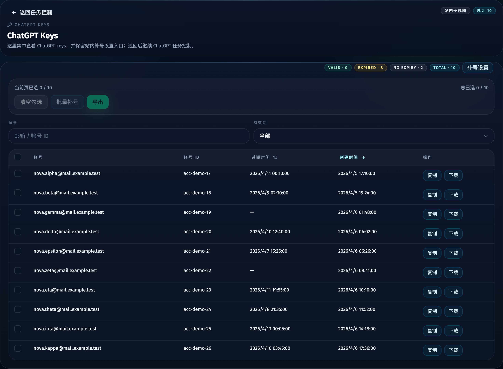
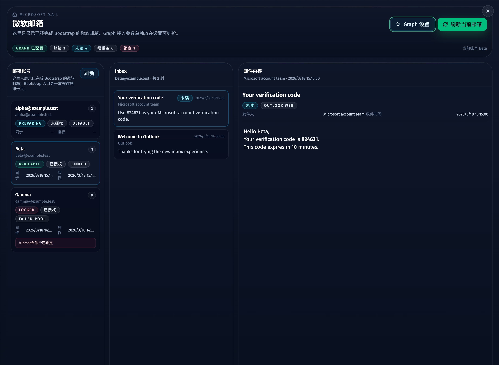
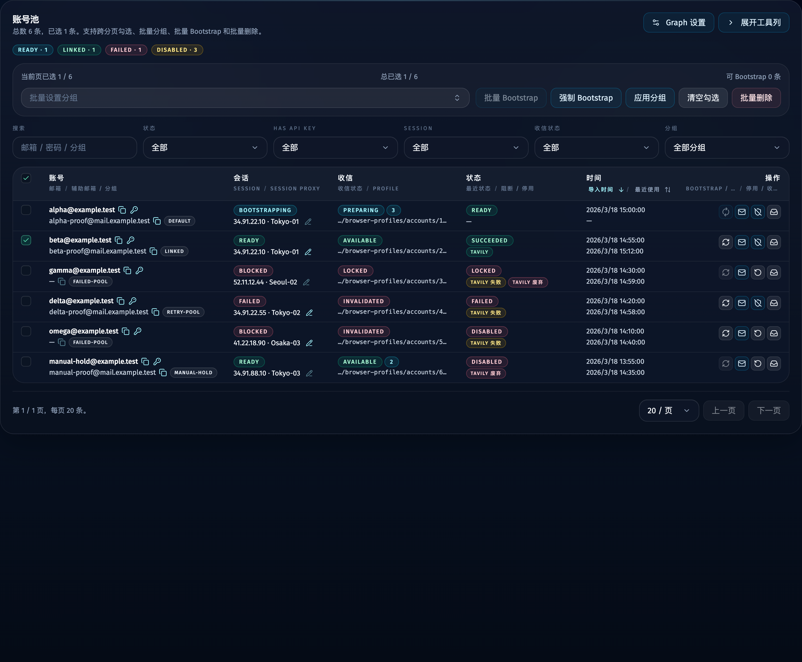

# Web 管理台导航收敛与 Microsoft 信箱抽屉整合（#8qyzh）

## 状态

- Status: 部分完成（3/4）
- Created: 2026-04-19
- Last: 2026-04-19

## 背景 / 问题陈述

- 当前顶层导航同时暴露 `微软邮箱` 与 `Keys`，会把主流程入口和次级工具入口混在同一层，页面信息架构继续膨胀。
- Tavily / Grok / ChatGPT 三个站点已经各自形成独立主控页，但 keys 仍作为顶层全局页存在，和站点主流程割裂。
- Microsoft 账号池与微软邮箱页虽然都围绕同一账号上下文，但“收件箱”仍通过独立顶层导航与独立页面进入，无法在账号池内完成单账号查看与回退。
- Microsoft 账号页中的“展开工具列 / 收起工具列”刷新后会丢失状态，重复操作成本偏高。

## 目标 / 非目标

### Goals

- 将顶层导航收敛为 `Tavily / Grok / ChatGPT / Microsoft / 代理节点` 五项。
- 把 Tavily / Grok / ChatGPT 的 Keys 能力收纳到各自模块内，以站内子视图形式进入。
- 把 Microsoft 邮箱查看收纳到账号池模块内，通过右侧抽屉直接查看对应账号邮箱，并在每次打开时自动刷新一次。
- 保留旧 `/keys`、`/api-keys`、`/mailboxes` 与 `/mailboxes/settings` 深链兼容能力，但不再作为顶层主导航入口。
- 将 Microsoft 模块“展开工具列 / 收起工具列”状态持久化到浏览器存储，并允许 Storybook 显式覆盖初始态。

### Non-goals

- 不修改 SQLite schema、mailbox / keys 后端 API 或 Graph OAuth 协议。
- 不重做 `/mailboxes/settings` 的 Graph 配置表单结构。
- 不改变代理节点页面的业务语义。
- 不引入新的 mailbox 状态字段或新的 key 数据模型。

## 范围（Scope）

### In scope

- `AppShell` 顶栏标签、说明文案与 page 映射收敛。
- `KeysView` 拆分为 Tavily / Grok / ChatGPT 可复用 pane，并支持站内 keys 子视图。
- Tavily / Grok / ChatGPT 主控页新增 `查看 Keys` 入口与返回主控页入口。
- Microsoft 账号页内的 mailbox drawer、Graph 设置入口与 drawer auto-refresh。
- Microsoft 工具列展开态的 localStorage 持久化。
- Storybook、视觉证据、Spec 索引与兼容路由测试更新。

### Out of scope

- 后端 mailbox 查询过滤策略变更。
- 新增统一的跨站点 keys API。
- 重写独立 `/mailboxes` 页面内部布局为全新组件树。

## 需求（Requirements）

### MUST

- 顶层导航必须只显示 `Tavily / Grok / ChatGPT / Microsoft / 代理节点`。
- `/accounts` 必须继续作为 Microsoft 模块主路由，owner-facing 标签改为 `Microsoft`。
- `/keys` 与 `/api-keys` 必须继续可访问，并映射到站点对应的 keys 兼容页。
- Tavily / Grok / ChatGPT 主控页必须各自提供站内 `查看 Keys` 入口，并能显式返回原主控页。
- ChatGPT 的“补号设置”必须继续保留在 ChatGPT keys 子视图中。
- Microsoft 账号列表点击“收件箱”后，必须留在 `accounts` 模块并打开右侧抽屉，不再切到独立顶栏页。
- 抽屉每次打开时必须自动触发一次 mailbox `sync + messages refresh`，但同一次打开周期内不得重复抖动刷新。
- Microsoft 工具列展开态必须在刷新后恢复，并支持 Storybook 通过显式初始 props 覆盖。

### SHOULD

- 旧 `/mailboxes?accountId=<id>`、`/mailboxes/settings` 深链应自动落到新的 `accounts` 模块上下文。
- Microsoft 抽屉对 `available / invalidated / locked / 未授权 / 无 mailbox` 都应给出稳定反馈，而不是跳回旧路由。
- Storybook 应覆盖五项导航、三个站点 keys 子视图、Microsoft 抽屉主要状态与工具列初始态。

### COULD

- None

## 功能与行为规格（Functional/Behavior Spec）

### 顶层导航与兼容路由

- 顶层导航固定为五项：`tavily / grok / chatgpt / accounts / proxies`。
- `/mailboxes`、`/mailboxes/settings` 继续可访问，但前端 page key 统一映射到 `accounts`。
- `/keys`、`/api-keys` 继续作为兼容入口；若 query 中带 `site=grok|chatgpt`，应落到对应站点 keys 视图，否则默认落到 Tavily。

### 站点内 Keys 子视图

- Tavily / Grok / ChatGPT 主控页顶部提供 `查看 Keys` 按钮。
- 点击后进入当前站点的 `?view=keys` 子视图，并显示“返回任务控制”按钮。
- 子视图继续复用既有 keys 数据能力与导出交互；ChatGPT 子视图继续提供“补号设置”。
- 旧兼容 `/keys` 页继续使用组合版 `KeysView`，但不再出现在顶层导航中。

### Microsoft 邮箱抽屉

- Microsoft 账号页点击某个账号的“收件箱”后，直接在 `accounts` 模块内打开 drawer。
- drawer 复用现有 mailbox 三栏工作区，并默认聚焦到当前账号对应的 mailbox。
- 每次打开 drawer 时自动触发一次 refresh；若当前 mailbox 为 `preparing` 且从未同步成功，则保持现有首次授权后自动 sync 逻辑，不重复额外触发。
- 若账号没有可显示 mailbox，drawer 保持在 Microsoft 模块内显示空态；若 mailbox 为 `invalidated / locked / 未授权`，则继续展示状态与 Graph 设置入口。
- Graph 设置改为 Microsoft 模块内的次级入口，通过 `accounts?view=graph-settings` 进入。

### Microsoft 工具列记忆

- `desktopToolsCollapsed` 默认从 localStorage 读取。
- 若传入 `initialDesktopToolsCollapsed`，则显式初始值优先于 localStorage，用于 Storybook 与受控测试场景。
- 用户切换展开态后，最新值需写回 localStorage。

## 接口契约（Interfaces & Contracts）

- 不新增 HTTP / DB 合约。
- 前端新增 query 约定：
  - `?view=keys`
  - `?view=graph-settings`
  - `?mailboxAccountId=<id>`
  - `?site=tavily|grok|chatgpt`（兼容 `/keys`）

## 验收标准（Acceptance Criteria）

- Given 用户打开顶栏导航
  When 页面渲染完成
  Then 只显示 `Tavily / Grok / ChatGPT / Microsoft / 代理节点`，且不再出现 `Keys` 与 `微软邮箱`。

- Given 用户位于 Tavily / Grok / ChatGPT 主控页
  When 点击 `查看 Keys`
  Then 页面进入当前站点 keys 子视图，并可通过“返回任务控制”回到原主控页。

- Given 用户位于 ChatGPT keys 子视图
  When 页面渲染完成
  Then 仍可直接打开“补号设置”，不需要返回旧统一 Keys 顶栏页。

- Given 用户在 Microsoft 模块点击某行“收件箱”
  When drawer 打开
  Then 页面停留在 `accounts` 模块，并自动刷新一次对应邮箱内容。

- Given 当前账号没有 mailbox，或 mailbox 处于 `invalidated / locked / 未授权`
  When drawer 渲染
  Then 页面仍留在 drawer 里显示稳定状态反馈，并保留 Graph 设置入口。

- Given 用户切换 Microsoft 工具列展开态
  When 刷新页面或离开后返回
  Then 恢复到上次状态。

## 实现前置条件（Definition of Ready / Preconditions）

- 现有 `/keys`、`/mailboxes`、`/mailboxes/settings` 兼容保留策略已锁定。
- Microsoft 抽屉继续复用现有 mailbox / message / sync API 已锁定。
- Storybook 已存在并可作为稳定视觉证据源。

## 非功能性验收 / 质量门槛（Quality Gates）

### Testing

- Unit tests: 路由映射覆盖 `/keys`、`/api-keys`、`/mailboxes`、`/mailboxes/settings` 与 query 解析。
- E2E / interaction: Storybook `play` 覆盖站内 keys 返回、ChatGPT 补号设置入口、Microsoft 抽屉主要状态与工具列初始态。

### UI / Storybook (if applicable)

- Stories to add/update: `AppShell`、`KeysView`、`SiteKeysView`、`DashboardView`、`GrokView`、`ChatGptView`、`AccountsView`、`MailboxDrawer`。
- Docs pages / state galleries to add/update: 依现有 autodocs 更新。
- Visual regression baseline changes (if any): none。

### Quality checks

- `bun run typecheck`
- `bun test`
- `bun run web:build`
- `bun run build-storybook`

## 文档更新（Docs to Update）

- `docs/specs/README.md`
- `docs/specs/8qyzh-nav-keys-mailbox-consolidation/SPEC.md`

## 计划资产（Plan assets）

- Directory: `docs/specs/8qyzh-nav-keys-mailbox-consolidation/assets/`
- In-plan references: ``
- Visual evidence source: `storybook_canvas`

## Visual Evidence

- source_type: `storybook_canvas`
  story_id_or_title: `Shell/AppShell/Microsoft Active`
  state: `five-item navigation`
  evidence_note: 验证顶栏已经收敛为 `Tavily / Grok / ChatGPT / Microsoft / 代理节点` 五项，并将 owner-facing 标签统一改为 `Microsoft`。
  

- source_type: `storybook_canvas`
  story_id_or_title: `Views/SiteKeysView/Chat Gpt Keys`
  state: `chatgpt embedded keys`
  evidence_note: 验证 ChatGPT 的 keys 已收纳到站内子视图，保留“返回任务控制”与“补号设置”入口，不再依赖顶层 Keys 导航。
  

- source_type: `storybook_canvas`
  story_id_or_title: `Views/MailboxDrawer/Available Mailbox`
  state: `microsoft mailbox drawer`
  evidence_note: 验证 Microsoft 账号模块内通过 drawer 直接查看邮箱，保留 Graph 设置与刷新入口，并继续复用三栏 mailbox 工作区。
  

- source_type: `storybook_canvas`
  story_id_or_title: `Views/AccountsView/Desktop Tools Collapsed`
  state: `collapsed desktop tools`
  evidence_note: 验证 Microsoft 账号页在工具列收起后仍保留稳定的“展开工具列”与 Graph 设置入口，作为记忆态回放的稳定视觉基线。
  

## 实现里程碑（Milestones / Delivery checklist）

- [x] M1: 顶层导航与兼容路由收敛完成
- [x] M2: Tavily / Grok / ChatGPT 站内 Keys 子视图完成
- [x] M3: Microsoft mailbox drawer 与 Graph 设置入口收敛完成
- [ ] M4: Storybook、视觉证据、验证链路与 PR merge-ready 收敛完成

## 方案概述（Approach, high-level）

- 保持后端与数据模型不动，只收敛前端信息架构与路由语义。
- 以可复用 pane 的方式拆分 Keys 页面，让站内 keys 子视图和兼容 `/keys` 页面共用同一套展示组件。
- 通过 `accounts` 模块下的 query state 驱动 Microsoft drawer / Graph settings，使刷新与返回路径都绑定在同一路由语义上。
- 使用 Storybook 作为视觉证据主源，确保 drawer、导航和站内 keys 子视图都有稳定 mock 场景。

## 风险 / 开放问题 / 假设（Risks, Open Questions, Assumptions）

- 风险：drawer 复用既有 mailbox 工作区后，若后续还需更强的账号级空态文案，可能需要把 `MailboxesView` 再拆成更细粒度子组件。
- 风险：localStorage 持久化若没有显式 Storybook override，容易被真实浏览器残留状态污染；因此 Storybook 必须覆盖受控初始态。
- 假设：旧 `/mailboxes*` 与 `/keys*` 只需作为兼容入口存在，不再需要顶栏暴露。

## 变更记录（Change log）

- 2026-04-19: 创建规格，冻结导航收敛、站内 keys 子视图、Microsoft mailbox drawer 与工具列持久化范围。

## 参考（References）

- `docs/specs/m9jnq-keys-dual-source-page/SPEC.md`
- `docs/specs/jg53e-microsoft-mail-inbox/SPEC.md`
- `docs/specs/8tmtv-microsoft-account-list-two-field-layout/SPEC.md`
- `docs/specs/vhvds-chatgpt-upstream-account-supplement/SPEC.md`
