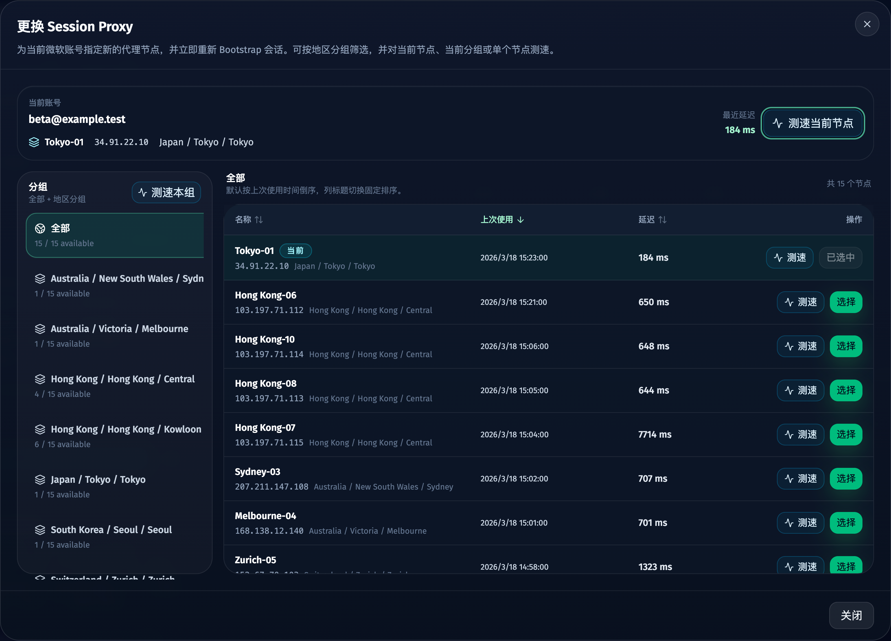
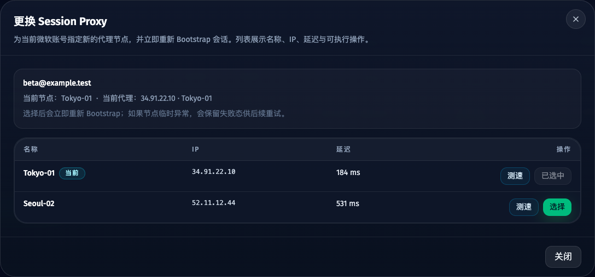
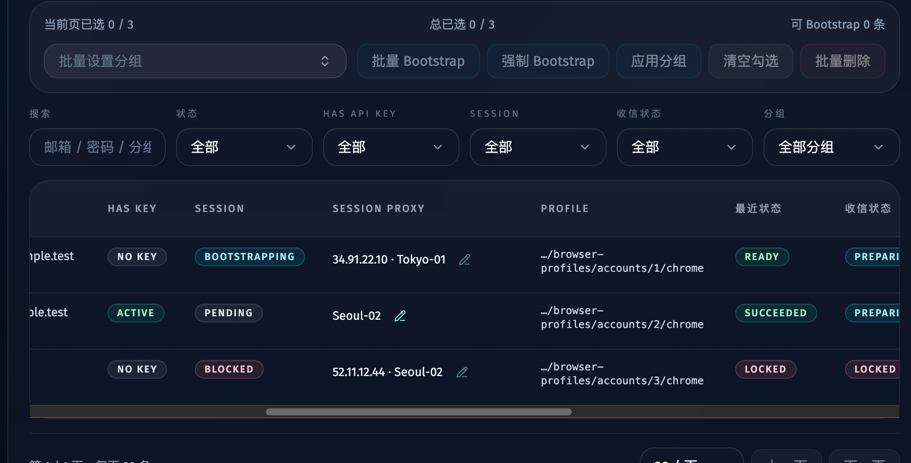
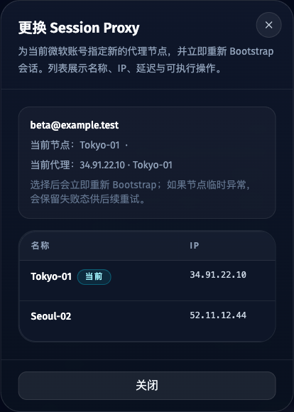

# 微软账号页 Session Proxy 行内更换代理节点（#9p1fh）

## 状态

- Status: 已完成
- Created: 2026-04-15
- Last: 2026-04-17

## 背景 / 问题陈述

- 当前微软账号页只展示 `Session Proxy` 快照，运营无法在账号上下文内直接更换会话代理节点。
- 已有 `重新 Bootstrap` 只能走自动复用/自动分配规则，不能针对单个账号显式指定下一次会话应切到哪个节点。
- 代理页已有库存快照与单节点测速能力，但账号页缺少把这些信息直接用于“当前账号会话切换”的入口。
- 历史 spec `bqa97` 明确写过“不新增手动切换代理节点的能力”；本次需要把边界收敛为：仍然**不提供全局手动选节点**，但允许**账号级手动切换当前 Session Proxy**。

## 目标 / 非目标

### Goals

- 在微软账号页 `Session Proxy` 展示区增加行内“编辑”入口。
- 打开代理选择对话框，直接展示节点名称、出口 IP、最近延迟，并支持单节点测速。
- 选择节点后，立即对当前账号触发带 `proxyNode` 的 rebootstrap，让会话切到新节点。
- 保持代理页的库存真相源与单节点测速接口不变，账号页只复用现有能力。
- 为桌面表格与移动卡片补齐 Storybook 覆盖、交互 play 与视觉证据。

### Non-goals

- 不新增代理节点 CRUD。
- 不新增全局 pinned proxy 或调度器全局手动选节点状态。
- 不引入“先记录偏好、下次再生效”的延迟切换模式。
- 不改造代理页主流程或 `GET /api/proxies` / `POST /api/proxies/check` 的主语义。

## 功能与行为规格

### 账号页 UI

- `Session Proxy` 单元格在当前值后面显示行内“编辑”按钮。
- 桌面表格与移动卡片都使用同一套代理选择对话框。
- 对话框采用三块结构：顶部固定显示当前账号与当前节点；左下显示分组；右侧显示组内节点。
- 分组固定包含 `全部` 和按 `country / region / city` 归并出的地区分组；缺失地区归入 `未知地区`。
- 右侧节点列表固定显示：`名称 / 上次使用 / 延迟 / 操作`，节点 IP 与地区展示在名称副信息中。
- 右侧排序是明确三选一：默认 `上次使用` 倒序；点击 `名称` 切到自然语言正序；点击 `延迟` 切到延迟正序，空值排最后；不提供升降序循环和排序偏好记忆。
- 当前已绑定节点需要有清晰标识。
- 操作列至少包含：
  - `测速`：复用 `POST /api/proxies/check { scope: "node", nodeName }`
  - `选择`：立即触发带 `proxyNode` 的 rebootstrap
- 顶部当前节点提供 `测速当前节点`，左侧当前分组提供 `测速本组`；当 `全部` 分组被选中时，`测速本组` 覆盖全部节点。

### 代理测速接口

- `POST /api/proxies/check` 启动 proxy-check coordinator，并快速返回 `{ ok, accepted, checkState }`。
- 请求体支持：
  - `{ scope: "all" }`：兼容既有全量检查。
  - `{ scope: "node", nodeName }`：检查单个节点。
  - `{ scope: "group", nodeNames }`：检查当前分组内多个节点。
- 已有检查运行中时返回 `accepted=false` 与当前 `checkState`，不得启动第二个并发 run。

### 服务端 rebootstrap

- `POST /api/accounts/:id/session/rebootstrap` 请求体扩展为 `{ force?: boolean; proxyNode?: string | null }`。
- 当 `proxyNode` 提供时：
  - 服务端必须先校验该节点存在于当前库存；不存在时返回 4xx。
  - bootstrap worker 必须优先使用该节点，而不是自动复用结果。
  - 显式指定节点的 rebootstrap 不再在同一轮里自动回退到“fresh proxy retry”。
- 当 `proxyNode` 未提供时：继续沿用现有自动复用规则。

### 边界与阻断

- 锁定、禁用、已被 job 占用或当前正在 bootstrapping 的账号，不能发起 Session Proxy 切换。
- 手动切换只影响当前账号的持久会话快照与后续复用，不改变全局调度器策略。
- 若选择的节点后续 bootstrap 失败，账号保持失败态，不得伪造切换成功。

## 验收标准

- Given 微软账号页存在账号记录，When 查看 `Session Proxy` 单元格，Then 当前值右侧可见行内“编辑”按钮。
- Given 打开代理选择对话框，When 查看布局，Then 能看到顶部当前节点、左侧分组和右侧组内节点列表，且当前节点有明显标识。
- Given 打开代理选择对话框，When 未点击排序列，Then 右侧节点默认按上次使用时间倒序排列。
- Given 点击 `名称 / 上次使用 / 延迟` 任一列标题，When 查看右侧节点，Then 排序直接切换到对应固定规则，延迟空值排在最后。
- Given 在对话框里点击 `测速当前节点 / 测速本组 / 单行测速`，When 节点检查完成，Then 对应范围的延迟/IP 会刷新，而不会跳转到代理页。
- Given 在对话框里点击 `选择`，When 请求成功，Then 当前账号立即进入 rebootstrap，最终账号页 `Session Proxy` 快照更新为新节点/IP。
- Given 提供了不存在的 `proxyNode`，When 调用 rebootstrap 接口，Then 服务端返回 4xx，而不是静默回退到自动节点。
- Given 账号已锁定、禁用或 bootstrapping，When 尝试切换 Session Proxy，Then 切换入口保持禁用或被阻断，文案与现有 Bootstrap 阻断语义一致。

## 实现备注

- 本 spec 收敛并覆盖 `bqa97` 中“无手动切换代理节点”的旧边界，但仅限**账号级 Session Proxy 切换**；代理页与全局调度仍保持无全局手动选节点能力。

## Visual Evidence

- source_type: `storybook_canvas`
- target_program: `mock-only`
- capture_scope: `element`
- requested_viewport: `none`
- viewport_strategy: `storybook-viewport`
- sensitive_exclusion: `N/A`
- submission_gate: `pending-owner-approval`
- story_id_or_title: `Views/AccountsView/SessionProxySwitchDialogPlay`
- state: 当前弹窗采用顶部当前节点、左侧地区分组、右侧组内节点列表；默认按上次使用倒序，并暴露当前节点、当前分组与单节点测速入口。

- source_type: `storybook_canvas`
- target_program: `mock-only`
- capture_scope: `dialog`
- sensitive_exclusion: `N/A`
- submission_gate: `pending-owner-approval`
- story_id_or_title: `Views/AccountsView/Session Proxy Switch Dialog Play`
- state: 重新打开桌面对话框后，当前节点与当前代理都会回显为刚刚切换到的 `Seoul-02`，且当前行保留 `当前` 标识。

- source_type: `storybook_canvas`
- target_program: `mock-only`
- capture_scope: `browser-viewport`
- sensitive_exclusion: `N/A`
- submission_gate: `pending-owner-approval`
- story_id_or_title: `Views/AccountsView/Session Proxy Switch Dialog Play`
- state: 选择 `Seoul-02` 后，账号列表会立即把 `Session Proxy` 单元格更新为新节点名，并清除旧 IP，避免出现旧 `IP · 节点名` 的混合回显。

- source_type: `storybook_canvas`
- target_program: `mock-only`
- capture_scope: `dialog`
- sensitive_exclusion: `N/A`
- submission_gate: `pending-owner-approval`
- story_id_or_title: `Views/AccountsView/SessionProxySwitchCompactCards`
- state: 移动卡片场景可从同一入口打开代理切换对话框。

