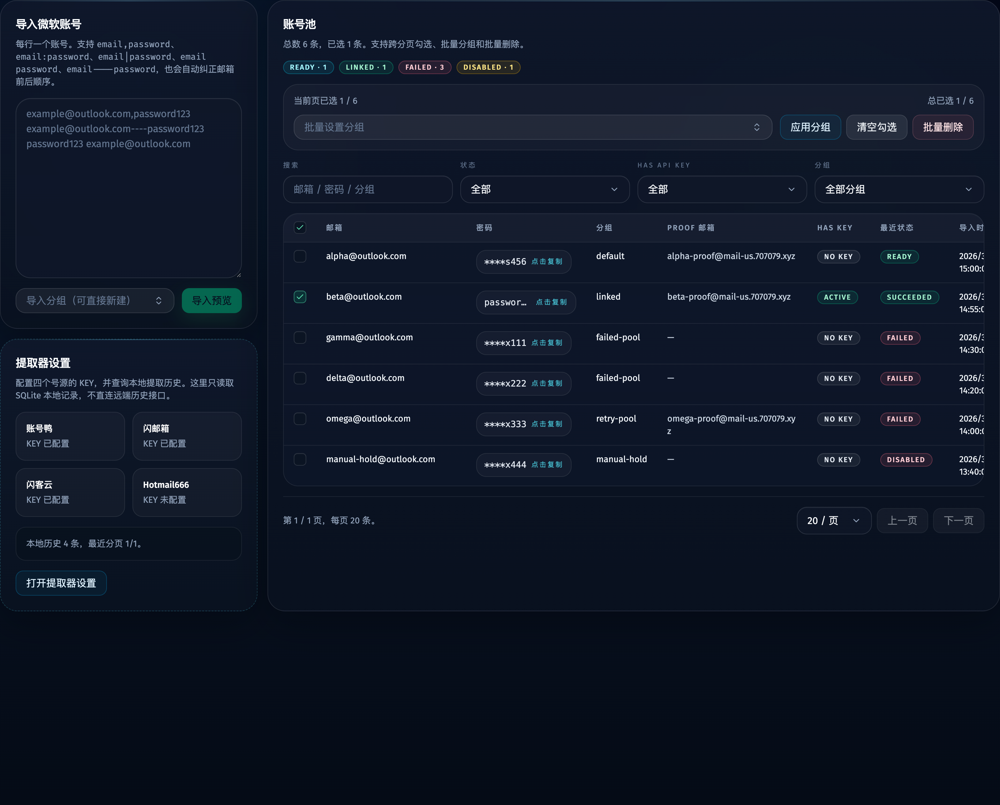
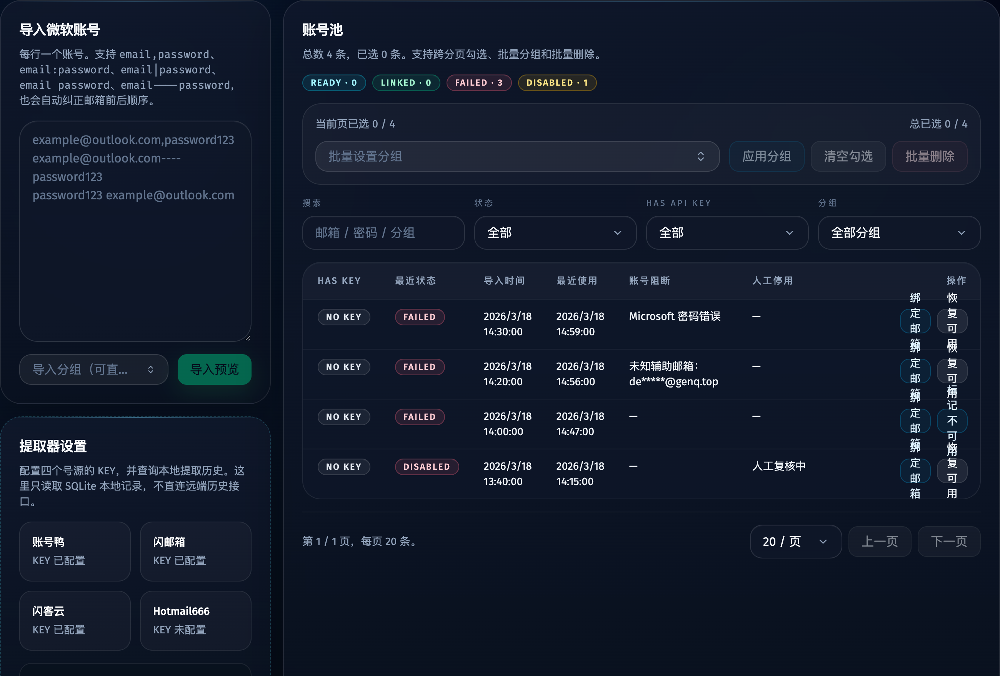

# Failed 微软账号复用策略收敛（#b5baw）

## 状态

- Status: 部分完成（4/5）
- Created: 2026-03-28
- Last: 2026-03-28

## 背景 / 问题陈述

- 现有调度逻辑把“failed 账号是否还能在后续任务复用”混在多个状态字段与隐式副作用里，导致失败的微软账号一旦落成某些状态，即使只是瞬时失败，也可能长期留在候选池外。
- 自动化流程会把密码错误、账号锁定、未知辅助邮箱等“硬账号错误”写进 `disabled_*`，这让人工停用与自动化阻断语义混杂，UI 也无法明确区分“人工停用”“瞬时失败可复用”“硬阻断需修复”。
- 当前账号修复入口分散在密码导入、Proof 邮箱保存与“恢复可用”按钮，但它们没有统一清除阻断的行为约束，导致账号修好后仍可能继续被调度层忽略。

## 目标 / 非目标

### Goals

- 把 failed 微软账号在“同一 job”和“新 job”两个维度上的复用规则改成显式、统一、可测试的判定。
- 将 `microsoft_password_incorrect`、`microsoft_account_locked`、`microsoft_unknown_recovery_email` 固定为硬账号阻断，并落在 `skip_reason`。
- 保留 `last_result_status='failed'` 作为最近运行结果，收敛 `disabled_at` / `disabled_reason` 为纯人工停用语义。
- 打通密码更新、Proof 邮箱保存与“恢复可用”三个解封入口，确保修复后账号能重新进入后续任务调度池。
- 更新账号页状态文案、Storybook 与视觉证据，明确展示“failed 但可在新任务复用”和“failed 且被硬阻断”的差异。

### Non-goals

- 不支持同一 job 内回头再次派发同一微软账号。
- 不重写 Microsoft 登录自动化主链或错误码体系。
- 不新增数据库列、额外 REST endpoint 或新的 WebSocket 事件类型。

## 数据与接口语义

### `microsoft_accounts`

- `skip_reason`
  - `has_api_key`
  - `microsoft_password_incorrect`
  - `microsoft_account_locked`
  - `microsoft_unknown_recovery_email`
- `last_result_status`
  - 继续保留 `failed` / `success` / `skipped` 等运行结果语义。
- `disabled_at` / `disabled_reason`
  - 仅表示操作者显式“标记账号不可用”。
  - 自动化硬账号错误不得再覆写这两个字段。

### `GET /api/accounts` / WebSocket 账号载荷

- 保持现有字段形状不变。
- `skipReason` 新增承载三类硬账号阻断值，不再只用于 `has_api_key`。
- `disabledAt` / `disabledReason` 只表达人工停用状态。

### `PATCH /api/accounts/:id`

- 保存 Proof 邮箱时，如果当前 `skip_reason = microsoft_unknown_recovery_email`，则清除该阻断。
- 点击“恢复可用”时，清除人工停用与三类硬账号阻断。
- 导入账号时如果密码发生变化，且当前 `skip_reason = microsoft_password_incorrect`，则清除该阻断。
- `microsoft_account_locked` 不会被密码导入或 Proof 邮箱保存隐式解除，只能通过显式“恢复可用”解除。

## 行为规格

### 账号可调度判定

- 同一 job 内，只要该账号已经被当前 job 尝试过，无论结果如何，都不得再次派发。
- 新 job 创建后：
  - `failed` 且 `skip_reason` 为空的账号，允许重新进入候选池。
  - `failed` 且 `skip_reason` 为三类硬账号阻断之一的账号，不得进入候选池。
  - `has_api_key` 与人工停用账号继续保持不可调度。

### 失败结果落盘

- 自动化运行失败时：
  - 若错误码属于硬账号阻断，则写入 `skip_reason`，同时保留 `last_result_status='failed'`。
  - 若错误码属于瞬时失败，例如 `network_connection_closed`、代理故障、浏览器异常、`microsoft_auth_try_again_later`、`microsoft_password_rate_limited`，则保留 `skip_reason = null`。
- 人工停用状态优先级高于自动化失败写入；自动化失败不得清空或改写既有 `disabled_*`。

### 恢复路径

- 重新导入新密码：
  - 仅清除 `microsoft_password_incorrect`。
- 保存 Proof 邮箱：
  - 仅清除 `microsoft_unknown_recovery_email`。
- 恢复可用：
  - 清除人工停用与三类硬账号阻断。
  - 若账号仍有 `has_api_key`，则继续保持 `skip_reason=has_api_key`。

### 账号页展示

- UI 必须明确区分：
  - `failed` 但可在新任务复用
  - `failed` 且被硬账号阻断
  - 人工停用
- 对三类硬账号阻断展示清晰的人类可读文案。
- “恢复可用”按钮同时适用于人工停用与硬账号阻断。

## 验收标准（Acceptance Criteria）

- Given 某账号在 job A 因 `network_connection_closed`、代理、浏览器或临时风控失败，When 创建 job B，Then 该账号会重新计入 `eligibleCount` 并可再次被派发。
- Given 某账号已经在当前 job 里失败过，When 当前 job 继续调度，Then 该账号不会在同一 job 内被再次派发。
- Given 某账号失败码为 `microsoft_password_incorrect`、`microsoft_account_locked` 或 `microsoft_unknown_recovery_email`，When 创建新 job，Then 该账号不会进入候选池，且账号页会显示明确阻断原因。
- Given 操作者更新了密码、保存了正确的 Proof 邮箱，或点击“恢复可用”，When 刷新账号列表并创建新 job，Then 对应阻断会被清除，账号重新可调度。
- Given 账号被人工停用，When 自动化再写失败结果，Then 人工停用状态不会被覆盖，且仍优先阻止调度。
- Given UI 文案与状态展示发生变化，When 执行 `bun test`、`bun run typecheck`、`bun run web:build` 与 `bun run build-storybook`，Then 全部通过。

## Visual Evidence

- source_type: storybook_docs
- target_program: mock-only
- capture_scope: element
- sensitive_exclusion: N/A
- submission_gate: pending-owner-approval
- docs_entry_or_title: Views/AccountsView/Failure Reuse Compact Cards
- scenario: overview matrix
- evidence_note: 验证账号池中同时存在瞬时失败可复用、密码错误阻断、未知辅助邮箱阻断与人工停用四类状态，并保持 failed/disabled 统计分离。

- source_type: storybook_docs
- target_program: mock-only
- capture_scope: element
- sensitive_exclusion: N/A
- submission_gate: pending-owner-approval
- docs_entry_or_title: Views/AccountsView/Failure Reuse Compact Cards
- scenario: blocking reasons and restore actions
- evidence_note: 验证 `Microsoft 密码错误`、`未知辅助邮箱`、瞬时失败空阻断与人工停用 `人工复核中` 在同一视图下可区分展示，并为硬阻断/人工停用暴露统一的“恢复可用”入口。

## 里程碑

- [x] M1: 冻结 failed 账号复用矩阵、阻断错误集合与接口语义
- [x] M2: 完成账号存储层调度判定与失败落盘收敛
- [x] M3: 完成密码导入、Proof 邮箱保存与恢复可用的解封路径
- [x] M4: 完成账号页文案、状态区分与 Storybook 状态覆盖
- [ ] M5: 完成全量验证、视觉证据与 merge-ready 收口

## 文档更新（Docs to Update）

- `docs/specs/README.md`

## Change log

- 2026-03-28: 初始化 failed 微软账号复用策略规格，冻结硬账号阻断语义、恢复路径与 merge-ready 验证门禁。
- 2026-03-28: 完成账号调度判定、恢复路径、账号页 Storybook 状态矩阵与 owner-facing 视觉证据。
