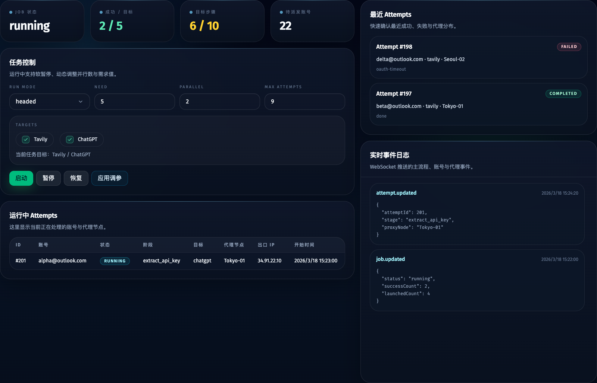
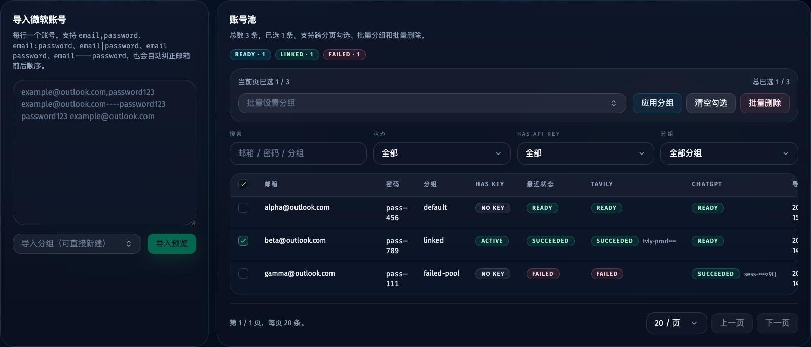
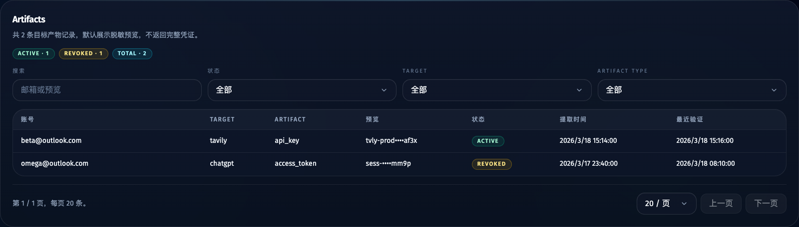

# Tavily 主流程 Provider 化并新增 ChatGPT 混合目标（#bcezs）

## 状态

- Status: 已实现（真实凭据 headed 验证待补）
- Created: 2026-03-26
- Last: 2026-03-26

## 背景 / 问题陈述

- 当前项目的 CLI、调度器、SQLite 和 Web 管理台都默认“微软账号只服务 Tavily”。
- 现有实现能稳定复用 Microsoft OAuth 登录 Tavily 并提取 API key，但无法在同一账号池里扩展到 ChatGPT Web。
- 如果继续把 Tavily 逻辑硬编码在 worker / DB / API / UI 中，新增第二个目标会导致调度规则、跳过逻辑和产物展示全部重复一份。

## 目标 / 非目标

### Goals

- 在保留 Tavily 默认能力的前提下，为主流程增加 `chatgpt` 目标。
- 支持单 job 选择一个或多个目标，同一账号在一个 worker / browser context 内按顺序串行执行目标集合。
- 抽出可复用的 Microsoft OAuth 自动化，分别供 Tavily 与 ChatGPT 目标复用。
- 将结果模型泛化为“账号目标状态 + 通用产物”，同时保留 Tavily 兼容投影。

### Non-goals

- 不重命名现有 `microsoft_accounts` / `api_keys` 表或所有前端字段。
- 不新增 Google / Apple / GitHub 等其他第三方登录提供商。
- 不覆盖 OpenAI Platform API key 创建、Sora、团队权限或非 `chatgpt.com` Web 能力。

## 范围（Scope）

### In scope

- CLI / worker 新增 `--targets <csv>` 与 `TARGETS` 环境变量。
- SQLite 新增 `account_target_states`、`artifacts`，并扩展 `jobs` / `job_attempts`。
- Scheduler 基于目标集合判断账号是否可派发，并消费标准化 `attempt-result.json`。
- Web API / UI 增加 targets、artifacts、账号 target 状态摘要。
- Tavily / ChatGPT 共用 Microsoft OAuth 编排；Tavily 继续提取 API key，ChatGPT 提取 `access_token` 并附脱敏 session 元数据。

### Out of scope

- 同一账号在多个目标上的并行执行。
- 真实生产级 secrets vault、权限分级或远程多用户部署。
- 对旧 `signup_tasks` 风控模型做 ChatGPT 扩展。

## 需求（Requirements）

### MUST

- 不传 `targets` 时默认只跑 `tavily`，保证 CLI / Web 兼容旧行为。
- `targets=["tavily","chatgpt"]` 时，同一账号必须按固定顺序串行执行，默认顺序 `tavily -> chatgpt`。
- Job 成功数只在账号完成全部所选目标后递增。
- `GET /api/accounts` 必须返回每个账号的 target 级状态摘要。
- `GET /api/artifacts` 必须同时支持 Tavily 与 ChatGPT 产物查询。
- `GET /api/api-keys` 必须保持为 Tavily-only 兼容别名。
- ChatGPT 产物默认只返回脱敏预览，不直接通过列表 API 暴露完整 token 或 session 原文。

### SHOULD

- 已存在 Tavily artifact 的账号，在 mixed-target job 中应直接跳过 Tavily 目标并继续执行 ChatGPT。
- 目标执行结果应写入标准化 `attempt-result.json`，优先作为 scheduler 真相源。

## 功能与行为规格（Functional/Behavior Spec）

### Core flows

- 启动 job 时可选择 `tavily`、`chatgpt` 或两者。
- Scheduler 只派发“未完成全部所选目标”的账号。
- Worker 初始化浏览器 / 代理一次后，按目标顺序执行：
  - Tavily：沿用现有登录与 API key 提取逻辑。
  - ChatGPT：通过 Microsoft OAuth 到达 ChatGPT 已登录首页，再捕获 `access_token`。
- Worker 结束后输出 `attempt-result.json`，由 scheduler 回写目标状态、产物、attempt 行和兼容投影。

### Edge cases / errors

- 若 mixed-target job 中 Tavily 成功但 ChatGPT 失败，账号必须保留 Tavily 成功产物，同时 job 不计成功。
- 若目标已有产物，worker 应把该目标标记为 `skipped_has_artifact` 并继续后续目标。
- 若 ChatGPT 登录后无法获得 session bootstrap / access token，应报出明确 target 级错误，不污染 Tavily 成功记录。

## 接口契约（Interfaces & Contracts）

### 接口清单（Inventory）

| 接口（Name） | 类型（Kind） | 范围（Scope） | 变更（Change） | 契约文档（Contract Doc） | 负责人（Owner） | 使用方（Consumers） | 备注（Notes） |
| --- | --- | --- | --- | --- | --- | --- | --- |
| Accounts API | HTTP API | internal | Modify | ./contracts/http-apis.md | server | web | 返回 targetStates |
| Jobs control API | HTTP API | internal | Modify | ./contracts/http-apis.md | server | web | start 支持 targets |
| Artifacts API | HTTP API | internal | New | ./contracts/http-apis.md | server | web | 通用产物列表 |
| Worker CLI | CLI | internal | Modify | ./contracts/cli.md | cli | scheduler/manual runs | 新增 `--targets` |
| App DB | DB | internal | Modify | ./contracts/db.md | storage | server/scheduler/web | 新增 target state / artifacts |

### 契约文档（按 Kind 拆分）

- [contracts/README.md](./contracts/README.md)
- [contracts/http-apis.md](./contracts/http-apis.md)
- [contracts/cli.md](./contracts/cli.md)
- [contracts/db.md](./contracts/db.md)

## 验收标准（Acceptance Criteria）

- Given 启动 Web job 时传入 `targets=["tavily"]`、`["chatgpt"]` 或 `["tavily","chatgpt"]`，When job 开始调度，Then 同一账号在一个 worker / browser context 内按顺序串行执行所选目标。
- Given 某账号已具备 Tavily artifact 但没有 ChatGPT artifact，When 启动 mixed-target job，Then worker 跳过 Tavily 并继续执行 ChatGPT，且账号只有在 ChatGPT 也成功后才计入 job success。
- Given ChatGPT 目标成功，When 查询 `/api/artifacts`，Then 能看到 `target=chatgpt`、`artifactType=access_token` 的脱敏产物记录。
- Given 旧前端或脚本仍调用 `/api/api-keys`，When 查询 Tavily 产物，Then 返回结果与旧契约兼容。
- Given 本次实现完成，When 执行 `bun run typecheck`、`bun test`、`bun run web:build`，Then 全部通过。

## 实现前置条件（Definition of Ready / Preconditions）

- 目标集合、成功计数语义和兼容策略已锁定
- HTTP / CLI / DB 契约已写入 `contracts/`
- 旧 Tavily-only 路径的兼容需求已明确

## 非功能性验收 / 质量门槛（Quality Gates）

### Testing

- Unit tests: AppDatabase migration / artifact projection / mixed-target eligibility
- Integration tests: scheduler runtime spec、API payload compatibility
- E2E tests (if applicable): 有凭据时进行一次 Tavily headed 与一次 ChatGPT headed 实跑

### Quality checks

- Lint / typecheck / formatting: `bun run typecheck`
- Tests: `bun test`
- Frontend build: `bun run web:build`

## 文档更新（Docs to Update）

- `docs/specs/README.md`: 新增本规格并在实现完成后更新状态
- `README.md`: 更新为 Tavily + ChatGPT mixed-target 入口说明
- `.env.example`: 新增 `TARGETS` 与 ChatGPT 必需域名说明

## 计划资产（Plan assets）

None

## Visual Evidence

- source_type: `storybook_canvas`
  target_program: `mock-only`
  capture_scope: `element`
  sensitive_exclusion: `N/A`
  submission_gate: `pending-owner-approval`
  story_id_or_title: `Views/DashboardView/Running`
  state: `mixed-target running`
  evidence_note: 验证主流程页新增 targets 选择、目标步骤进度和 attempt target 列。
  

- source_type: `storybook_canvas`
  target_program: `mock-only`
  capture_scope: `element`
  sensitive_exclusion: `N/A`
  submission_gate: `pending-owner-approval`
  story_id_or_title: `Views/AccountsView/Default`
  state: `account target summaries`
  evidence_note: 验证账号池同时展示 Tavily / ChatGPT 的目标状态和脱敏产物预览。
  

- source_type: `storybook_canvas`
  target_program: `mock-only`
  capture_scope: `element`
  sensitive_exclusion: `N/A`
  submission_gate: `pending-owner-approval`
  story_id_or_title: `Views/ApiKeysView/Default`
  state: `artifacts listing`
  evidence_note: 验证 Artifacts 视图展示 mixed-target 产物与 target/artifactType 过滤器。
  

## 资产晋升（Asset promotion）

None

## 实现里程碑（Milestones / Delivery checklist）

- [x] M1: 扩展 worker / CLI / Microsoft OAuth 复用能力，并支持 Tavily + ChatGPT 目标执行
- [x] M2: 扩展 SQLite / scheduler / result contract 以支持 targets、target states 与 artifacts
- [x] M3: 完成 Web API / UI 的 target-aware MVP
- [x] M4: 补齐测试与本地质量检查
- [ ] M5: 完成 review 收敛并达到 merge-ready

## 方案概述（Approach, high-level）

- 以“新增通用层 + 保留 Tavily 兼容投影”为主，不做大规模 rename。
- Microsoft OAuth 编排从 Tavily-specific 完成态判断中解耦，改为可注入的 provider 回调。
- Worker 产物先规范化，再由 scheduler / DB 做目标级归档和兼容映射。

## 风险 / 开放问题 / 假设（Risks, Open Questions, Assumptions）

- 风险：ChatGPT 的 Web session bootstrap 结构可能变动，需要以脱敏 metadata 保留调试线索。
- 风险：当前仓库无 `.env.local`，真实 headed 登录验证需依赖后续凭据补齐。
- 假设：ChatGPT Web 仍支持 Microsoft 登录并可从 first-party session bootstrap 获得 `access_token`。

## 变更记录（Change log）

- 2026-03-26: 初始化 mixed-target Tavily + ChatGPT 规格与接口契约。

## 参考（References）

- [Why can't I log in to ChatGPT?](https://help.openai.com/en/articles/7426629)
- [Resetting or Changing Your ChatGPT Password](https://help.openai.com/en/articles/4936828-how-do-i-change-my-account-password%23.webm)
