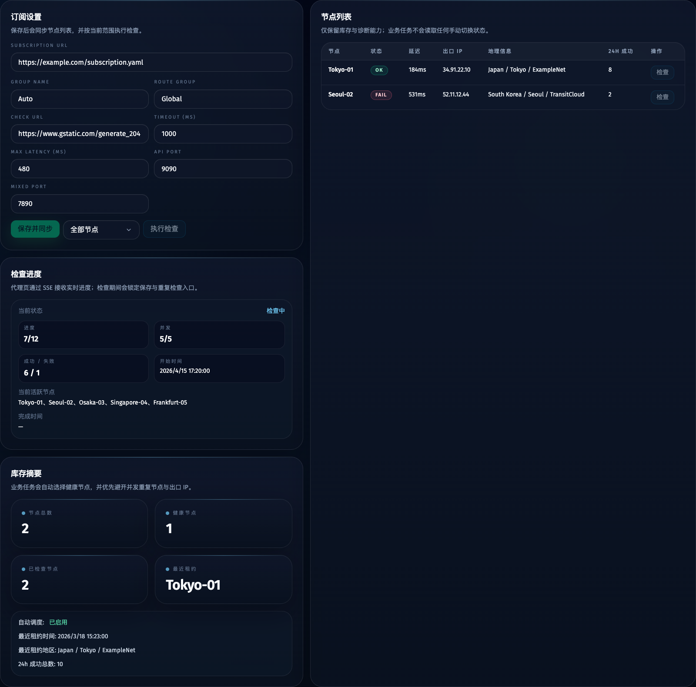
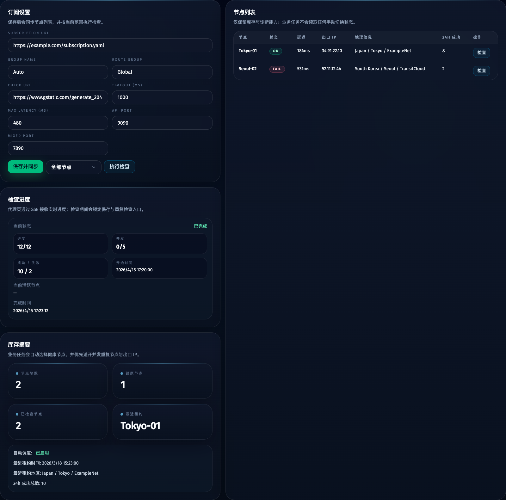
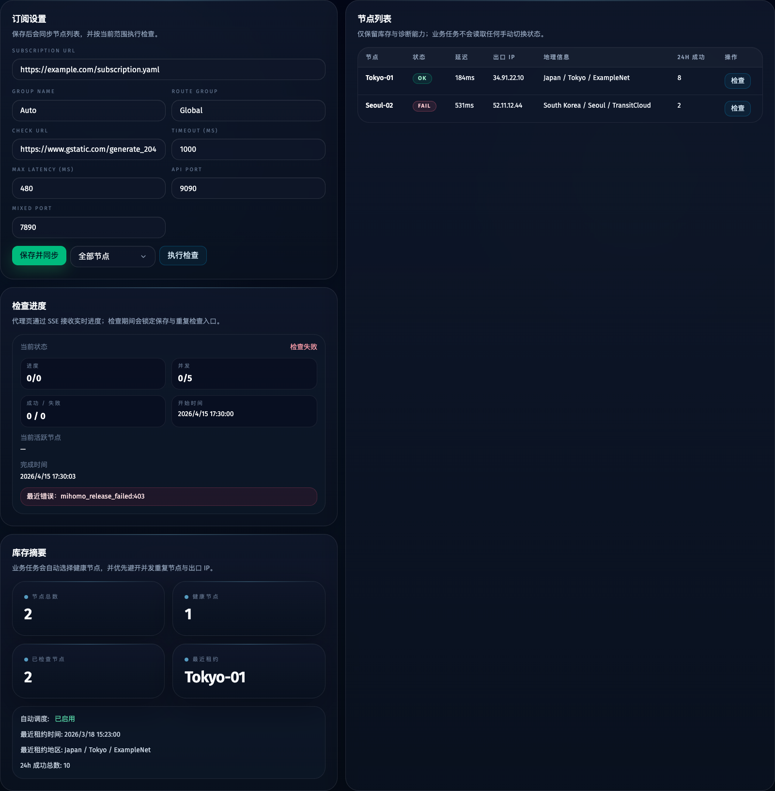

# 代理节点检查并发化 + SSE 进度流 + `/api/proxies` 快照化（#bqa97）

## 状态

- Status: 已完成
- Created: 2026-04-15
- Last: 2026-04-15

## 背景 / 问题陈述

- 当前 `POST /api/proxies/check` 会在请求内串行检查全部节点，单次全量检查耗时长时会一直占住处理链路。
- 当前 `GET /api/proxies` 会在读取时再次执行重型库存同步，并与检查路径共用同一串行锁，导致主人在代理页刷新时出现“接口长时间未响应”的体感。
- 代理页现有刷新方式主要依赖全站 WebSocket 触发后重新拉取整页快照，缺少针对代理检查过程的专用进度流，无法稳定表达“同步中/检查中/已完成/失败”状态。
- `checkNode()` 依赖 `setGroupProxy()` 切换 Mihomo 当前选中节点；若直接对同一个 controller 做并发检查，会因为共享全局选中状态而相互踩踏，结果不可信。

## 目标 / 非目标

### Goals

- 把全量代理检查改为默认 `5` 个 worker 的并发执行，并允许通过服务端环境变量覆盖并发数。
- 每个检查 worker 都持有独立 Mihomo controller 与独立端口租约，禁止共享全局选中状态。
- `POST /api/proxies/check` 改为异步启动；服务端维护单一 active check run，并持续输出进度快照。
- `GET /api/proxies` 改为只读当前快照，不再在读取路径执行重型同步。
- 新增 `/api/proxies/events` SSE，向代理页推送 `started / progress / completed / failed` 状态，并在连接建立时先发送当前快照。
- 任一节点完成检查后立即写入 `proxy_checks` / `proxy_nodes`，避免结果只在整批结束时一次性落库。
- 代理页显式展示检查状态、进度与活跃 worker，并在 active run 期间禁止重复启动检查与保存设置。

### Non-goals

- 不调整业务任务的代理自动分配策略。
- 不新增手动切换代理节点的能力。
- 不把全站 WebSocket 统一替换成 SSE；本次只为代理页补独立进度通道。
- 不在本次改动中把并发数做成主人可编辑的页面设置项。

## API / 数据契约

### `GET /api/proxies`

- 返回 `settings`、`nodes`、`syncError` 与新增的 `checkState`。
- `checkState` 至少包含：
  - `runId`
  - `status`（`idle | running | completed | failed`）
  - `scope`
  - `concurrency`
  - `total`
  - `completed`
  - `succeeded`
  - `failed`
  - `activeWorkers`
  - `currentNodeNames`
  - `startedAt`
  - `finishedAt`
  - `error`
- 接口不得在请求内执行 `syncProxyInventory()`；只读取当前数据库快照与内存运行态。

### `POST /api/proxies/check`

- 改为快速返回 `{ ok, accepted, checkState }`。
- 当 `scope=all` 时：
  - 若当前无 active run，则启动新的全量检查并立刻返回 `accepted=true`。
  - 若当前已有 active run，则不重复启动，返回 `accepted=false` 与当前 `checkState`。
- 当 `scope=node` 时：
  - 保持单节点检查能力，但结果也需要更新 `checkState` 快照与节点落库口径。
- 当配置缺失或 scope 非法时，返回明确错误。

### `GET /api/proxies/events`

- 使用 `text/event-stream`。
- 连接建立后先发送一次当前 `checkState` 快照。
- 运行期间推送：
  - `proxy.check.started`
  - `proxy.check.progress`
  - `proxy.check.completed`
  - `proxy.check.failed`
- 每条事件都带最新 `checkState`；进度事件额外带当前刚完成节点的结果与最新节点快照（如需要）。

## 行为规格

### 并发检查编排

- 新增独立 proxy-check coordinator 负责：
  - 维护 active run
  - 生成 `runId`
  - 防重入
  - worker 池调度
  - 进度快照更新
  - 每节点完成即落库/广播
- 默认并发数为 `5`，从 `PROXY_CHECK_CONCURRENCY` 读取覆盖值，最小值为 `1`。
- 全量检查通过 worker 池消费节点队列；同一时刻在途 worker 数不得超过并发上限。
- 每个 worker 必须：
  - 单独申请 Mihomo `apiPort` / `mixedPort` 租约
  - 单独启动 Mihomo controller
  - 对目标节点执行 `testDelay -> setGroupProxy -> geo lookup`
  - 结束后无论成功失败都释放端口与 controller
- 单节点完成后立即：
  - 更新内存快照计数
  - 调用 `db.recordProxyCheck()`
  - 广播 SSE / WebSocket 事件
- active run 结束后，`checkState` 保留最近一次终态快照，供刷新页面时立即恢复。

### 代理读取与配置变更

- `GET /api/proxies` 只返回快照，不得因检查进行中而阻塞。
- `POST /api/proxies/settings` 在 active check run 存在时必须拒绝，返回明确错误，避免运行中修改订阅或端口导致结果失真。
- 当订阅为空时，`nodes=[]`，`checkState` 仍需返回 idle 快照。

### 代理页 UI

- 代理页新增检查状态区，展示：
  - 当前状态
  - 已完成/总数
  - 成功/失败数
  - 当前活跃节点
  - 开始/完成时间
  - 最近错误（若有）
- active run 期间：
  - “执行检查”按钮禁用
  - “保存并同步”按钮禁用
  - 页面通过 `/api/proxies/events` 实时更新，不依赖反复轮询整页数据
- 重新进入 `/proxies` 页面时，前端先拉取 `GET /api/proxies`，随后通过 SSE 接上实时进度。

## 验收标准（Acceptance Criteria）

- Given 已启动全量检查，When 客户端请求 `GET /api/proxies`，Then 接口快速返回快照且包含 `checkState`，不会被检查流程长时间阻塞。
- Given 节点数大于 `5`，When 服务端执行全量检查，Then 同时在途的检查 worker 不超过 `5`，且每个 worker 使用独立 Mihomo controller 与独立端口租约。
- Given 任一节点完成检查，When 结果产生，Then 该节点记录立即写入 `proxy_checks` / `proxy_nodes`，并通过 `/api/proxies/events` 推送最新进度，而不是等整批结束。
- Given 用户在代理页停留，When 检查进行中，Then 页面能持续显示 running 状态、进度计数与当前活跃节点；刷新页面后可通过初始快照恢复到当前真实进度。
- Given 已有 active check run，When 再次点击“执行检查”或尝试保存代理设置，Then 前后端都会明确阻止该操作。
- Given 检查完成或失败，When SSE 推送终态，Then 页面恢复可操作状态，节点列表展示最终最新结果，且无需额外等待一次重型同步。

## Visual Evidence

- source_type: storybook_canvas
  story_id_or_title: `Views/ProxiesView/Running`
  state: 并发检查进行中
  evidence_note: 验证代理页在 active run 期间显示实时进度、活跃节点与并发计数，并禁用“保存并同步 / 执行检查 / 单节点检查”入口。

- source_type: storybook_canvas
  story_id_or_title: `Views/ProxiesView/Completed With Failures`
  state: 检查完成
  evidence_note: 验证检查完成后显示终态汇总、完成时间与成功/失败计数，页面回到可操作的完成态。

- source_type: storybook_canvas
  story_id_or_title: `Views/ProxiesView/Failed State`
  state: 检查失败
  evidence_note: 验证 orchestration 失败时展示失败态与最近错误文案，而不是让页面停留在无响应的空白状态。

## 里程碑

- [x] M1: proxy-check coordinator、并发 worker 池与独立 Mihomo 实例落地
- [x] M2: `/api/proxies`、`/api/proxies/check`、`/api/proxies/events` 契约改造完成
- [x] M3: 代理页状态展示、SSE 接入与 Storybook 覆盖完成
- [x] M4: 测试、构建、视觉证据与 review 收敛完成

## 文档更新（Docs to Update）

- `docs/specs/README.md`
- `docs/specs/bqa97-proxy-check-progress-stream/SPEC.md`
