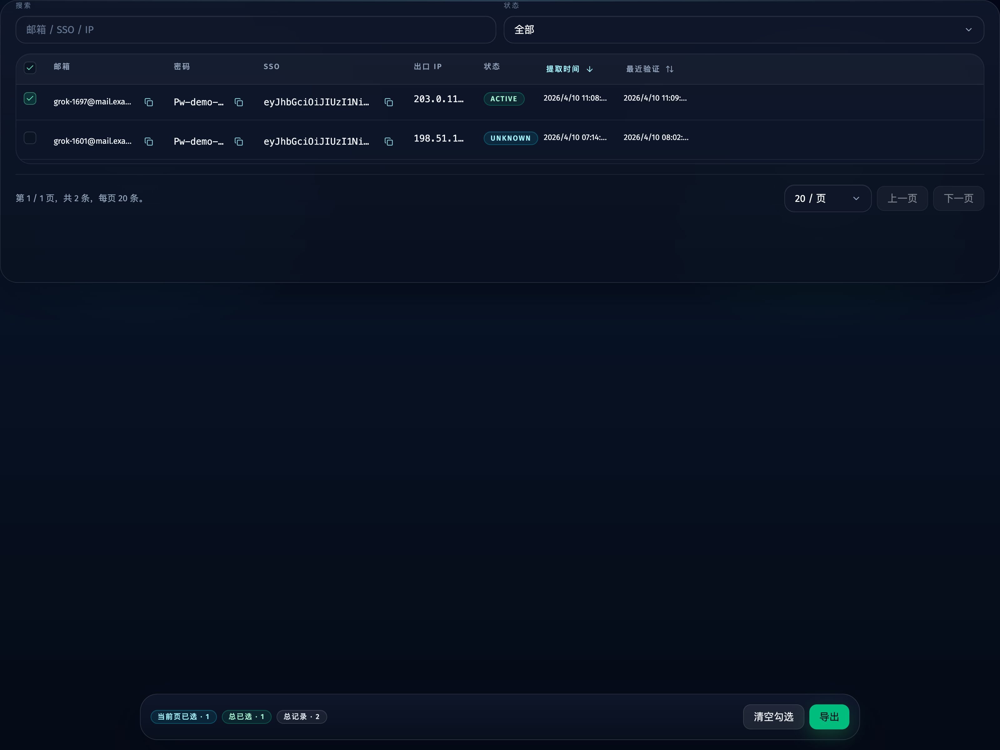
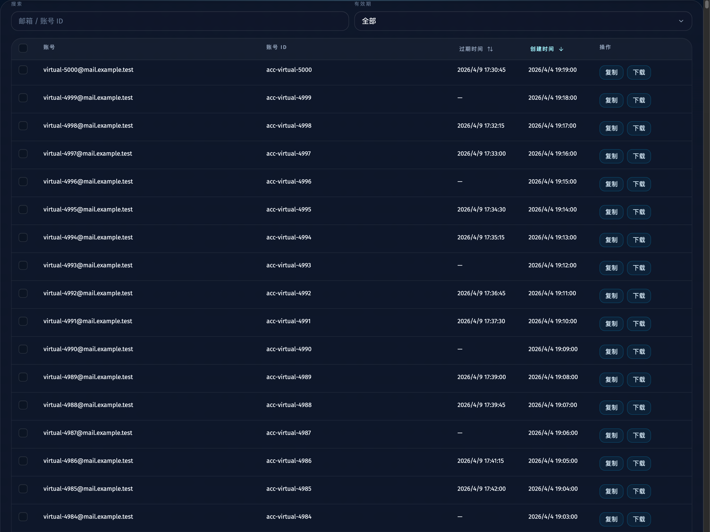
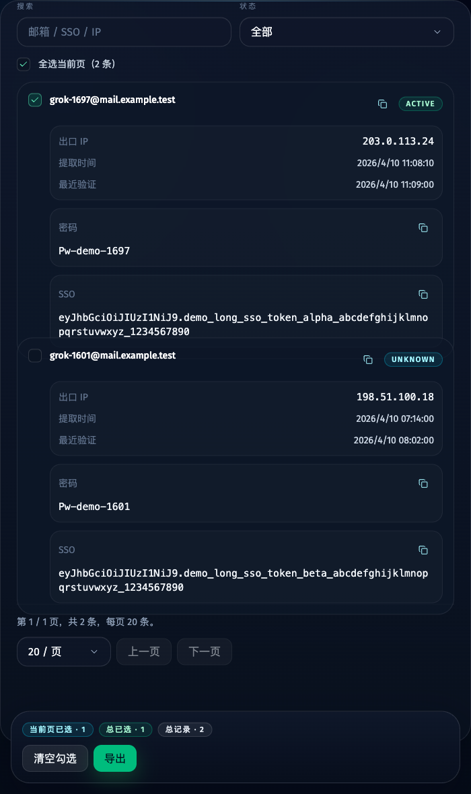
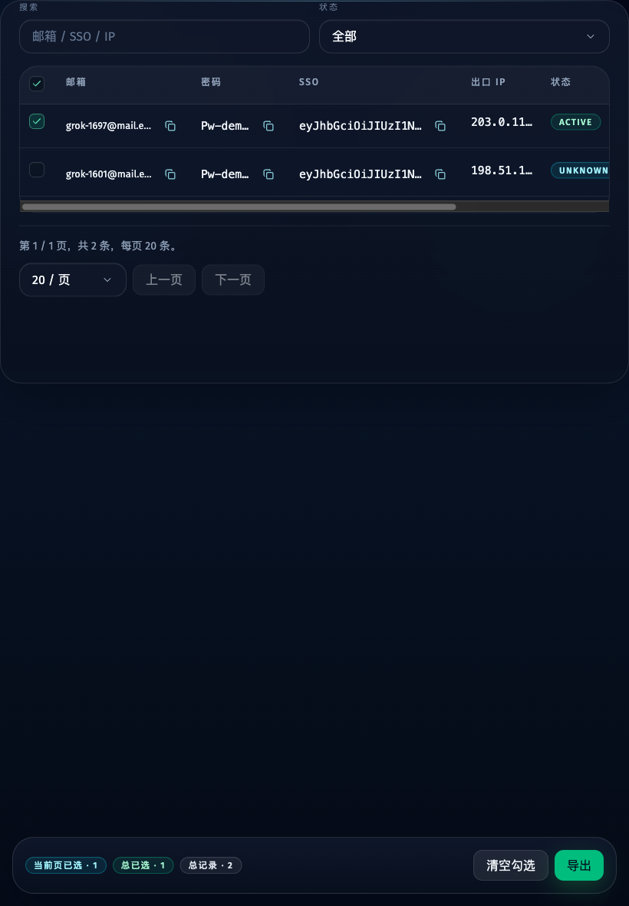

# Keys 页面信息架构与大数据列表性能收敛（#gvabx）

## 状态

- Status: 已完成
- Created: 2026-04-23
- Last: 2026-04-23

## 背景 / 问题陈述

- 站点页打开 Keys 时，首屏先出现一块独立说明卡片，纵向空间浪费明显，且 owner-facing 文案里包含错误的“站内 / 子视图”表述。
- Tavily / Grok / ChatGPT 三套 Keys 面板的批量操作区长期占位，未勾选时仍然消耗首屏空间。
- Tavily / Grok 的服务端 `pageSize` 仍被静默限制到 `100`；ChatGPT keys 仍停留在“最近 20 条”接口，无法形成真实分页。
- 大页尺寸下三套列表都是逐行全量渲染，数据量扩大后会直接拖慢页面。

## 目标 / 非目标

### Goals

- 删除站点 Keys 页那块独立说明壳子，收敛为轻量页首导航行，并彻底移除 owner-facing“站内 / 子视图”文案。
- 批量操作区改为仅在存在勾选项时显示的底部固定浮动条，持续展示“当前页已选 / 总已选 / 总记录”真实计数。
- Tavily / Grok / ChatGPT 的分页器统一支持 `10 / 20 / 50 / 100 / 500 / 1000 / 5000`。
- ChatGPT keys 升级为真实服务端分页接口，前后端统一 `page / pageSize / total / summary` 契约。
- 三套列表改为基于浏览器窗口滚动的虚拟列表，纵向滚动条继续只出现在整页，而不是列表内部。

### Non-goals

- 不改变单条复制、单条下载、Tavily `key | ip` 导出、Grok SSO 导出、ChatGPT JSON 导出格式。
- 不调整 Tavily / Grok / ChatGPT worker、scheduler、SQLite 存储语义。
- 不引入列表内纵向滚动容器。

## 范围（Scope）

### In scope

- `SiteKeysView`、`ApiKeysView`、`GrokApiKeysView`、`ChatGptCredentialsView`、`KeysView`。
- `GET /api/chatgpt/credentials` 的分页契约补齐。
- Tavily / Grok 的后端 pageSize 上限提升。
- Keys 相关 Storybook、spec 索引与既有 spec current truth 修正。

### Out of scope

- 非 Keys 页面布局调整。
- 新增后端导出接口。
- 账号页 / mailbox 页的信息架构调整。

## 接口契约（Interfaces & Contracts）

### `GET /api/chatgpt/credentials`

- Request:
  - `page`
  - `pageSize`
  - `sortBy`
  - `sortDir`
  - `q`
  - `expiryStatus`
- Response:
  - `rows`
  - `total`
  - `page`
  - `pageSize`
  - `summary.valid`
  - `summary.expired`
  - `summary.noExpiry`

### Shared pagination options

- Web 端统一常量：`[10, 20, 50, 100, 500, 1000, 5000]`
- Tavily / Grok / ChatGPT 后端最大 pageSize：`5000`

## 功能与行为规格（Functional / Behavior Spec）

### 站点 Keys 页头部

- Tavily / Grok / ChatGPT 的站点 Keys 页不再展示说明卡片。
- 顶部仅保留轻量导航行：左侧 `返回任务控制`，右侧 `查看 <Site> Keys`。
- 页面与文档中的 owner-facing 文案不得再出现“站内 / 子视图”。

### 批量操作浮动条

- 当 `selectedIds.length === 0` 时，不显示批量操作浮动条。
- 当存在勾选项时，在视口底部显示固定浮动条。
- 浮动条必须显示：
  - `当前页已选`
  - `总已选`
  - `总记录`
- Tavily 保留 `清空勾选` + `导出`。
- Grok 保留 `清空勾选` + `导出`。
- ChatGPT 保留 `清空勾选` + `批量补号` + `导出`。

### 分页与跨页勾选

- Tavily / Grok / ChatGPT 都必须支持真实分页。
- 翻页、回页、改页尺寸、排序、筛选后，已勾选 ID 不得只剩当前页。
- ChatGPT 的批量导出必须能处理当前页以外的已选记录。

### 虚拟列表

- 三套列表使用窗口虚拟化，仅渲染视口附近行。
- 纵向滚动继续依赖 `window`；列表内只允许横向溢出滚动。
- 桌面端使用“静态列头 + 虚拟化行层”；移动端继续显示卡片化记录，但也走同一虚拟化数据窗口。
- 三套 keys 列表统一在 `md` 以下才切换为卡片布局；`md` 及以上继续优先保留表格布局。

## 验收标准（Acceptance Criteria）

- Given 用户从任一站点页打开 Keys
  When 页面渲染完成
  Then 不再出现大块说明卡片，也不再出现“站内 / 子视图”文案。

- Given 用户没有勾选任何记录
  When 页面渲染完成
  Then 不显示底部浮动批量条。

- Given 用户勾选任意记录
  When 页面停留在 Keys 列表
  Then 视口底部出现固定浮动条，并显示当前页已选、总已选与总记录。

- Given 用户把页尺寸切到 `5000`
  When 页面渲染大数据列表
  Then 只渲染视口附近行，纵向滚动条依旧只在浏览器页面本身出现。

- Given 用户在 ChatGPT keys 中跨页勾选多条记录
  When 点击导出
  Then 导出结果包含全部已勾选记录，而不是仅当前页。

## 非功能性验收 / 质量门槛（Quality Gates）

### Testing

- `bun run typecheck`
- `bun test`
- `bun run web:build`
- `bun run build-storybook`

### UI / Storybook

- Stories to add/update: `ApiKeysView`、`GrokApiKeysView`、`ChatGptCredentialsView`、`KeysView`、`SiteKeysView`
- `play` coverage to add/update:
  - 错误文案清除
  - 底部浮动条显隐
  - 跨页勾选保留
  - 7 档 pageSize
  - ChatGPT 服务端分页
  - 5000 条大数据虚拟化

## 文档更新（Docs to Update）

- `docs/specs/README.md`
- `docs/specs/8qyzh-nav-keys-mailbox-consolidation/SPEC.md`

## Visual Evidence

- source_type: `storybook_canvas`
  story_id_or_title: `Views/SiteKeysView/CompactHeader`
  state: `site keys compact header`
  evidence_note: 验证站点 Keys 页首已收敛为轻量导航行，且 owner-facing 文案不再出现“站内 / 子视图”。
  

- source_type: `storybook_canvas`
  story_id_or_title: `Views/ApiKeysView/ActionsOnly`
  state: `tavily floating selection dock`
  evidence_note: 验证 Tavily keys 勾选后使用底部固定浮动条承载批量操作，不再占据列表顶部空间。
  

- source_type: `storybook_canvas`
  story_id_or_title: `Views/GrokApiKeysView/ActionsOnly`
  state: `grok floating selection dock`
  evidence_note: 验证 Grok keys 勾选后同样使用底部浮动条，并保留导出语义。
  

- source_type: `storybook_canvas`
  story_id_or_title: `Views/ChatGptCredentialsView/Virtualized5000Rows`
  state: `chatgpt virtualized large dataset`
  evidence_note: 验证 ChatGPT keys 支持大页尺寸与整页窗口虚拟列表。
  

- source_type: `storybook_canvas`
  story_id_or_title: `Views/GrokApiKeysView/CompactBelowMd`
  state: `grok keeps card layout below md`
  evidence_note: 验证 Grok keys 在 700px 视口仍处于 `md` 以下，因此使用卡片布局。
  

- source_type: `storybook_canvas`
  story_id_or_title: `Views/GrokApiKeysView/MediumTableLayout`
  state: `grok keeps table layout at md and above`
  evidence_note: 验证 Grok keys 在 820px 视口已进入 `md`，恢复表格布局。
  

## 方案概述（Approach）

- 以共享分页配置、共享底部浮动条和共享窗口虚拟列表为核心，把三套 Keys 面板收敛到同一交互骨架。
- 对 ChatGPT keys 先补齐服务端分页契约，再把前端跨页选择与导出切到 ID 驱动。
- 用 Storybook 产出稳定截图，作为 owner-facing 视觉验收主源。

## 风险 / 假设

- 风险：窗口虚拟列表依赖 `scrollMargin` 与稳定的行高估算，若后续页面顶部结构或行高密度明显变化，需要同步校正偏移量与估算值。
- 假设：跨页勾选默认基于全局已选 ID 集，而不是“当前筛选结果全集”的隐式选择语义。

## 参考（References）

- `docs/specs/8qyzh-nav-keys-mailbox-consolidation/SPEC.md`
- `docs/specs/m9jnq-keys-dual-source-page/SPEC.md`
- `docs/specs/vhvds-chatgpt-upstream-account-supplement/SPEC.md`
