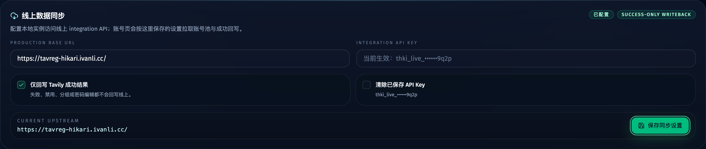
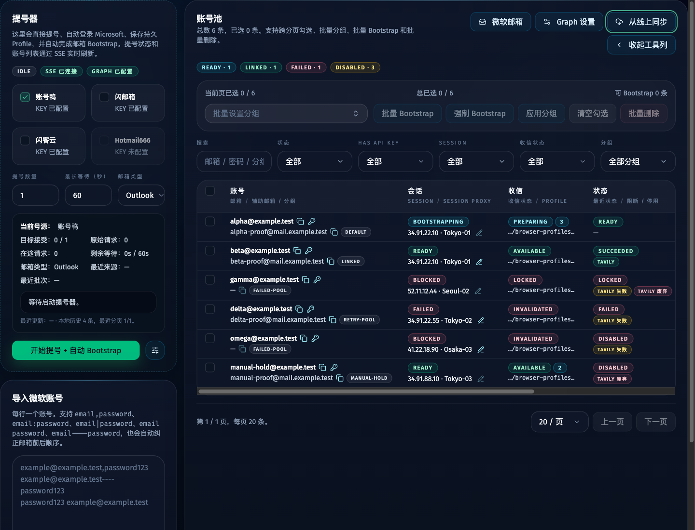
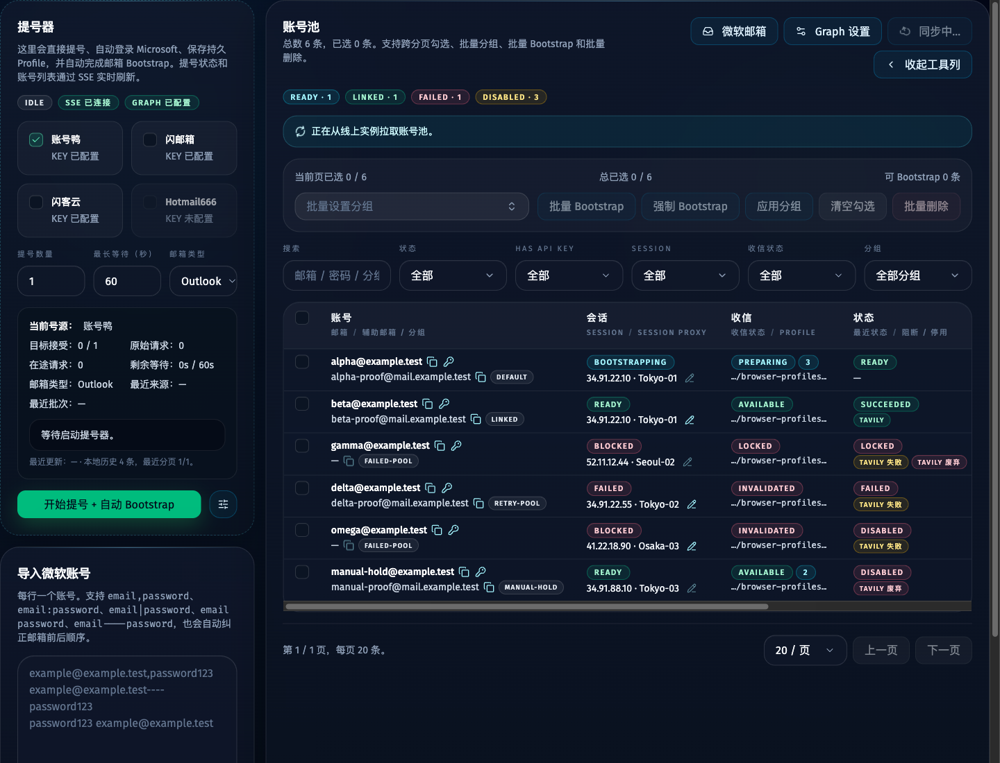
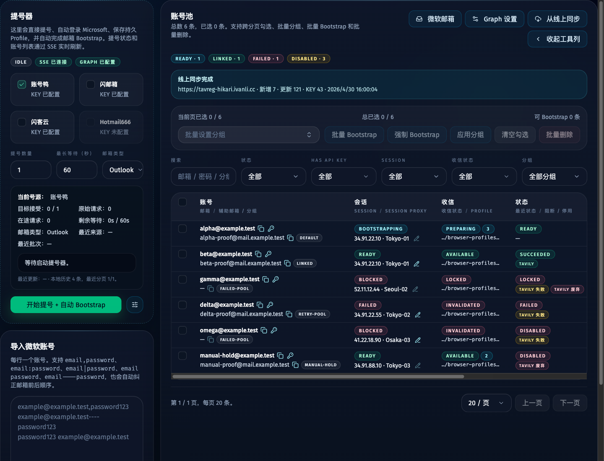
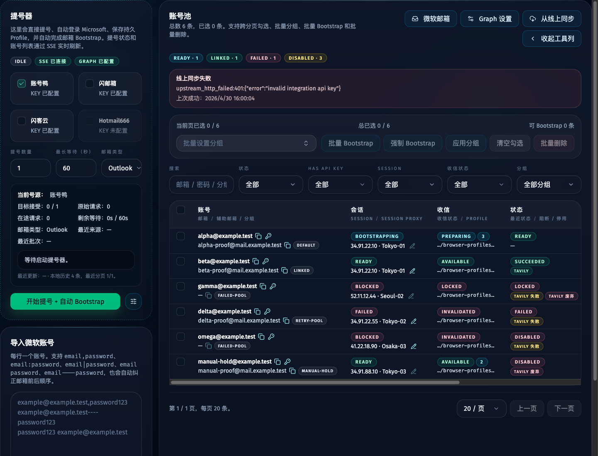

# 线上账号数据同步到本地实例（#hn72q）

## 状态

- Lifecycle: active
- Created: 2026-04-30
- Last: 2026-04-30

## 背景 / 问题陈述

- 生产实例已经长期维护 Microsoft 账号、proof mailbox、Tavily API key 与服务接入快照。
- 本地 worktree 适合有头浏览器调试，但默认只能消费本地 SQLite 与本地 profile，无法直接复现线上 `/accounts` 的真实账号池。
- 直接复制线上 SQLite 或 Chrome profile 风险高，且跨机器/跨系统路径不可稳定复用。

## 目标 / 非目标

### Goals

- 让本地 `/accounts` 可手动从线上 Tavreg Hikari integration API 拉取账号数据并落入本地 SQLite。
- 本地按 `microsoftEmail` upsert 账号，并保存线上来源映射：`upstream_origin`、`upstream_account_id`、`upstream_synced_at`。
- 同步账号密码、分组、proof mailbox、账号状态摘要、Tavily key 与 Tavily service access snapshot。
- 保留本地运行态：browser profile path、lease、job history 与本地 session 状态不由线上快照覆盖。
- 仅在本地 Tavily 成功时，把成功结果回写线上；失败、禁用、分组编辑与密码编辑不回写。

### Non-goals

- 不复制线上 SQLite 整库、WAL 或浏览器 profile 目录。
- 不绕过线上 SSO；实例间访问只使用 integration API key。
- 不做双向账号编辑同步。
- 不让远端 session 状态把本地账号伪装成 `ready`。
- 不为 Grok / ChatGPT 引入线上回写。

## 配置契约

- 本地 `/settings` 提供“线上数据同步”设置卡片，所有 upstream sync 配置都保存到 `app_settings`，不通过环境变量配置。
- `upstreamTavregBaseUrl`
  - 默认：`https://tavreg-hikari.ivanli.cc`
  - 用于本地同步与成功回写的线上实例 base URL。
- `upstreamTavregApiKey`
  - 填写后才允许同步或回写。
  - 使用 `Authorization: Bearer <key>` 访问 production integration API。
- `upstreamTavregWriteback`
  - 默认：`off`
  - `success_only` 时，本地 Tavily 成功结果允许回写线上。

## 接口契约

### Internal local API

- `POST /api/upstream-sync/accounts`
  - 范围：`internal`
  - 行为：从 settings 保存的 upstream base URL 分页拉取 `/api/integration/v1/microsoft-accounts`，再逐账号拉详情并 upsert 本地库。
  - 响应：返回 `created / updated / total / linkedApiKeys / upstreamOrigin / startedAt / completedAt`。
  - 错误：配置缺失、上游认证失败或上游响应结构无效时返回 `{ error }`；不得写入半解析的无效账号。
- `GET /api/upstream-sync/settings`
  - 范围：`internal`
  - 行为：返回 base URL、masked API key、是否已配置与当前回写模式。
- `POST /api/upstream-sync/settings`
  - 范围：`internal`
  - 行为：保存 base URL、API key、清除 API key 标记与回写模式。

### Integration v1 read API

- `GET /api/integration/v1/microsoft-accounts`
  - 列表继续不返回明文密码或本机 profile path。
  - 列表需要返回账号状态、分组、proof mailbox、Tavily/Microsoft Mail 服务摘要。
- `GET /api/integration/v1/microsoft-accounts/:id`
  - 详情返回同步所需的明文密码、Tavily API key、Tavily service access snapshot 与 mailbox 摘要。

### Integration v1 writeback API

- `POST /api/integration/v1/microsoft-accounts/:id/tavily-success`
  - 仅接受 Tavily 成功结果。
  - 请求体必须包含 `microsoftEmail` 与 `apiKey`；若 path id 与邮箱不匹配，返回 `409`。
  - 可选接收 `extractedIp`、`lastSuccessAt`、`cookiesSnapshot`、`browserFingerprintSnapshot`、`apiKeyPrefix`。
  - 服务端必须幂等调用现有 key/service access 记录逻辑。

## 数据与状态规则

- 本地同步以线上账号为来源，但不得删除本地已存在的 Tavily key；如果线上未返回 key 而本地已有 key，保留本地 key。
- 新同步账号的本地 `account_browser_sessions` 初始为 `pending`，profile path 仍固定为本地 `output/browser-profiles/accounts/<accountId>/chrome`。
- 本地已有账号同步后保留其本地 session row 与 profile path；仅更新账号元数据与上游映射。
- 同步导入的 Tavily service snapshot 应写入 `account_service_access(service='tavily')`，供 integration detail 与本地状态摘要复用。
- 回写失败必须非致命：本地成功结果仍保留在本地，只在 UI/toast/log 里暴露失败原因。

## 验收标准

- Given 本地配置了有效 upstream API key，When 在 `/accounts` 点击“从线上同步”，Then 本地账号池出现线上账号、分组、proof mailbox、Tavily key 与服务摘要。
- Given 线上账号有 ready session，When 同步到本地，Then 本地 session 不会被标为 ready，仍需本地 bootstrap/profile。
- Given 本地 Tavily 单账号或批量 attempt 成功，When settings 中 `upstreamTavregWriteback=success_only`，Then 成功结果回写线上并按账号 id + email 校验。
- Given 上游认证失败或配置缺失，When 点击同步，Then UI 显示失败原因且本地账号池不被破坏。
- Given 写回失败，When 本地 attempt 已成功，Then 本地 key 与 service snapshot 保留，attempt 不回滚。

## 非功能性验收 / 质量门槛

- Unit/integration tests 覆盖：上游同步 upsert、integration writeback 校验、Tavily key 幂等记录、写回失败非致命。
- UI/Storybook 覆盖：`/settings` 同步配置状态，`/accounts` 同步 idle/loading/success/error 状态与一次点击行为。
- Quality checks：`bun test`、`bun run typecheck`、`bun run web:build`、`bun run build-storybook`。

## Visual Evidence

- source_type: storybook_canvas
  story_id_or_title: `Views/ApiAccessSettingsView/UpstreamSyncSettingsPlay`
  scenario: `/settings` upstream sync configuration
  evidence_note: settings page contains persisted production URL, API key state, clear-key control, and success-only writeback toggle.

- source_type: storybook_canvas
  story_id_or_title: `Views/AccountsView/UpstreamSyncIdlePlay`
  scenario: `/accounts` manual sync idle state
  evidence_note: accounts page exposes manual upstream sync entry and last-sync summary.

- source_type: storybook_canvas
  story_id_or_title: `Views/AccountsView/UpstreamSyncRunning`
  scenario: `/accounts` manual sync loading state
  evidence_note: accounts page keeps sync operation visible while the upstream pull is running.

- source_type: storybook_canvas
  story_id_or_title: `Views/AccountsView/UpstreamSyncSucceeded`
  scenario: `/accounts` manual sync success state
  evidence_note: accounts page reports created, updated, linked key, and upstream origin summary.

- source_type: storybook_canvas
  story_id_or_title: `Views/AccountsView/UpstreamSyncFailed`
  scenario: `/accounts` manual sync error state
  evidence_note: accounts page shows a clear upstream sync error without destroying local state.

