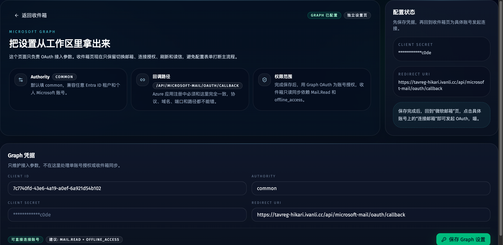
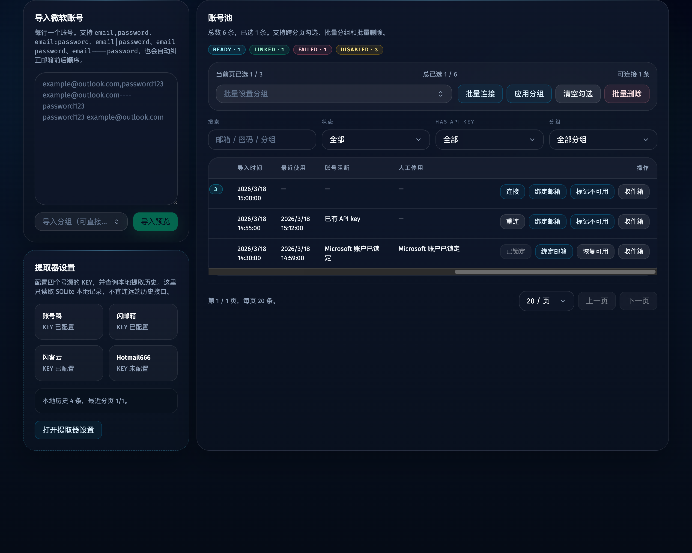
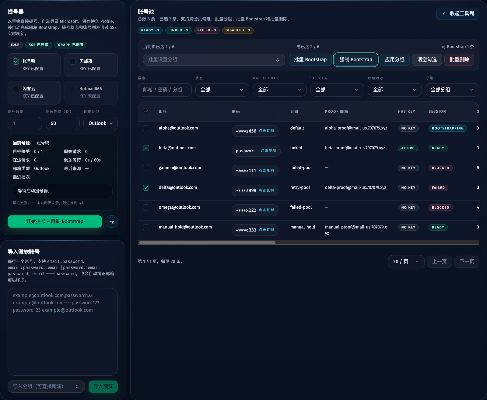
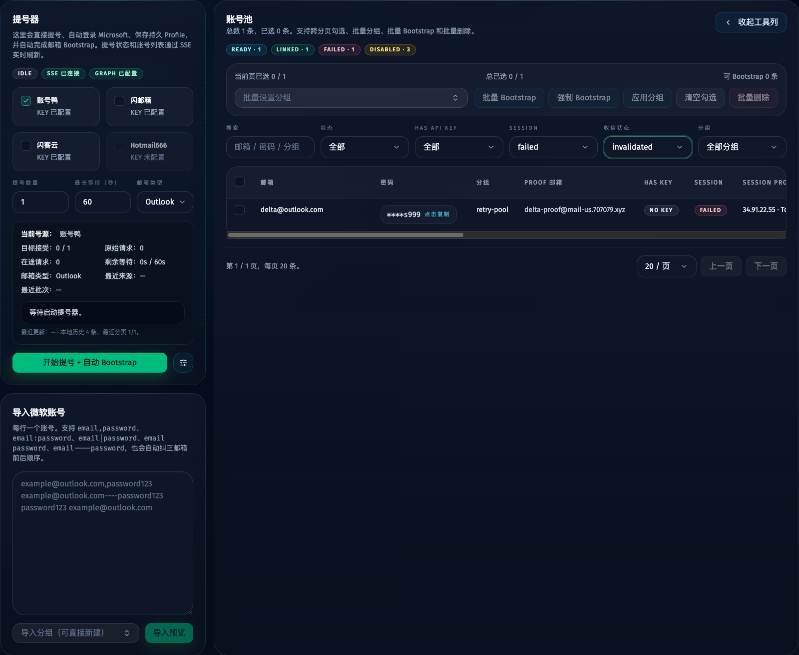

# 微软邮箱 Graph/OAuth 收信模块（#jg53e）

## 状态

- Status: 已完成
- Created: 2026-03-28
- Last: 2026-04-26

## 背景 / 问题陈述

- 当前 Web 管理台只管理微软账号池与 API key 提取，没有独立的收信视图，导入账号后无法直接查看 Inbox。
- 收信需求已经明确绑定 Microsoft Graph OAuth，而不是邮箱密码直登，所以导入账号后除了账号池记录，还需要为每个账号维护独立 mailbox/OAuth/sync 状态。
- 账号页需要同时暴露“这个微软账号是否已接入收信功能”的状态，否则用户无法分辨哪些账号待授权、哪些账号已可收信、哪些账号授权已经失效。

## 目标 / 非目标

### Goals

- 新增独立 `/mailboxes` 页面，使用左侧账号列表 / 中间邮件列表 / 右侧正文的三栏布局，并且只展示已完成 Bootstrap 的微软邮箱。
- 新增独立 `/mailboxes/settings` 页面，用于维护 Microsoft Graph `client id / client secret / redirect uri / authority`。
- 每次导入或更新微软账号时自动确保存在对应 `microsoft_mailboxes` 记录，默认状态为 `preparing`。
- 用 Microsoft Graph OAuth 授权码流 + web callback 接入 Inbox 只读同步，固定回调路径为 `/api/microsoft-mail/oauth/callback`。
- Graph 设置完整后，系统在自有 Chromium 浏览器中自动完成 Microsoft 登录、proof 与 consent，不要求用户手动点击 OAuth 页面。
- 在本地 `app_settings` 中保存 Graph 设置，在账号页显示收信状态，并由账号页承载单账号与批量串行 Bootstrap；邮箱页只保留浏览与手动刷新，配置维护移到独立设置页。
- 本地缓存 Inbox 邮件，并保留 HTML 正文净化渲染能力。

### Non-goals

- 不实现发信、回复、删除、移动邮件、附件下载与多文件夹树。
- 不实现全账号后台轮询守护。
- 不把导入账号自动等同于“已授权可收信”；导入后会自动排队执行浏览器授权，但失败后仍需用户手动重试。

## 数据模型

### `app_settings`

- 新增：
  - `microsoftGraphClientId`
  - `microsoftGraphClientSecret`
  - `microsoftGraphRedirectUri`
  - `microsoftGraphAuthority`

### `microsoft_mailboxes`

- `account_id`：与 `microsoft_accounts.id` 一对一
- `status`：`preparing | available | failed | invalidated | locked`
- `sync_enabled`
- `refresh_token`
- `access_token`
- `access_token_expires_at`
- `graph_user_id`
- `graph_user_principal_name`
- `graph_display_name`
- `authority`
- `oauth_state`
- `oauth_code_verifier`
- `oauth_started_at`
- `oauth_connected_at`
- `delta_link`
- `unread_count`
- `last_synced_at`
- `last_error_code`
- `last_error_message`
- `created_at`
- `updated_at`

### `microsoft_mail_messages`

- `mailbox_id`
- `graph_message_id`
- `internet_message_id`
- `conversation_id`
- `subject`
- `from_name`
- `from_address`
- `received_at`
- `is_read`
- `has_attachments`
- `body_content_type`
- `body_preview`
- `body_content`
- `web_link`
- `created_at`
- `updated_at`
- 约束：`UNIQUE(mailbox_id, graph_message_id)`
- 保留策略：每个 mailbox 最多缓存最近 `500` 封

## API 合约

- `GET /api/microsoft-mail/settings`
- `POST /api/microsoft-mail/settings`
- `GET /api/microsoft-mail/mailboxes`
  - 返回值限定为“已完成 Bootstrap 或已有有效收信状态”的 mailbox；仅 `preparing` 且从未完成 OAuth 的账号不会出现在收件箱工作台。
- `POST /api/microsoft-mail/accounts/:accountId/oauth/start`
- `GET /api/microsoft-mail/oauth/callback`
- `POST /api/microsoft-mail/mailboxes/:mailboxId/sync`
- `GET /api/microsoft-mail/mailboxes/:mailboxId/messages`
- `GET /api/microsoft-mail/messages/:messageId`

## 行为规格

### OAuth / Graph 设置

- Graph 设置默认 authority 为 `common`，以兼容任意 Entra ID 租户与个人 Microsoft 账号。
- `/mailboxes/settings` 是 Graph 凭据的唯一维护入口；收件箱工作台不再内嵌配置表单。
- 微软账号页是唯一 Bootstrap 入口：支持单账号 Bootstrap，以及基于勾选集的默认批量 Bootstrap / 强制 Bootstrap 两种模式；锁定或人工禁用账号不会发起 Bootstrap。
- OAuth start 为每个 mailbox 生成独立 `state + PKCE`，然后由后端拉起自有 Chromium 浏览器完成授权，不再把 `authUrl` 暴露给前端跳转。
- 导入账号成功后，如果 Graph 设置完整且该 mailbox 仍未授权、已失败或已失效，系统会自动排队触发一次浏览器授权。
- callback 成功后写入 refresh token、access token、过期时间与 Graph 用户信息，并重定向回 `/mailboxes?accountId=<id>&oauth=<success|error>`。
- 浏览器自动化若最终没有回到 callback 或 `/mailboxes?...oauth=...`，必须判定为 OAuth 未完成并写入失败态，不能把中间页误当作成功。
- 如果 callback 已成功写入 `refresh_token` / `oauth_connected_at`，该 DB 授权事实优先于浏览器最终 URL；即使浏览器最终停在 SSO 中继页或 worker 回传了非完成态中间 URL，也必须改写为 OAuth success 收敛，不能覆盖为失败。
- worker 回查本地 mailbox detail API 时必须携带受信任 Forward Auth 共享密钥与内部 worker 身份头，避免被 internal gate 拦截导致授权事实不可见。
- 默认“批量 Bootstrap”只处理 `session != ready` 或 `mailbox != available` 的账号；“强制 Bootstrap”忽略这条成功判定，但两者都继续跳过锁定、禁用、占用中和当前 `bootstrapping` 的账号。

### 收信状态语义

- `preparing`：已纳入收信模块，但尚未完成首个成功同步，或者仍未完成 OAuth。
- `available`：refresh token 可用，最近一次同步成功。
- `failed`：最近一次 OAuth 或同步失败，但仍可直接重试。
- `invalidated`：Graph 返回 `invalid_grant`、`interaction_required`、`consent_required` 等必须重新授权的错误。
- `locked`：微软明确返回账号锁定，系统同步把账号标记为不可用并阻断后续 Bootstrap 与自动授权。

### 同步与缓存

- 首次进入 `/mailboxes` 时，如果当前选中 mailbox 为 `preparing` 且已经完成 OAuth，但尚未成功同步，则前端自动触发一次同步。
- 其余刷新只由用户点击“刷新”按钮触发。
- 同步走 Graph Inbox delta 查询，落库后以本地缓存作为列表和正文的默认数据源。
- 邮件 HTML 正文必须先经 `DOMPurify` 净化再渲染，禁止直接输出原始 Graph HTML。

### 界面

- 账号页在桌面表格与移动卡片中都显示“收信状态”，并增加“收件箱”入口、单账号 Bootstrap 按钮以及批量串行 Bootstrap 工具栏。
- `/mailboxes/settings` 负责维护 Graph `client id / client secret / redirect uri / authority`，并提供 callback 与权限范围提示。
- 邮箱页左栏显示 mailbox 状态、未读数与最近异常，但不再提供 Bootstrap 入口；中栏显示 Inbox 列表；右栏显示正文与邮件头信息。
- 未完成 Bootstrap 的账号不出现在邮箱页；若当前没有任何已完成 Bootstrap 的邮箱，页面显示“先去微软账号页完成 Bootstrap”的空态。

## 验收标准

- Given 新导入或重复导入同一微软账号，When 导入完成，Then `microsoft_mailboxes` 中对应账号始终只有一条记录，默认状态为 `preparing`，且不会清空已有 OAuth token。
- Given Graph 设置已保存并点击 Bootstrap 邮箱，When 浏览器授权与 callback 成功，Then mailbox 会写入 refresh token 与 Graph 用户信息，并返回 `/mailboxes`。
- Given OAuth callback 已写入 refresh token，但浏览器最终 URL 是 SSO 中继到 `/mailboxes?oauth=success`，When worker 收敛结果，Then mailbox/session 必须保持成功状态，不能被最终 URL 覆盖成 failed。
- Given Graph 设置已保存并导入新微软账号，When mailbox 尚未授权，Then 系统会自动排队拉起浏览器完成 OAuth；如果失败，则 mailbox 状态转为 `failed` 或 `invalidated`。
- Given 微软返回账号锁定错误，When 自动授权、手动 Bootstrap 或同步失败，Then mailbox 状态转为 `locked`，对应微软账号同步标记为不可用，且账号页 Bootstrap 按钮保持禁用。
- Given 在微软账号页勾选多个账号，When 触发默认“批量 Bootstrap”，Then 系统按服务端 preview 解析后的顺序逐个执行，并自动跳过已锁定、已禁用、占用中、进行中或已成功 Bootstrap 的账号。
- Given 在微软账号页勾选多个账号，When 触发“强制 Bootstrap”，Then 系统仍会跳过硬阻断账号，但允许已成功 Bootstrap 的账号重新进入执行队列。
- Given mailbox 已授权但尚未同步，When 首次进入 `/mailboxes` 并选中它，Then 自动触发一次同步；成功后状态变为 `available`。
- Given Graph 返回授权失效类错误，When 刷新 token 或同步失败，Then mailbox 状态转为 `invalidated`，账号页与邮箱页都会暴露该状态。
- Given 邮件正文是 HTML，When 右栏展示正文，Then 内容必须经过净化后再渲染。
- Given 本地缓存的邮件正文为空但 mailbox 仍持有可用 access token，When integration detail API 读取单封邮件，Then 必须先从 Graph 拉取完整正文再解析验证码，且测试不得依赖会随日期过期的固定 token 时间。
- Given UI 改动完成，When 执行 `bun run typecheck`、`bun test`、`bun run web:build` 与 `bun run build-storybook`，Then 全部通过。

## Visual Evidence

- source_type: storybook_canvas
- target_program: mock-only
- capture_scope: browser-viewport
- sensitive_exclusion: N/A
- submission_gate: pending-owner-approval
- story_id_or_title: Views/MailboxesView/Default
- state: compact toolbar + mailbox list + inbox + message detail
- evidence_note: 验证收件箱页采用紧凑工具栏与三栏工作区，显示锁定计数并把 Bootstrap 入口明确收回微软账号页，同时保留账号状态标签、未读邮件列表和净化后的正文展示。

- source_type: storybook_canvas
- target_program: mock-only
- capture_scope: browser-viewport
- sensitive_exclusion: N/A
- submission_gate: pending-owner-approval
- story_id_or_title: Views/MailboxSettingsView/Configured
- state: form-first settings layout
- evidence_note: 验证设置页改为工具型表单布局，Graph 凭据、状态摘要、接入要求和返回邮箱入口已经独立到单独页面，并统一使用 Bootstrap 术语。

- source_type: storybook_canvas
- target_program: mock-only
- capture_scope: browser-viewport
- sensitive_exclusion: N/A
- submission_gate: pending-owner-approval
- story_id_or_title: Views/AccountsView/Default
- state: account table with mailbox status
- evidence_note: 验证微软账号页新增“收信状态”列、单账号 Bootstrap、批量 Bootstrap 工具栏与“收件箱”入口，并同时展示 `preparing / available / locked` 样例。

PR: include

- source_type: storybook_canvas
- target_program: mock-only
- capture_scope: browser-viewport
- sensitive_exclusion: N/A
- submission_gate: pending-owner-approval
- story_id_or_title: Views/AccountsView/DesktopActionButtonsNoWrap
- state: desktop action column no-wrap under constrained width
- evidence_note: 验证桌面账号表格在较窄工作区下保留横向操作按钮组，并通过表格横向滚动消化宽度压力，不再把“Bootstrap / 绑定邮箱 / 标记不可用 / 收件箱”挤成竖排。

- source_type: storybook_canvas
- target_program: mock-only
- capture_scope: element
- sensitive_exclusion: N/A
- submission_gate: pending-owner-approval
- story_id_or_title: Views/AccountsView/ForceBootstrapSelectionPlay
- state: batch bootstrap dual-entry toolbar
- evidence_note: 验证微软账号页批量工具栏已拆成“批量 Bootstrap / 强制 Bootstrap”两个入口，并以服务端 preview 结果显示“可 Bootstrap x 条”。

- source_type: storybook_canvas
- target_program: mock-only
- capture_scope: element
- sensitive_exclusion: N/A
- submission_gate: pending-owner-approval
- story_id_or_title: Views/AccountsView/StatusFiltersPlay
- state: session + mailbox filters
- evidence_note: 验证微软账号页新增 `Session / 收信状态` 两个筛选，并且能够组合过滤到目标 mailbox 状态。

## 里程碑

- [x] M1: 建立 spec 并冻结 OAuth、状态语义、回调路径与 v1 Inbox-only 范围
- [x] M2: 完成 SQLite migration、mailbox/message repository 与账号导入自动纳入 mailbox
- [x] M3: 完成 Graph 设置、OAuth start/callback、Inbox 同步与消息详情 API
- [x] M4: 完成账号页收信状态与 `/mailboxes` 三栏页面
- [x] M5: 完成 Storybook、视觉证据、验证与 merge-ready 收敛

## 文档更新

- `docs/specs/README.md`
- `README.md`

## Change log

- 2026-04-26: 补充 OAuth 成功后 integration detail API 从 Graph 补齐正文与日期无关 token 过期测试边界。
- 2026-04-07: 账号页统一改用 Bootstrap 术语，并补充默认/强制批量 Bootstrap、状态筛选与对应视觉证据。
- 2026-03-31: 修复微软账号页桌面表格操作列按钮挤压回归，为操作列补齐稳定最小宽度、按钮单行约束和 Storybook 回归证据。
