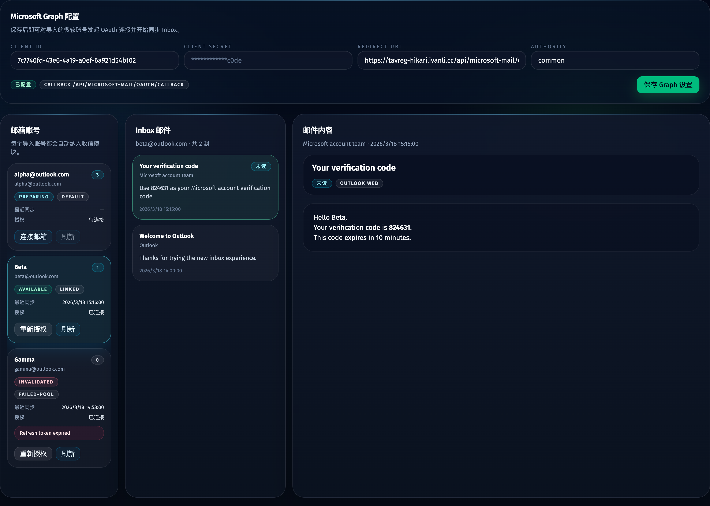
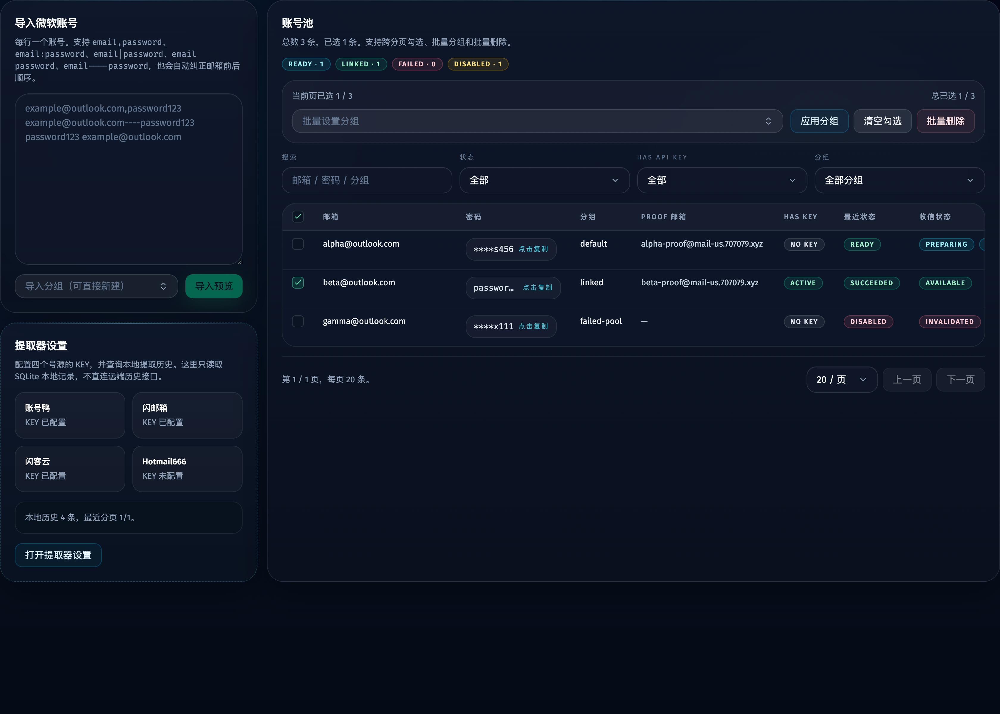

# 微软邮箱 Graph/OAuth 收信模块（#jg53e）

## 状态

- Status: 已实现
- Created: 2026-03-28
- Last: 2026-03-28

## 背景 / 问题陈述

- 当前 Web 管理台只管理微软账号池与 API key 提取，没有独立的收信视图，导入账号后无法直接查看 Inbox。
- 收信需求已经明确绑定 Microsoft Graph OAuth，而不是邮箱密码直登，所以导入账号后除了账号池记录，还需要为每个账号维护独立 mailbox/OAuth/sync 状态。
- 账号页需要同时暴露“这个微软账号是否已接入收信功能”的状态，否则用户无法分辨哪些账号待授权、哪些账号已可收信、哪些账号授权已经失效。

## 目标 / 非目标

### Goals

- 新增独立 `/mailboxes` 页面，使用左侧账号列表 / 中间邮件列表 / 右侧正文的三栏布局。
- 每次导入或更新微软账号时自动确保存在对应 `microsoft_mailboxes` 记录，默认状态为 `preparing`。
- 用 Microsoft Graph OAuth 授权码流 + web callback 接入 Inbox 只读同步，固定回调路径为 `/api/microsoft-mail/oauth/callback`。
- 在本地 `app_settings` 中保存 Graph 设置，在账号页显示收信状态，在邮箱页支持连接、重连和手动刷新。
- 本地缓存 Inbox 邮件，并保留 HTML 正文净化渲染能力。

### Non-goals

- 不实现发信、回复、删除、移动邮件、附件下载与多文件夹树。
- 不实现全账号后台轮询守护。
- 不把导入账号自动等同于“已授权可收信”；导入后只自动建 mailbox 记录，仍需用户完成 OAuth。

## 数据模型

### `app_settings`

- 新增：
  - `microsoftGraphClientId`
  - `microsoftGraphClientSecret`
  - `microsoftGraphRedirectUri`
  - `microsoftGraphAuthority`

### `microsoft_mailboxes`

- `account_id`：与 `microsoft_accounts.id` 一对一
- `status`：`preparing | available | failed | invalidated`
- `sync_enabled`
- `refresh_token`
- `access_token`
- `access_token_expires_at`
- `graph_user_id`
- `graph_user_principal_name`
- `graph_display_name`
- `authority`
- `oauth_state`
- `oauth_code_verifier`
- `oauth_started_at`
- `oauth_connected_at`
- `delta_link`
- `unread_count`
- `last_synced_at`
- `last_error_code`
- `last_error_message`
- `created_at`
- `updated_at`

### `microsoft_mail_messages`

- `mailbox_id`
- `graph_message_id`
- `internet_message_id`
- `conversation_id`
- `subject`
- `from_name`
- `from_address`
- `received_at`
- `is_read`
- `has_attachments`
- `body_content_type`
- `body_preview`
- `body_content`
- `web_link`
- `created_at`
- `updated_at`
- 约束：`UNIQUE(mailbox_id, graph_message_id)`
- 保留策略：每个 mailbox 最多缓存最近 `500` 封

## API 合约

- `GET /api/microsoft-mail/settings`
- `POST /api/microsoft-mail/settings`
- `GET /api/microsoft-mail/mailboxes`
- `POST /api/microsoft-mail/accounts/:accountId/oauth/start`
- `GET /api/microsoft-mail/oauth/callback`
- `POST /api/microsoft-mail/mailboxes/:mailboxId/sync`
- `GET /api/microsoft-mail/mailboxes/:mailboxId/messages`
- `GET /api/microsoft-mail/messages/:messageId`

## 行为规格

### OAuth / Graph 设置

- Graph 设置默认 authority 为 `common`，以兼容任意 Entra ID 租户与个人 Microsoft 账号。
- OAuth start 为每个 mailbox 生成独立 `state + PKCE`，并返回跳转用 `authUrl`。
- callback 成功后写入 refresh token、access token、过期时间与 Graph 用户信息，并重定向回 `/mailboxes?accountId=<id>&oauth=<success|error>`。

### 收信状态语义

- `preparing`：已纳入收信模块，但尚未完成首个成功同步，或者仍未完成 OAuth。
- `available`：refresh token 可用，最近一次同步成功。
- `failed`：最近一次 OAuth 或同步失败，但仍可直接重试。
- `invalidated`：Graph 返回 `invalid_grant`、`interaction_required`、`consent_required` 等必须重新授权的错误。

### 同步与缓存

- 首次进入 `/mailboxes` 时，如果当前选中 mailbox 为 `preparing` 且已经完成 OAuth，但尚未成功同步，则前端自动触发一次同步。
- 其余刷新只由用户点击“刷新”按钮触发。
- 同步走 Graph Inbox delta 查询，落库后以本地缓存作为列表和正文的默认数据源。
- 邮件 HTML 正文必须先经 `DOMPurify` 净化再渲染，禁止直接输出原始 Graph HTML。

### 界面

- 顶部设置卡片维护 Graph `client id / client secret / redirect uri / authority`。
- 账号页在桌面表格与移动卡片中都显示“收信状态”，并增加“收件箱”入口按钮。
- 邮箱页左栏显示 mailbox 状态、未读数、连接/重连与刷新按钮；中栏显示 Inbox 列表；右栏显示正文与邮件头信息。

## 验收标准

- Given 新导入或重复导入同一微软账号，When 导入完成，Then `microsoft_mailboxes` 中对应账号始终只有一条记录，默认状态为 `preparing`，且不会清空已有 OAuth token。
- Given Graph 设置已保存并点击连接邮箱，When callback 成功，Then mailbox 会写入 refresh token 与 Graph 用户信息，并返回 `/mailboxes`。
- Given mailbox 已授权但尚未同步，When 首次进入 `/mailboxes` 并选中它，Then 自动触发一次同步；成功后状态变为 `available`。
- Given Graph 返回授权失效类错误，When 刷新 token 或同步失败，Then mailbox 状态转为 `invalidated`，账号页与邮箱页都会暴露该状态。
- Given 邮件正文是 HTML，When 右栏展示正文，Then 内容必须经过净化后再渲染。
- Given UI 改动完成，When 执行 `bun run typecheck`、`bun test`、`bun run web:build` 与 `bun run build-storybook`，Then 全部通过。

## Visual Evidence

- source_type: storybook_canvas
- target_program: mock-only
- capture_scope: browser-viewport
- sensitive_exclusion: N/A
- submission_gate: pending-owner-approval
- story_id_or_title: Views/MailboxesView/Default
- state: graph settings + mailbox list + inbox + message detail
- evidence_note: 验证 Microsoft Graph 设置面板、三栏邮箱布局、账号状态标签、未读邮件列表和净化后的正文展示。

- source_type: storybook_canvas
- target_program: mock-only
- capture_scope: browser-viewport
- sensitive_exclusion: N/A
- submission_gate: pending-owner-approval
- story_id_or_title: Views/AccountsView/Default
- state: account table with mailbox status
- evidence_note: 验证微软账号页新增“收信状态”列与“收件箱”入口，并同时展示 `preparing / available / invalidated` 样例。

## 里程碑

- [x] M1: 建立 spec 并冻结 OAuth、状态语义、回调路径与 v1 Inbox-only 范围
- [x] M2: 完成 SQLite migration、mailbox/message repository 与账号导入自动纳入 mailbox
- [x] M3: 完成 Graph 设置、OAuth start/callback、Inbox 同步与消息详情 API
- [x] M4: 完成账号页收信状态与 `/mailboxes` 三栏页面
- [x] M5: 完成 Storybook、视觉证据、验证与 merge-ready 收敛

## 文档更新

- `docs/specs/README.md`
- `README.md`

