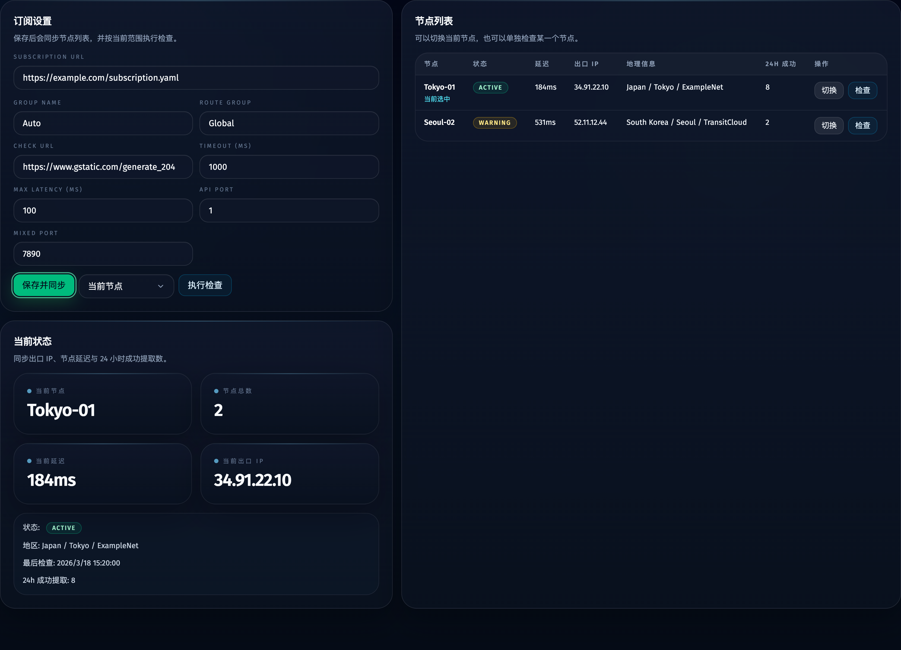

# 显式指纹浏览器契约 + GitHub 质量门禁收口（#k9tfr）

## 状态

- Status: 进行中
- Created: 2026-04-07
- Last: 2026-04-07

## 背景 / 问题陈述

- 当前 Docker / Linux 运行时在没有显式浏览器路径时，会继续尝试扫描或隐式回退，导致 worker 进入 `browser_launch` 前后的状态不稳定，线上出现“attempt 运行中但没有出口 IP”的假象。
- 现有系统允许保存代理设置时顺手把整份 `AppSettings` 回写到后端，导致 `defaultRunMode` 之类无关字段被污染，线上保存订阅地址后会把默认运行模式改坏。
- 代理订阅在并发 worker 场景下会重复拉取，同一时间命中上游过多请求，容易触发 403 / 滥用风控。
- 仓库当前缺少与 `codex-vibe-monitor` 同级别的 PR 标签、Review Policy、CI PR、CI Main、Release 以及发布后 PR 评论闭环，也缺少与之对应的 live branch rules。

## 目标 / 非目标

### Goals

- 运行时只接受显式 `CHROME_EXECUTABLE_PATH`，并且只允许主人提供的指纹浏览器，不再扫描系统路径、仓库工具目录、Playwright 缓存或其他候选浏览器。
- 在 attempt 进入真正浏览器启动前完成浏览器 preflight，路径缺失 / 不可执行 / 非允许浏览器时直接失败，避免把错误伪装成“运行中”。
- `/api/proxies/settings` 只允许代理字段落库，保存订阅地址不再污染 `defaultRunMode` 等无关设置。
- 为 Mihomo 订阅增加跨 worker 共享缓存与锁，减少并发重复拉取，避免对上游造成多客户端同时拉订阅的滥用特征。
- 引入与 `codex-vibe-monitor` 同构的质量门禁：Label Gate、Review Policy、CI PR、CI Main、Release、release snapshot、PR release comment。
- 在 101 上改成只读挂载 Linux 指纹浏览器到固定路径 `/opt/fingerprint-browser/chrome`，并以该路径作为唯一运行时入口。

### Non-goals

- 不放宽“只能使用主人提供的指纹浏览器”的约束。
- 不把 GitHub CI 的前端检查浏览器也替换成运行时指纹浏览器；CI 里的 Playwright / Chromium 仅作为测试依赖存在。
- 不在本次修复中改动与代理、微软邮箱流程无关的业务规则。

## 行为规格

### 浏览器运行时契约

- `CHROME_EXECUTABLE_PATH` 成为业务运行时的显式必需输入；worker 不再从 ambient env 隐式继承，也不再扫描任何默认位置。
- 浏览器路径解析只负责 trim / normalize，不承担候选发现职责。
- 指纹浏览器校验只针对显式路径本身；显式路径缺失时报 `fingerprint browser executable path is not configured`，非允许浏览器时报 `Only the provided fingerprint browser is allowed.`。
- 调度器在 spawn worker 前完成浏览器 preflight，失败时走配置错误而不是继续进入 `spawned / browser_launch` 假状态。
- 运行中的 runtime spec 必须显式携带 `CHROME_EXECUTABLE_PATH`，不能依赖父进程环境偶然残留。

### 代理设置保存隔离

- `POST /api/proxies/settings` 仅接受：`subscriptionUrl`、`groupName`、`routeGroupName`、`checkUrl`、`timeoutMs`、`maxLatencyMs`、`apiPort`、`mixedPort`。
- 前端保存代理设置时只发送 `ProxySettingsUpdate` 子集；若客户端夹带 `defaultRunMode` 等无关字段，服务端直接拒绝。
- 再次保存订阅地址后，`defaultRunMode` 仍保持原值，不因代理页面操作被覆盖。

### Mihomo 订阅共享缓存

- 并发 worker 读取同一订阅地址时，优先复用内存成功缓存与磁盘新鲜缓存。
- 磁盘缓存写入必须通过锁文件串行化，避免多个 worker 在缓存 miss 时同时打上游。
- 当上游短时失败但本地仍有可用缓存时，运行时可使用最近成功订阅兜底；没有可用缓存时再显式失败。

### GitHub 治理与发布

- 指向 `main` 的 PR 必须带且仅带一组 release-intent labels：`1 x type:*` + `1 x channel:*`。
- `Review Policy Gate` 作为 required check 承担条件化审批规则：默认 1 个有效 approval，但仓库 owner / `admin` / `maintain` 作者可豁免。
- `CI PR` 必须提供：`Typecheck & Quality Gates`、`Bun Tests`、`Web Build`、`Storybook Build`、`Docker Smoke`。
- `CI Main` 在上述检查全部通过后，额外生成 immutable release snapshot。
- `Release` 读取 release snapshot，发布 GHCR 镜像、git tag、GitHub Release，并在对应 PR 上 upsert 单条 marker 评论：`<!-- tavreg-hikari-release-version-comment -->`。

## 验收标准（Acceptance Criteria）

- Given 运行时未提供 `CHROME_EXECUTABLE_PATH`，When 调度器准备派发 worker，Then attempt 会在浏览器 preflight 阶段明确失败，而不是继续停留在 `spawned` 并显示空出口 IP。
- Given 提供的 `CHROME_EXECUTABLE_PATH` 不是主人提供的指纹浏览器，When 服务加载或调度器 preflight，Then 系统会拒绝启动并返回明确错误。
- Given 前端在代理页点击“保存并同步”，When 请求到达 `/api/proxies/settings`，Then 只有代理字段被持久化，`defaultRunMode` 等其它字段不会被覆盖。
- Given 多个 worker 并发读取相同 Mihomo 订阅，When 第一个 worker 正在刷新缓存，Then 其他 worker 会等待或复用共享缓存，不会全部直连上游重拉订阅。
- Given 仓库创建指向 `main` 的 PR，When 没有设置正确的 `type:*` 与 `channel:*` labels，Then `Validate PR labels` 会 fail closed。
- Given `main` 上有通过 CI Main 的提交，When Release 运行，Then 会生成 Git tag、GitHub Release、GHCR 镜像，并在对应 PR 上维护单条 release version comment。
- Given 101 完成部署并挂载固定指纹浏览器路径，When 运行单账号 bootstrap smoke，Then attempt 能跨过 `browser_launch`，并写回 `proxy_node` 与 `proxy_ip`。

## Visual Evidence

- source_type: storybook_canvas
  story_id_or_title: `Views/ProxiesView/Buffered Settings Play`
  state: 保存代理设置时只保留代理字段
  evidence_note: 证明代理设置页在缓冲输入和保存后仍保持代理配置视图稳定，且用于回归“保存订阅不污染默认运行模式”的 UI 入口已具备稳定 Storybook 证据面。

## 里程碑

- [x] M1: 删除浏览器扫描 / 回退逻辑，收敛为显式路径契约
- [x] M2: 拆分代理设置保存载荷并补齐前后端回归
- [x] M3: 为 Mihomo 订阅增加共享缓存与锁，降低并发上游请求
- [ ] M4: 补齐 GitHub 质量门禁、Release 流程与 live branch rules
- [ ] M5: 完成本地验证、视觉证据、PR / merge / release / 101 smoke 收口

## 文档更新（Docs to Update）

- `docs/specs/README.md`
- `README.md`
- `docs/specs/k9tfr-explicit-fingerprint-browser-quality-gates/SPEC.md`
