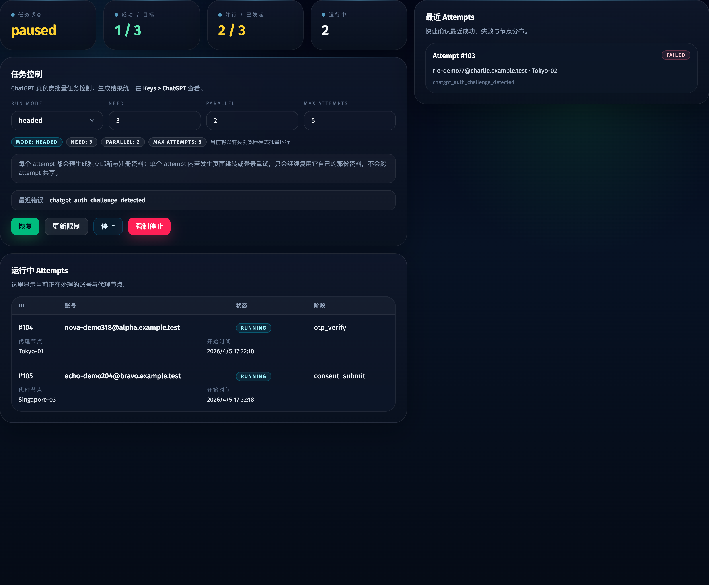
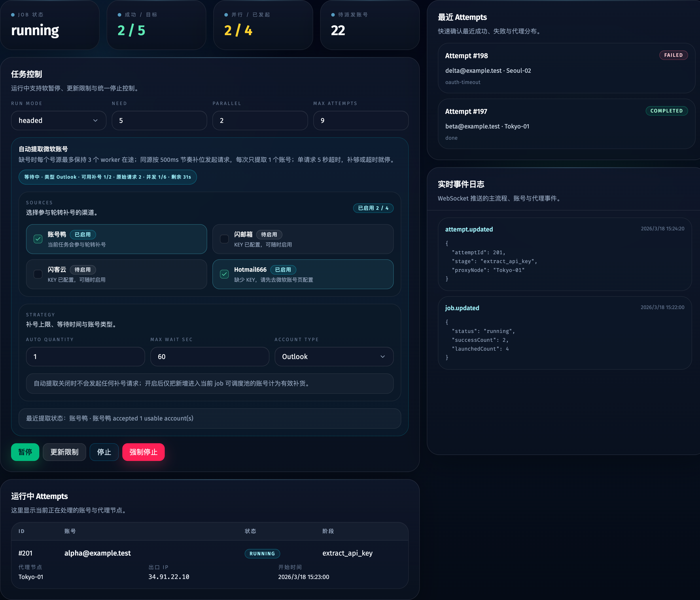

# 跨站点任务控制区对齐：ChatGPT 补齐更新限制，Tavily / ChatGPT 对齐 Grok（#kq7rv）

## 状态

- Status: 已完成
- Created: 2026-04-17
- Last: 2026-04-17

## 背景 / 问题陈述

- Grok 控制区已经具备较完整的批量任务语义：上下文主按钮、`更新限制`、`停止`、`强制停止` 与明确的运行态提示。
- ChatGPT 控制区仍停留在 `开始 / 停止 / 强制停止`，缺少 `pause / resume / update_limits` 的端到端能力，运行中也无法只更新 `need / parallel / maxAttempts`。
- Tavily 控制区虽然已有后端 `pause / resume / update_limits / stop / force_stop` 真相源，但 owner-facing 文案和按钮集合仍未完全对齐 Grok，当前还保留 `应用调参` 与 `强行停止` 等旧口径。
- 若继续让三个站点各自长出一套控制语义，后续维护与验收都会变得混乱，特别是 Storybook、视觉证据和 current job API 的状态矩阵会反复分叉。

## 目标 / 非目标

### Goals

- 以 Grok 控制区为基准，统一 Tavily / ChatGPT / Grok 的任务控制语义、按钮顺序、禁用态与停止提示文案。
- 为 ChatGPT 调度器与控制 API 补齐 `pause / resume / update_limits`，且不新增数据库字段。
- 把 Tavily 控制区的 `应用调参` 收敛为 `更新限制`，并将 `强行停止` 统一为 `强制停止`。
- 补齐 Storybook 场景、交互回归和视觉证据，确保当前 UI 变更有稳定 mock 入口。

### Non-goals

- 不修改 Grok worker / key 导出 / 凭据持久化语义。
- 不引入新的 jobs 状态族；ChatGPT 仍不新增 `completing` 状态。
- 不扩展 Keys 页、attempt 详情、代理页或账户页的非控制区交互。

## 范围（Scope）

### In scope

- `web/src/lib/job-controls.ts`
- `web/src/components/chatgpt-view.tsx`
- `web/src/components/dashboard-view.tsx`
- `web/src/App.tsx`
- `src/server/chatgpt-scheduler.ts`
- `src/server/main.ts`
- ChatGPT / Tavily 相关 Storybook stories、component play 和 scheduler / job-controls 测试
- `docs/specs/README.md` 与本 spec 的视觉证据

### Out of scope

- Grok 页面功能逻辑本身
- current job snapshot 的 schema 扩张
- 非任务控制区的 UI 重构

## 需求（Requirements）

### MUST

- ChatGPT 控制区必须支持上下文主按钮：`开始/重新开始`、`暂停`、`恢复`、`停止中`、`强停中`。
- ChatGPT 在 `running / paused` 时必须允许更新 `need / parallel / maxAttempts`，并通过 `/api/jobs/current/control` 的 `site=chatgpt` + `action=update_limits` 落到后端。
- ChatGPT 在 `paused` 时不得继续派发新 attempt，但已启动 attempt 允许自然收尾；恢复后应继续派发。
- ChatGPT `stop` 必须支持从 `running / paused` 发起；`force_stop` 必须支持从 `running / paused / stopping` 发起。
- Tavily 控制区按钮集合、按钮顺序与停机提示必须与 Grok 保持同口径。
- Tavily `应用调参` 按钮文案必须改为 `更新限制`；`强行停止` 必须统一为 `强制停止`。
- 三个站点复用同一份 `job-controls` 状态映射，不再在各页各写一套主按钮/停止提示条件。
- 三个站点的强制停止确认弹窗应使用一致的危险提示文案，明确提示立即终止影响并建议优先使用优雅停止。

### SHOULD

- ChatGPT 控制区在 `stopping / force_stopping / stopped` 时显示与 Grok/Tavily 一致的 stop hint。
- 前端在提交 `start / update_limits` 前应统一 commit buffered number inputs，避免 UI 上已修改但请求仍发送旧值。
- ChatGPT 与 Tavily 的 Storybook 交互回归应直接验证 action payload，而不是只看静态文案。

## 功能与行为规格（Functional/Behavior Spec）

### Core flows

- 用户在 ChatGPT 页运行任务时，主按钮显示 `暂停`；点击后发出 `pause`，当前 job 进入 `paused`。
- 用户在 ChatGPT 页暂停任务后，主按钮显示 `恢复`；点击后发出 `resume`，调度器继续派发剩余 attempt。
- 用户在 ChatGPT 页修改 `need / parallel / maxAttempts` 后点击 `更新限制`，前端提交当前草稿，后端立即更新 current job，后续派发容量按新值生效。
- 用户在 Tavily 页查看任务控制区时，会看到与 Grok 对齐的按钮顺序：主按钮、`停止`、`强制停止`、`更新限制`。
- 用户在 Tavily 或 ChatGPT 页进入 `stopping / force_stopping / stopped` 时，会看到统一 stop hint。

### Edge cases / errors

- ChatGPT 在 `stopping / force_stopping` 中不得继续更新限制。
- ChatGPT 在 `paused` 且当前没有 active attempts 时，点击 `停止` 后可以直接收束到 `stopped`，无需额外派发。
- ChatGPT `update_limits` 若把 `maxAttempts` 调低到小于 `need`，后端仍需按现有归一化规则自动抬到合法值。
- Tavily 自动补号相关 draft 字段仍通过现有 Tavily 路径提交，不因按钮重排而丢失。

## 接口契约（Interfaces & Contracts）

- HTTP API: `POST /api/jobs/current/control`
  - `site=chatgpt` 新增支持：
    - `action=pause`
    - `action=resume`
    - `action=update_limits`
  - `action=update_limits` 仍复用现有请求体字段：`need`、`parallel`、`maxAttempts`
- Internal API:
  - `ChatGptJobScheduler.pauseCurrentJob()`
  - `ChatGptJobScheduler.resumeCurrentJob()`
  - `ChatGptJobScheduler.updateCurrentJobLimits(...)`

## 验收标准（Acceptance Criteria）

- Given ChatGPT current job 为 `running`
  When 用户查看任务控制区
  Then 主按钮显示 `暂停`，且 `更新限制 / 停止 / 强制停止` 同时可见。

- Given ChatGPT current job 为 `paused`
  When 用户点击主按钮
  Then 前端发送 `resume`，后端把 job 恢复为 `running`。

- Given ChatGPT current job 为 `running`
  When 用户修改 `need / parallel / maxAttempts` 并点击 `更新限制`
  Then `/api/jobs/current/control` 接收到 `site=chatgpt`、`action=update_limits` 与最新 draft 值，且 job snapshot 立即反映新限制。

- Given ChatGPT current job 为 `paused`
  When 调度循环运行
  Then 不再派发新 attempt，但已在跑 attempt 允许自然完成。

- Given Tavily 页渲染任务控制区
  When 用户查看按钮与提示文案
  Then `更新限制 / 停止 / 强制停止` 的文案与 Grok 对齐，且旧的 `应用调参 / 强行停止` 不再出现。

## 非功能性验收 / 质量门槛（Quality Gates）

### Testing

- `bun test test/job-controls.test.ts test/chatgpt-scheduler.test.ts`
- `bunx tsc --noEmit`
- `bun run build-storybook`

### Quality checks

- Storybook 至少覆盖：
  - `Views/ChatGptView` 的 ready / running / paused / stopping / stopped / interactive update-limits
  - `Views/DashboardView` 的 Tavily 控制区回归与交互验证
- 视觉证据必须来自 Storybook，而不是临时浏览器页面截图。

## 文档更新（Docs to Update）

- `docs/specs/README.md`
- `docs/specs/kq7rv-cross-site-job-control-alignment/SPEC.md`

## Visual Evidence

- source_type: storybook_canvas
  target_program: mock-only
  capture_scope: element
  sensitive_exclusion: N/A
  submission_gate: approved
  story_id_or_title: `Views/ChatGptView/Paused`
  state: `chatgpt paused controls`
  evidence_note: 验证 ChatGPT 控制区在 paused 状态已经补齐上下文主按钮、`更新限制`、`停止` 与 `强制停止`，不再停留在旧的三按钮模式。
  image:
  

- source_type: storybook_canvas
  target_program: mock-only
  capture_scope: element
  sensitive_exclusion: N/A
  submission_gate: approved
  story_id_or_title: `Views/DashboardView/Running`
  state: `tavily aligned controls`
  evidence_note: 验证 Tavily 控制区按钮顺序与文案已经对齐 Grok，显示 `暂停 / 更新限制 / 停止 / 强制停止`，旧的 `应用调参 / 强行停止` 已被移除。
  image:
  

- source_type: storybook_canvas
  target_program: mock-only
  capture_scope: element
  sensitive_exclusion: N/A
  submission_gate: approved
  story_id_or_title: `Components/ForceStopDialog/Default`
  state: `chatgpt force stop copy`
  evidence_note: 验证 ChatGPT / Grok 复用统一的危险确认弹窗文案，明确说明会立刻终止当前任务，并提示优先使用优雅停止。
  image:
  PR: include
  

## 参考（References）

- `docs/specs/pakwp-chatgpt-web-site/SPEC.md`
- `docs/specs/r6h9s-job-stop-controls/SPEC.md`
- `docs/specs/3hrx4-grok-web-site/SPEC.md`

## 变更记录（Change log）

- 2026-04-17: 创建增量 spec，冻结 ChatGPT / Tavily 控制区对齐目标、API 变化与视觉证据要求。
- 2026-04-17: 已补齐 ChatGPT `pause / resume / update_limits` 与前端控制区对齐，并写入首轮 Storybook 视觉证据。
