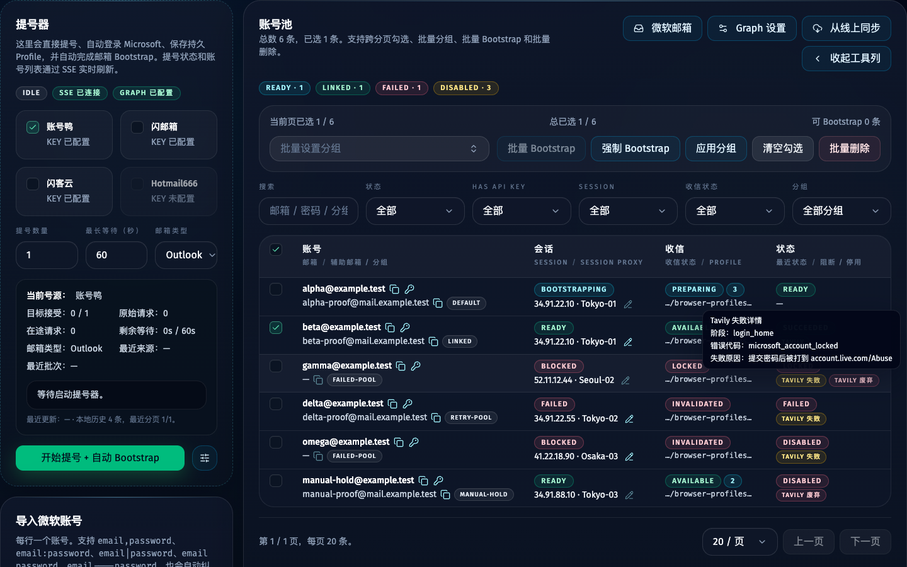
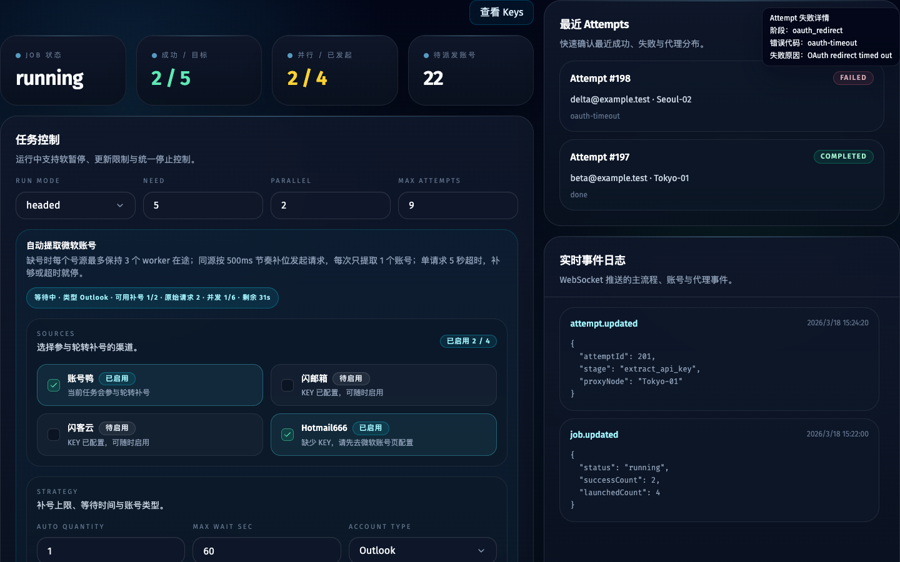

# 微软账号固定登录接入 Tavily 流程（#m1sso）

## 状态

- Status: 已完成
- Created: 2026-03-18
- Last: 2026-05-11

## 背景 / 问题陈述

- Tavily 当前不再提供原有的邮箱密码注册入口，主流程继续走注册会稳定失败在 `signup` 阶段。
- 实际可用路径已经切换为第三方身份提供商登录，其中 Microsoft Account 已验证可正常进入 `app.tavily.com/home`。
- 现有程序只有“邮箱密码复用”和“新邮箱注册”两条路径，缺少对固定 Microsoft OAuth 登录的支持。

## 目标 / 非目标

### Goals

- 为主流程增加固定 Microsoft Account 登录模式，并允许被微软账号页的单账号业务流 launcher 复用。
- 跳过失效的 Tavily 邮箱注册步骤，直接通过 Microsoft OAuth 进入应用首页并继续提取 API key。
- 将“保持登录状态”作为可配置行为，默认选择“是”。

### Non-goals

- 不实现 Microsoft 账号创建。
- 不扩展到 Google、GitHub、LinkedIn 等其他社交登录提供商。
- 不把批量 job 主链改造成微软账号页单账号 launcher。

## 范围（Scope）

### In scope

- 新增 Microsoft 账号环境变量配置。
- 新增 CF Mail 配置，用于 Microsoft proof 条件分支。
- 在登录流程中接入 Tavily -> Microsoft -> Tavily Home 的自动化状态机。
- 将同一套 Microsoft 登录状态机暴露给单账号 launcher，使 `无 / Tavily / ChatGPT / Grok` 都能复用微软账号密码、proof 与保持登录能力；其中 `无` 会直接停在微软账号页。
- 兼容首次授权与已记住账号的复用场景。
- 兼容 Microsoft 可选的 proof / 备用邮箱绑定 / 安全码验证页面。
- 更新 env 模板与规格索引。

### Out of scope

- 重构所有登录/注册逻辑为插件式架构。
- 修改 Mihomo、邮箱提供商或 OCR 相关逻辑。

## 需求（Requirements）

### MUST

- `MICROSOFT_ACCOUNT_EMAIL` 与 `MICROSOFT_ACCOUNT_PASSWORD` 必须成对配置。
- 已配置 Microsoft 登录时，主流程必须跳过 Tavily 邮箱注册与邮箱验证阶段。
- 登录流程必须覆盖以下页面步骤：
  - Tavily 的 `Continue with Microsoft Account`
  - Microsoft 账号选择或邮箱输入
  - Microsoft 密码输入
  - 通行密钥打断页的取消/跳过
  - `保持登录状态`，默认选 `是`
  - Tavily Login 授权确认
- 当 Microsoft 实际出现 proof / 备用邮箱验证分支时，若账号已配置备用邮箱映射，程序必须自动填写备用邮箱并通过统一 mailbox waiter/verification-code extractor 获取安全码。
- 当 Tavily OAuth 回跳在 `login.live.com/oauth20_authorize.srf` 上出现 “Verify your email / We'll send a code to ...” proof confirmation 页面时，必须优先使用账号绑定的 proof mailbox 完成确认与收码，不得先点击 `Use your password` shortcut。
- 成功后必须回到 `https://app.tavily.com/home` 并继续后续 API key 获取。

### SHOULD

- 已存在 Microsoft 会话时，尽量直接复用而不是重复输入账号密码。
- 若同时配置 Tavily 邮箱密码与 Microsoft 账号，程序应显式报错，避免歧义。
- proof 备用邮箱映射应落在账号数据库记录中，而不是只保存在本地临时笔记。

## 功能与行为规格（Functional/Behavior Spec）

### Core flows

- 启动时读取 Microsoft 账号配置，并将其视为一种固定登录账号模式。
- 进入 `loginAndReachHome` 后，若当前配置使用 Microsoft 登录，则不走 Auth0 邮箱验证码/密码提交分支。
- 在 Tavily 登录入口点击 Microsoft 按钮后，按页面状态逐步处理账号选择、密码、proof 条件分支、保持登录、授权确认，直到返回 Tavily Home。
- 当 ChatGPT / Grok 单账号 launcher 选择 Microsoft 登录时，也复用同一套账号选择、密码、proof、保持登录能力；若站点在 SSO 后仍要求补验证码或资料，则交回各站点 worker 继续处理。
- proof 条件分支只在 Microsoft 实际弹出相关页面时触发；未触发时保持既有 OAuth 路径不变。
- 当 proof 页面出现时，程序使用账号级 `proofMailboxAddress` / `proofMailboxId` 映射和 `CFMAIL_API_KEY` 调用 `GET /api/messages?mailbox=<address>&after=<iso>`、`GET /api/messages/{id}` 获取安全码。
- 后续 API key 获取逻辑保持不变。

### Edge cases / errors

- 若 Microsoft 账号配置只填了一半，程序应在加载配置时直接失败。
- 若 proof 页面出现但账号未配置备用邮箱映射，程序应明确失败为 `microsoft_proof_mailbox_missing`。
- 若 CF Mail API key 缺失、邮箱不存在或安全码超时，程序应分别报出 `cfmail_api_key_missing`、`cfmail_mailbox_not_found`、`microsoft_proof_code_timeout`。
- 若 Microsoft OAuth 长时间未回到 Tavily Home，程序应报出明确的 `microsoft_oauth_did_not_reach_home` 错误码和 `microsoft login flow did not reach home` 失败文案。
- 若 OAuth worker 超时或代理会话中断，程序应分别报出稳定错误码；任何包含 OAuth URL 的诊断文案必须脱敏 query/hash 后再落库或展示。

## 验收标准（Acceptance Criteria）

- Given `.env.local` 配置了 Microsoft 账号，When 执行有头模式运行，Then 程序跳过注册阶段并直接通过 Microsoft 登录进入 Tavily Home。
- Given 首次登录出现 `保持登录状态?`，When 自动化继续，Then 默认点击 `是`。
- Given Microsoft 登录中出现 proof 页面且账号已配置备用邮箱映射，When 自动化继续，Then 程序自动提交备用邮箱并用统一 live mailbox waiter 完成安全码验证。
- Given 用户从微软账号页启动 ChatGPT / Grok 的单账号业务流，When 该站点选择 `Continue with Microsoft`，Then 系统复用同一套 Microsoft 登录状态机完成账号密码、proof 与保持登录分支。
- Given Microsoft OAuth 停在密码页或未回到 Tavily Home，When bootstrap worker 返回失败，Then `browserSession.lastErrorCode` 必须为 `microsoft_oauth_did_not_reach_home`，且错误文案可被账号页 tooltip 直接消费。
- Given 本次实现完成，When 执行 `bun run typecheck`，Then 类型检查通过。

## 非功能性验收 / 质量门槛（Quality Gates）

### Testing

- `bun run typecheck`
- `bun test`
- 至少一次有头实跑，确认 Microsoft OAuth 能进入 Tavily Home

## Visual Evidence

- source_type: `storybook_canvas`
  story_id_or_title: `views-accountsview--failure-reuse-matrix`
  state: `Microsoft accounts Tavily failure badge hover`
  evidence_note: Microsoft 账号列表中悬浮 `Tavily 失败` badge 会显示 Tavily 失败详情、阶段、错误代码与 `提交密码后被打到 account.live.com/Abuse` 级别的具体原因。
  

- source_type: `storybook_canvas`
  story_id_or_title: `views-dashboardview--running`
  state: `Attempt status badge hover`
  evidence_note: 任务执行记录中悬浮失败 attempt 状态 badge 会显示失败阶段、错误代码与详细失败原因。
  

## 文档更新（Docs to Update）

- `.env.example`
- `docs/specs/README.md`
- `docs/WORKFLOW.md`
