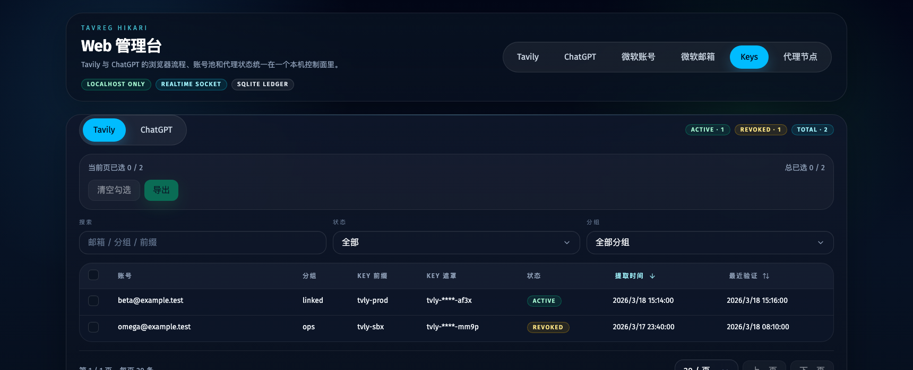
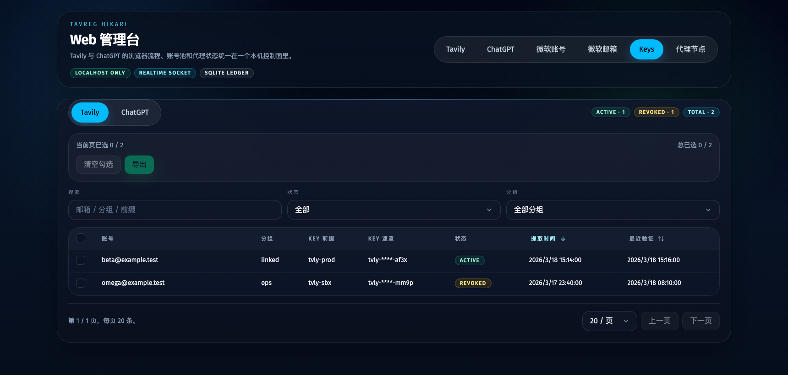
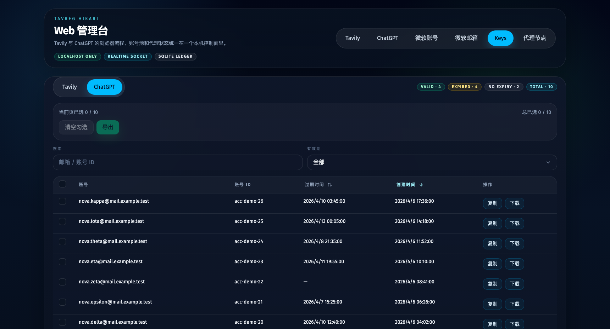
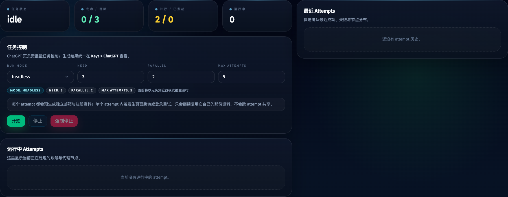
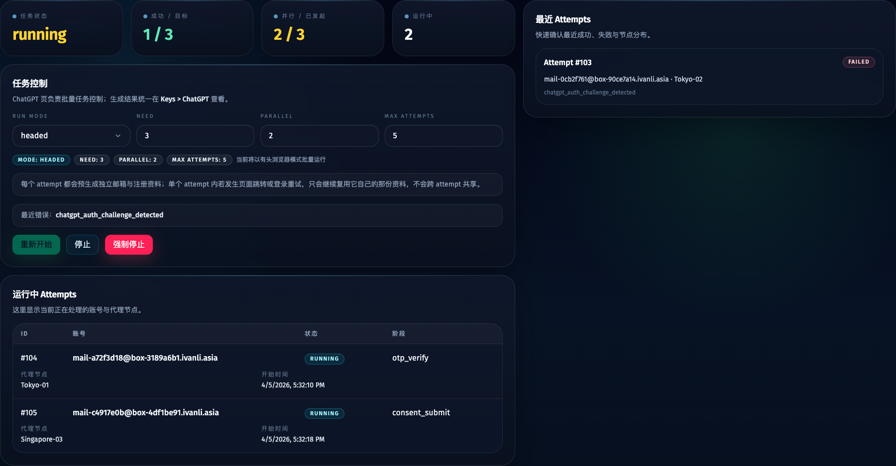

# Keys 页双数据源收敛：Tavily / ChatGPT 双 Tabs（#m9jnq）

## 状态

- Status: 已完成
- Created: 2026-04-09
- Last: 2026-04-09

## 背景 / 问题陈述

- 当前 Web 管理台已经同时接入 Tavily 与 ChatGPT 两个数据源，但 keys/credentials 展示面仍分裂：Tavily API key 在 `/api-keys`，ChatGPT 凭据仍留在 `/chatgpt` 页右侧。
- 顶层导航继续使用 `API Keys` 会误导为“只有 Tavily key”，与现有双站点能力不一致。
- 若继续保留分裂入口，用户在查看密钥类结果时需要来回切换页面，也会让 `pakwp` 与 `2dkks` 的旧 UI 口径继续漂移。

## 目标 / 非目标

### Goals

- 将顶层导航从 `API Keys` 收敛为 `Keys`。
- 在 Keys 页内提供 `Tavily` 与 `ChatGPT` 两个稳定 tabs。
- 把 ChatGPT 的最近凭据列表从 `/chatgpt` 页迁移到 `Keys > ChatGPT`，并收敛为与 Keys 列表一致的勾选、筛选、排序、复制与下载交互。
- 保留 Tavily API key 查询、跨分页勾选与 `key | ip` 导出行为不变。
- 明确该方案接管 `pakwp` 中“ChatGPT 凭据留在 /chatgpt 页”与 `2dkks` 中“API Keys 单源页面”这两处旧 UI 口径。

### Non-goals

- 不新增或修改 HTTP / DB 接口。
- 不在页面展示 ChatGPT 凭据明文详情，也不引入 reveal / 解锁动作。
- 不为 ChatGPT 凭据新增服务端分页或高级检索接口；仍基于现有最近记录接口在前端完成筛选与排序。
- 不改造 `微软账号 / 微软邮箱 / 代理节点` 为多站点通用页。
- 不改变 Tavily API key 导出协议与文件格式。

## 范围（Scope）

### In scope

- 顶层导航文案、页面路由与前端 `PageKey` 收敛为 `keys`。
- `/keys` 主路由与 `/api-keys` 兼容 alias。
- 新的 Keys 页级 Tabs 结构。
- ChatGPT 凭据展示区域的组件拆分与迁移。
- AppShell / Keys 页 / ChatGPT 页的 Storybook 覆盖与视觉证据。

### Out of scope

- 新增后端 API、SQLite schema 变更、服务端过滤能力。
- ChatGPT 凭据列表的分页化或高级检索。
- 非 key/credential 页面的信息架构重组。

## 需求（Requirements）

### MUST

- 顶部导航必须显示 `Keys`，不再显示 `API Keys`。
- `/keys` 与 `/api-keys` 必须进入同一页面。
- Keys 页必须包含 `Tavily` 与 `ChatGPT` 两个 tabs，默认落在 `Tavily`。
- `Keys > Tavily` 必须复用现有 API key 查询、勾选与导出能力，不得回退。
- `Keys > ChatGPT` 必须使用标准 keys 列表骨架，支持多选、批量导出、搜索、有效期筛选与时间字段排序。
- `Keys > ChatGPT` 行内操作必须收敛为 `复制` / `下载`，且页面不得展示明文详情或 reveal/解锁按钮。
- `/chatgpt` 页面必须收敛为批量控制、启动/停止与任务态，不再重复展示凭据列表。

### SHOULD

- 新增的 Keys 页应使用稳定 Tabs 组件并保持与现有视觉体系一致。
- Tabs 行右侧应直接显示当前站点的统计 badge，避免重复标题区占用纵向空间。
- Storybook 应同时覆盖导航、Keys 页 tab 切换、ChatGPT 列表排序/批量导出与 ChatGPT 页回归状态。

### COULD

- None

## 功能与行为规格（Functional/Behavior Spec）

### Core flows

- 用户点击顶部 `Keys` 导航，进入 `/keys` 页面，并默认看到 `Tavily` tab。
- 用户在 `Tavily` tab 中继续使用现有查询、跨分页勾选与导出 API key。
- 用户切换到 `ChatGPT` tab 后，看到最近凭据列表，可按邮箱/账号 ID 搜索、按有效期筛选，并按创建时间或过期时间排序。
- 用户可对 ChatGPT 记录执行当前页全选、多选批量导出，以及单行 `复制` / `下载` JSON；页面本身只展示邮箱、账号 ID 与时间字段，不展示明文。
- 用户在 `/chatgpt` 页面只处理批量控制与运行态；任务成功后数据仍刷新到共享的 ChatGPT credentials 状态，随后可在 `Keys > ChatGPT` 查看。

### Edge cases / errors

- 当 ChatGPT 凭据为空时，`Keys > ChatGPT` 必须显示明确空状态，而不是空白区域。
- 当 ChatGPT 列表应用筛选后无结果时，必须显示“没有符合筛选条件的 ChatGPT key 记录”空状态。
- 当复制或下载单行 / 批量 JSON 失败时，错误继续走现有全局错误条，不新增局部异常协议。
- 当用户访问旧 `/api-keys` 路径时，前端必须按 alias 进入 `Keys` 页，而不是 404 或留在旧语义 page key。

## 接口契约（Interfaces & Contracts）

None

## 验收标准（Acceptance Criteria）

- Given 用户打开管理台顶部导航
  When 页面完成渲染
  Then 导航中显示 `Keys`，且不再出现 `API Keys`。

- Given 用户访问 `/keys`
  When 页面首次加载
  Then 默认展示 `Tavily` tab，且 Tavily key 查询与导出交互保持可用。

- Given 用户访问 `/api-keys`
  When 前端解析路由
  Then 同样进入 `Keys` 页面，并映射到统一的 `keys` page key。

- Given 用户切换到 `Keys > ChatGPT`
  When 存在最近凭据
  Then 页面以标准 keys 列表展示邮箱、account id、过期时间、创建时间与 `复制` / `下载` 操作，不展示明文详情，且支持搜索、有效期筛选与时间排序。

- Given 用户打开 `/chatgpt`
  When 页面渲染完成
  Then 只显示批量控制、按钮、当前任务与 attempts，不再重复显示凭据列表。

## 实现前置条件（Definition of Ready / Preconditions）

- 顶层导航改名为 `Keys` 已锁定。
- `/keys` 主路由与 `/api-keys` alias 已锁定。
- ChatGPT 凭据迁移到 Keys 页、且不在 `/chatgpt` 双处保留，已锁定。
- Storybook 作为视觉证据主源已存在且可复用。

## 非功能性验收 / 质量门槛（Quality Gates）

### Testing

- Unit tests: 路由映射测试覆盖 `/keys` 与 `/api-keys` alias。
- Integration tests: N/A（无新增后端接口）。
- E2E tests (if applicable): Storybook `play` 覆盖 Keys 页切换、ChatGPT 列表批量导出与时间字段排序交互。

### UI / Storybook (if applicable)

- Stories to add/update: `AppShell`、`KeysView`、`ChatGptView`、必要时 `ChatGptCredentialsView`。
- Docs pages / state galleries to add/update: 依仓库现有 autodocs 生成 Keys 页与回归页面说明。
- `play` / interaction coverage to add/update: Keys 页切换到 ChatGPT tab、ChatGPT 列表批量导出与时间列排序；ChatGPT 页批量控件回归。
- Visual regression baseline changes (if any): none。

### Quality checks

- Lint / typecheck / formatting: `bun run typecheck`
- Storybook/build: `bun run build-storybook`
- Targeted tests: `bun test test/routes.test.ts`

## 文档更新（Docs to Update）

- `docs/specs/README.md`: 新增 m9jnq 索引，修复现有冲突标记。

## 计划资产（Plan assets）

- Directory: `docs/specs/m9jnq-keys-dual-source-page/assets/`
- In-plan references: ``
- Visual evidence source: maintain `## Visual Evidence` in this spec when owner-facing or PR-facing screenshots are needed.

## Visual Evidence

- source_type: `storybook_canvas`
  story_id_or_title: `Views/KeysView/IntegratedTavily`
  state: `top navigation with keys`
  evidence_note: 验证顶层导航已从 `API Keys` 收敛为 `Keys`，且在真实 Keys 集成页中激活态明确落在 `Keys`。
  

- source_type: `storybook_canvas`
  story_id_or_title: `Views/KeysView/IntegratedTavily`
  state: `keys tavily tab`
  evidence_note: 验证 Keys 页默认落在 Tavily tab，并完整保留现有 API key 查询、勾选与导出交互。
  

- source_type: `storybook_canvas`
  story_id_or_title: `Views/KeysView/IntegratedChatGpt`
  state: `keys chatgpt tab`
  evidence_note: 验证 ChatGPT keys 已迁移到 Keys 页内，使用标准列表骨架提供搜索、有效期筛选、时间排序、多选导出与行内 `复制` / `下载` 操作，且页面不展示明文详情。
  

- source_type: `storybook_canvas`
  story_id_or_title: `Views/ChatGptView/BatchReady`
  state: `chatgpt route ready`
  evidence_note: 验证 `/chatgpt` 页面已收敛为批量控制与任务态，不再重复展示凭据区块；生成结果统一引导到 `Keys > ChatGPT`。
  

- source_type: `storybook_canvas`
  story_id_or_title: `Views/ChatGptView/BatchRunning`
  state: `chatgpt route running`
  evidence_note: 验证运行态只保留预算、attempt 与错误摘要；右侧 reveal / export 凭据功能不再出现在 `/chatgpt` 页面。
  

## 资产晋升（Asset promotion）

None

## 实现里程碑（Milestones / Delivery checklist）

- [x] M1: 顶层导航、路由与 `keys` page key 收敛完成
- [x] M2: Keys 页双 tabs 与 ChatGPT 凭据归位完成
- [x] M3: Storybook、视觉证据与验证链路补齐完成

## 方案概述（Approach, high-level）

- 保持后端 API 不动，只重组前端页面信息架构与组件边界。
- 将 ChatGPT 凭据区域从 `ChatGptView` 抽成独立可复用展示组件，再由新的 Keys 页容器托管，并按 keys 列表语义统一选择、筛选、排序与导出交互。
- 使用 Storybook 作为主要视觉证据源，避免临时浏览器截图口径漂移。

## 风险 / 开放问题 / 假设（Risks, Open Questions, Assumptions）

- 风险：ChatGPT keys 仍依赖现有“最近记录”接口，若后续数据量继续增长，可能需要再引入服务端分页或更细粒度过滤。
- 需要决策的问题：None。
- 假设（需主人确认）：None。

## 变更记录（Change log）

- 2026-04-09: 创建规格，定义 Keys 双数据源页面、路由别名与 ChatGPT 凭据归位方案。

## 参考（References）

- `docs/specs/2dkks-api-key-batch-export/SPEC.md`
- `docs/specs/pakwp-chatgpt-web-site/SPEC.md`
