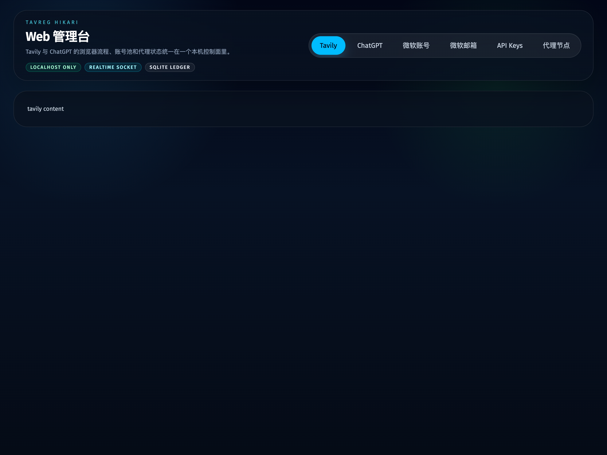
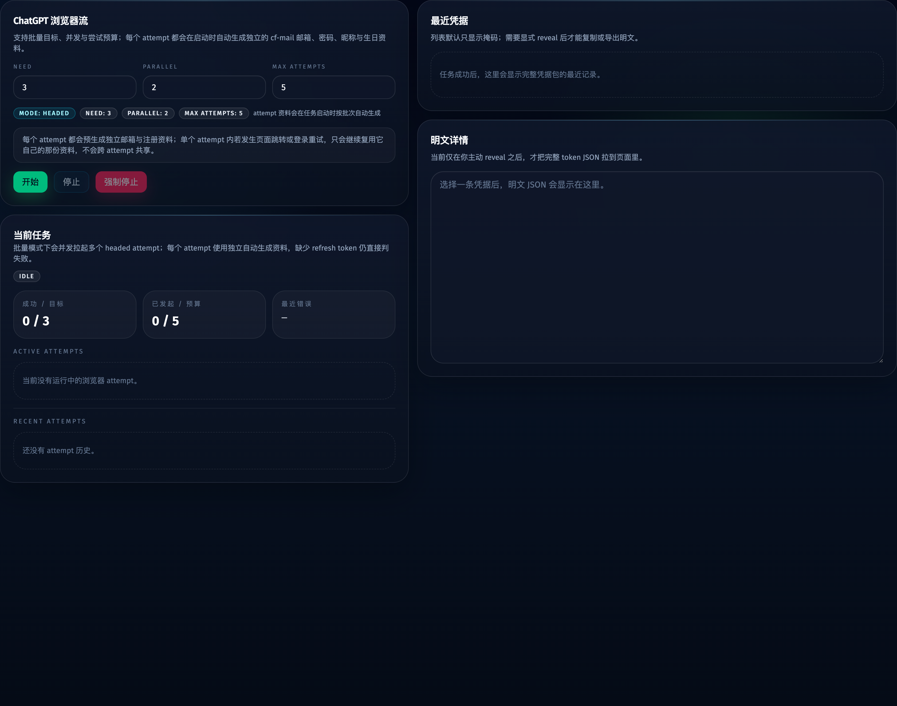
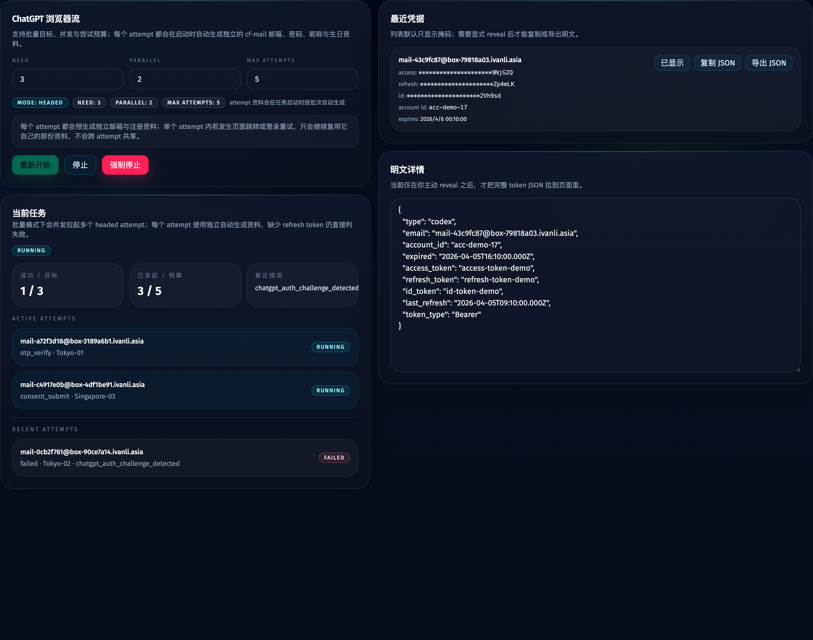
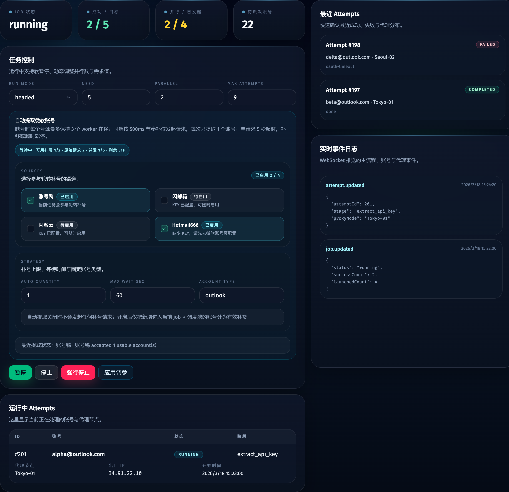

# ChatGPT 站点接入现有 Web 管理台（#pakwp）

## 状态

- Status: 已实现待评审
- Created: 2026-04-05
- Last: 2026-04-09

## 背景 / 问题陈述

- 当前 Web 管理台只有 Tavily 单站点模型，路由、当前 job、页面文案与调度器都默认围绕 `dashboard` 展开。
- 主人要求把现有主流程明确命名为 `Tavily`，并新增一个独立的 `ChatGPT` 站点页，且 ChatGPT 必须复用现有浏览器、cf-mail、日志与调试体系。
- 若继续沿用单站点 current job 语义，就无法同时保留 Tavily 与 ChatGPT 两个站点的运行态，也无法在 UI 与 API 上清晰区分两类任务与结果。

## 目标 / 非目标

### Goals

- 把现有主流程重命名为 `Tavily`，新增并列 `ChatGPT` 顶层页与站点化路由。
- 将 job / attempt / scheduler / HTTP API 收敛为 `site=tavily|chatgpt` 的多站点模型，并允许两个站点各自维护 current job。
- 为 ChatGPT 提供批量任务控制面，并在每个 attempt 实际派发时由服务端自动生成完整注册资料。
- 为 ChatGPT 增加批量可配置、有头浏览器优先的 worker 流程，并把结果提升为完整凭据包持久化与可视化展示。

### Non-goals

- 不把 `微软账号 / 微软邮箱 / API Keys / 代理节点` 页面改造成多站点通用页。
- 不接受仅登录成功或仅拿到 session access token 的降级成功定义。

## 范围（Scope）

### In scope

- 顶层导航、路由与页面文案从单 `dashboard` 收敛为 `Tavily` 与 `ChatGPT` 双站点入口。
- `jobs` 新增 `site` 与 `payload_json`，站点化 `jobs/current` / `jobs/current/control` 接口落地，旧路径保持 Tavily alias 兼容。
- 新增 ChatGPT 最近凭据列表接口、显式 reveal/export 接口与 `chatgpt_credentials` 表。
- 新增 ChatGPT worker 运行时分流，并接入现有输出目录、失败保留浏览器、代理租约与 cf-mail。

### Out of scope

- 现有 Tavily API Key 导出页混入 ChatGPT 凭据。
- 重构 Microsoft account lease 与 mailbox 页面为通用 identity 平台。

## 需求（Requirements）

### MUST

- `/` 与旧 `dashboard` 语义默认进入 Tavily，顶部标签显示 `Tavily / ChatGPT / 微软账号 / 微软邮箱 / API Keys / 代理节点`。
- ChatGPT 页必须提供 `need / parallel / maxAttempts` 批量控制输入，并明确说明 attempt 资料由服务端自动生成。
- ChatGPT 必须支持 `runMode=headed|headless` 显式配置；当当前运行环境不支持有头浏览器时，界面不得错误提供 `headed` 选项，后端也必须拒绝显式 `headed` 启动。
- ChatGPT 每个 attempt 的邮箱必须由服务端通过 cf-mail provision/ensure 生成，且每个 attempt 都要拿到独立资料。
- ChatGPT 成功结果必须包含 `access_token / refresh_token / id_token / account_id / email / exp(expires_at)`；缺少 `refresh_token` 视为失败。
- 当 ChatGPT 批量任务派发 attempt 时，服务端必须为该 attempt 生成新的 cf-mail 邮箱、密码、昵称与生日，避免跨 attempt 共享资料，也不得为未实际派发的预算预占邮箱。

### SHOULD

- ChatGPT 凭据在 UI 默认掩码显示，只有显式 reveal/copy/export 才返回完整值。
- Tavily 与 ChatGPT 的 current job 可以并行运行，互不覆盖。
- ChatGPT worker 失败时应保留现有 headed 调试体验与诊断输出。

## 功能与行为规格（Functional/Behavior Spec）

### Core flows

- 用户进入 `/chatgpt` 时，前端展示批量控制与自动生成说明，不暴露单次 attempt 的邮箱 / 密码 / 昵称 / 出生日期输入框。
- 用户点击“启动”后，前端向站点化 job 控制接口发送 `site=chatgpt` 的 start 请求，并携带 `need / parallel / maxAttempts`。
- 后端按当前请求与环境能力创建 ChatGPT job，并在每个 attempt 实际启动前生成独立的 cf-mail 邮箱、随机密码、随机昵称与 `1990-01-01` 至 `2005-12-31` 之间的生日。
- 调度器按 `site` 分流：Tavily 继续沿用现有 worker；ChatGPT 走独立 runtime，产出完整凭据后写入 `chatgpt_credentials` 并把 attempt 标记成功。
- 用户在 ChatGPT 页查看最近凭据时，只看到掩码值；显式 reveal/export 时再读取完整凭据 JSON。

### Edge cases / errors

- cf-mail 未配置、provision/ensure 失败或邮箱域名不受支持时，启动必须返回明确错误。
- ChatGPT worker 只拿到 session access token 或 callback 不完整时，attempt 必须失败并记录 failure code。
- 若当前 `site=chatgpt` 已有活跃 job，则新的 ChatGPT start 请求返回冲突；但 Tavily 活跃 job 不应阻塞 ChatGPT。

## 接口契约（Interfaces & Contracts）

### 接口清单（Inventory）

| 接口（Name） | 类型（Kind） | 范围（Scope） | 变更（Change） | 契约文档（Contract Doc） | 负责人（Owner） | 使用方（Consumers） | 备注（Notes） |
| --- | --- | --- | --- | --- | --- | --- | --- |
| 站点化 current job API | http | internal | Modify | ./contracts/http-apis.md | web server | React app / scheduler | 旧 Tavily 路径保留 alias |
| ChatGPT 凭据 API | http | internal | New | ./contracts/http-apis.md | web server | React app | 仅供 ChatGPT 页使用 |
| 多站点 jobs 与 ChatGPT 凭据表 | db | internal | Modify/New | ./contracts/db.md | SQLite | server / scheduler | jobs 增加 site 与 payload |

### 契约文档（按 Kind 拆分）

- [contracts/http-apis.md](./contracts/http-apis.md)
- [contracts/db.md](./contracts/db.md)

## 验收标准（Acceptance Criteria）

- Given 现有单站点管理台
  When 用户打开首页
  Then 顶部导航显示 `Tavily`，且原“主流程”字样消失。

- Given 用户打开 ChatGPT 页
  When 页面首次加载
  Then 页面只展示批量控制与自动生成说明，不暴露 attempt 草稿字段。

- Given Tavily 已有 current job
  When 用户再启动 ChatGPT job
  Then ChatGPT job 可以独立运行，且不会覆盖 Tavily current job。

- Given ChatGPT worker 完成浏览器流
  When 最终没有拿到 `refresh_token`
  Then attempt 标记失败并记录明确 failure code，不得误标成功。

- Given 用户把 ChatGPT job 目标设为 `runMode=headed / need=3 / parallel=2 / maxAttempts=5`
  When 启动任务
  Then 在当前环境支持有头浏览器时，服务端会以 headed 模式并发拉起最多 2 个 attempt，直到成功数达到 3 或尝试预算耗尽。

- Given ChatGPT worker 成功拿到完整凭据
  When 用户在 ChatGPT 页查看最近结果
  Then 可看到 `access_token / refresh_token / id_token / account_id / email / exp` 的完整语义，且默认以掩码形式展示。

## 实现前置条件（Definition of Ready / Preconditions）

- 多站点 job 语义、ChatGPT 成功定义与 UI 范围已锁定。
- cf-mail provision/ensure 能力已存在且可被服务端复用。
- Storybook 已存在，新增页面与导航改动必须补齐 stories/docs 覆盖。

## 非功能性验收 / 质量门槛（Quality Gates）

### Testing

- Unit tests: 站点化 job/db/server 逻辑的 Bun 测试。
- Integration tests: ChatGPT current job 与凭据 API 的服务端集成校验。
- E2E tests (if applicable): 一次 headed ChatGPT 手工链路验证。

### UI / Storybook (if applicable)

- Stories to add/update: AppShell、Tavily 页面、ChatGPT 页面。
- Docs pages / state galleries to add/update: ChatGPT 页主要状态与凭据列表态。
- `play` / interaction coverage to add/update: ChatGPT 批量控件输入、凭据 reveal 与启动按钮交互。

### Quality checks

- Lint / typecheck / formatting: `bun run typecheck`、相关 Bun tests、Storybook 构建或 CI 脚本。

## 文档更新（Docs to Update）

- `docs/specs/README.md`: 新增 spec 索引并跟踪状态。

## 计划资产（Plan assets）

- Directory: `docs/specs/pakwp-chatgpt-web-site/assets/`
- In-plan references: ``
- Visual evidence source: maintain `## Visual Evidence` in this spec when owner-facing or PR-facing screenshots are needed.

## Visual Evidence

- Evidence SHA: `local working tree`
- source_type: `storybook_canvas`
  story_id_or_title: `shell-appshell--default`
  state: `top-level navigation`
  evidence_note: 验证顶部导航已经从“主流程”收敛为 `Tavily / ChatGPT / 微软账号 / 微软邮箱 / API Keys / 代理节点`
  

- source_type: `storybook_canvas`
  story_id_or_title: `views-chatgptview--batch-ready`
  state: `chatgpt batch ready`
  evidence_note: 验证 ChatGPT 页新增 `need / parallel / maxAttempts` 批量控制，并在空闲态明确显示 attempt 资料会在启动时自动生成。
  

- source_type: `storybook_canvas`
  story_id_or_title: `views-chatgptview--batch-running`
  state: `chatgpt batch running`
  evidence_note: 验证 ChatGPT 批量运行态会显示并发 attempt、预算进度、最近错误与默认掩码凭据列表。
  

- source_type: `storybook_canvas`
  story_id_or_title: `views-dashboardview--running`
  state: `tavily running`
  evidence_note: 验证 Tavily 面板仍保留原有控制面与自动补号区，作为主流程改名后的回归证据
  

## 资产晋升（Asset promotion）

None

## 实现里程碑（Milestones / Delivery checklist）

- [x] M1: 站点化路由、前端类型与 ChatGPT 页面落地，并补齐 Storybook 覆盖
- [x] M2: SQLite / API / scheduler 改造成按 `site` 隔离的 current job 模型
- [x] M3: ChatGPT worker 与完整凭据持久化、掩码展示和导出流程落地
- [x] M4: 类型检查、站点化测试、视觉证据与 review 收敛完成

## 方案概述（Approach, high-level）

- 把现有 `dashboard` 视图抽象成 Tavily site，并把站点 key 贯穿前端路由、后端 current job API 与 SQLite job 记录。
- ChatGPT 不复用 Microsoft account lease，而是走独立 payload + 独立 worker；调度器只共用 current job、attempt、proxy 和输出目录骨架。
- 凭据完整性在 worker 结束时统一判定；只有完整凭据包才能驱动成功落库与 UI 展示。

## 风险 / 开放问题 / 假设（Risks, Open Questions, Assumptions）

- 风险：目标站点真实 selector、OTP/consent 流与风控页面可能变化，导致浏览器脚本需要后续修正。
- 风险：完整凭据提取依赖 OAuth callback / token exchange，若站点策略变更，可能只能得到 session token。
- 假设：现有 cf-mail 服务对 ChatGPT 默认邮箱可正常 provision/ensure。

## 变更记录（Change log）

- 2026-04-05: 创建 spec，冻结多站点 current job、ChatGPT 页面范围与完整凭据成功定义。
- 2026-04-09: ChatGPT 页补充 `need / parallel / maxAttempts` 批量控制，服务端改为为每个 attempt 自动生成完整资料，并更新 Storybook 视觉证据。

## 参考（References）

- 参考项目：`/Users/ivan/Downloads/gpt-register-oss`
