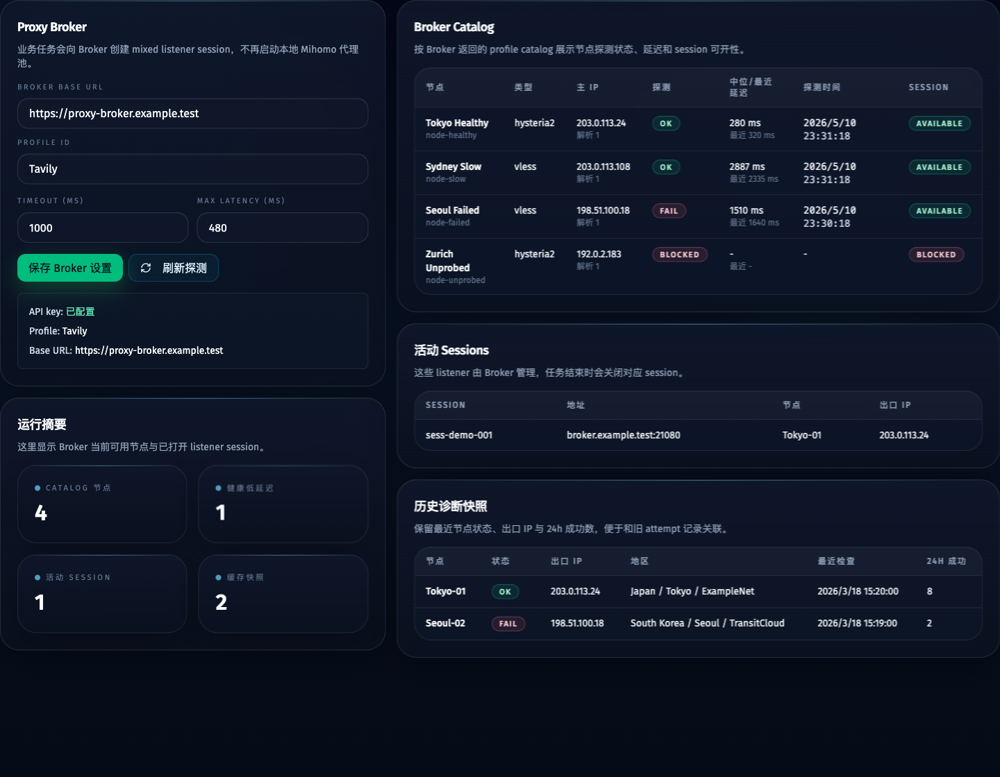

# Proxy Broker 代理运行时迁移（#pbk7x）

## 背景

项目原先在本地启动 Mihomo、拉取订阅并维护 `proxy_nodes` / `proxy_checks` 作为代理池真相源。Proxy Broker 已经提供 profile catalog、listener session 与 API key 机器认证，本项目不再直接维护生产代理池。

相关历史规格：

- `docs/specs/wht6n-persistent-account-browser-sessions/SPEC.md`
- `docs/specs/bqa97-proxy-check-progress-stream/SPEC.md`

## 目标

- 任务运行、账号 bootstrap、ChatGPT / Grok / Tavily worker 通过 Proxy Broker 创建 mixed listener session。
- 浏览器、邮箱与 geo 检查统一消费 `http://{display_address}` 形式的 session proxy URL。
- attempt 记录保留 Broker session、节点、出口 IP 与 display address，便于失败诊断与账号 session 复用。
- 代理页展示 Broker 配置、profile catalog、活动 sessions 与历史诊断快照。

## 非目标

- 不在本项目里实现 Proxy Broker 的节点 CRUD、订阅导入或 allocation 管理。
- 不把 `PROXY_BROKER_API_KEY` 持久化到 SQLite 或返回给前端。
- 不删除旧 Mihomo 源码；旧 CLI/兼容路径可以保留，但生产 Web 调度路径必须走 Broker。

## 接口契约

- 默认配置：
  - `PROXY_BROKER_BASE_URL=https://proxy-broker.ivanli.cc`
  - `PROXY_BROKER_PROFILE_ID=Tavily`
  - `PROXY_BROKER_API_KEY` 必须由运行环境提供
- Broker 认证：
  - `Authorization: Bearer pbk_<key_id>_<secret>`
- Broker API：
  - `GET /api/v1/auth/me`
  - `GET /api/v1/proxy-catalog?view=project&project_id=<profile>`，用于代理页、节点排除提示与任务启动前健康候选筛选；若 Broker key 不能读取 catalog，任务启动必须明确失败。
  - `POST /api/v1/projects/{profile_id}/refresh`，用于刷新 project 节点元数据、IP 地理信息与延迟探测。
  - `GET /api/v1/projects/{profile_id}/sessions`
  - `POST /api/v1/projects/{profile_id}/sessions/open`
  - `DELETE /api/v1/projects/{profile_id}/sessions/{session_id}`
- 节点可用性：
  - `can_open_session` 只表示 Broker 可以尝试打开 listener，不等同于代理节点健康。
  - 任务运行时只使用 `last_probe_ok=true` 且 `median_latency_ms` 或 `last_latency_ms` 不超过 `maxLatencyMs` 的 IP。
  - 探测结果超过 30 分钟或没有健康候选时，任务启动前必须触发一次 project refresh 后重新读取 catalog。
  - refresh 后仍没有健康低延迟候选时，任务必须明确失败，不得降级到任意 session。

## 验收

- 未配置 `PROXY_BROKER_API_KEY` 时，Web 任务启动必须明确失败，不再提示配置 Mihomo subscription。
- 启动 attempt 前必须创建 Broker session，并向 worker 注入 `PROXY_BROKER_PROXY_URL`。
- 创建 Broker session 前必须先通过 Broker 探测元数据筛选健康低延迟候选 IP。
- worker 检测到 Broker proxy env 后不得启动 Mihomo。
- attempt 完成、失败或停止后必须 best-effort 关闭 Broker session。
- 代理页不再暴露 Mihomo subscription / group / apiPort / mixedPort 编辑入口，并且必须展示 Broker 探测状态、延迟、探测时间与 session 可开性。

## Visual Evidence

- Proxy Broker 代理页 Storybook default state: `docs/specs/pbk7x-proxy-broker-migration/assets/proxy-broker-proxies-view.png`
- Proxy Broker 探测状态与延迟展示:

