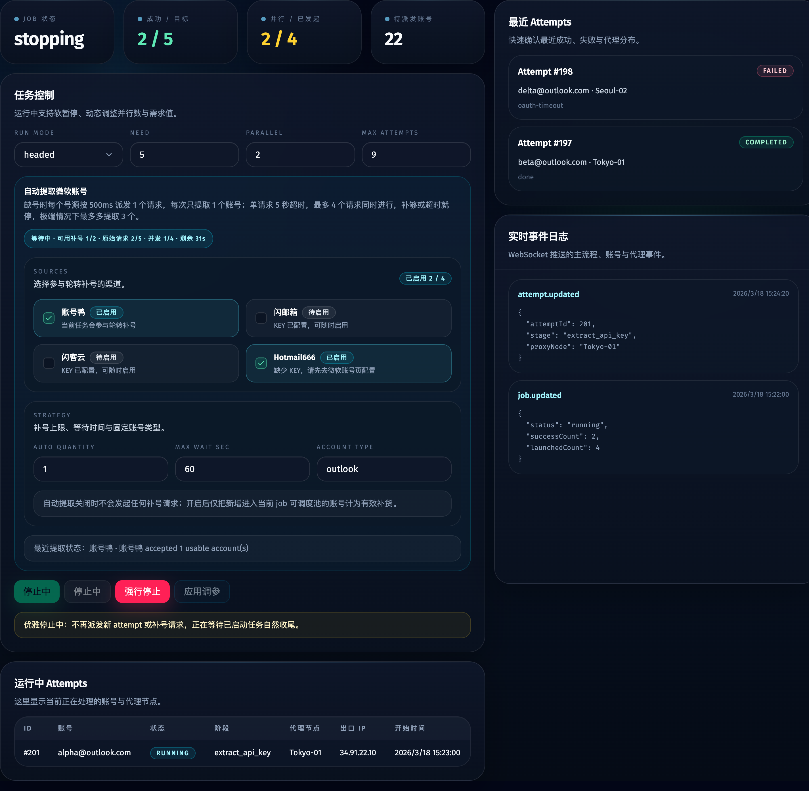
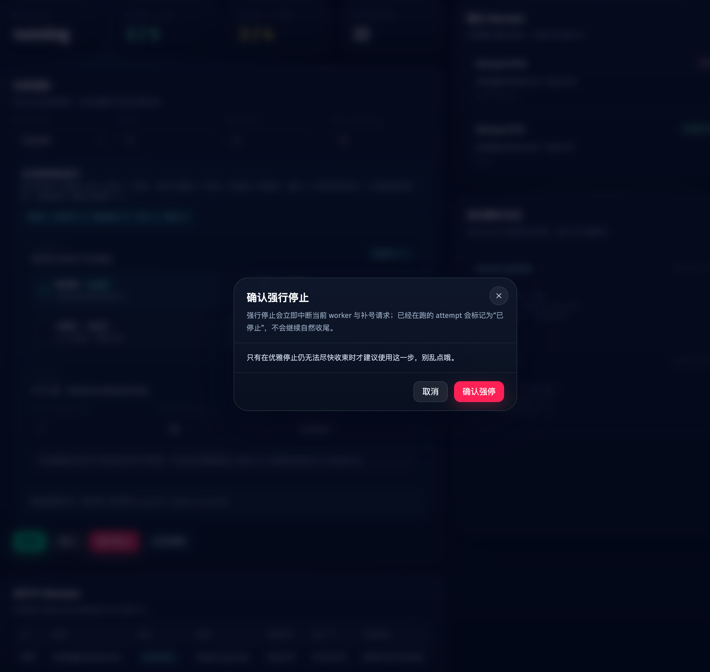
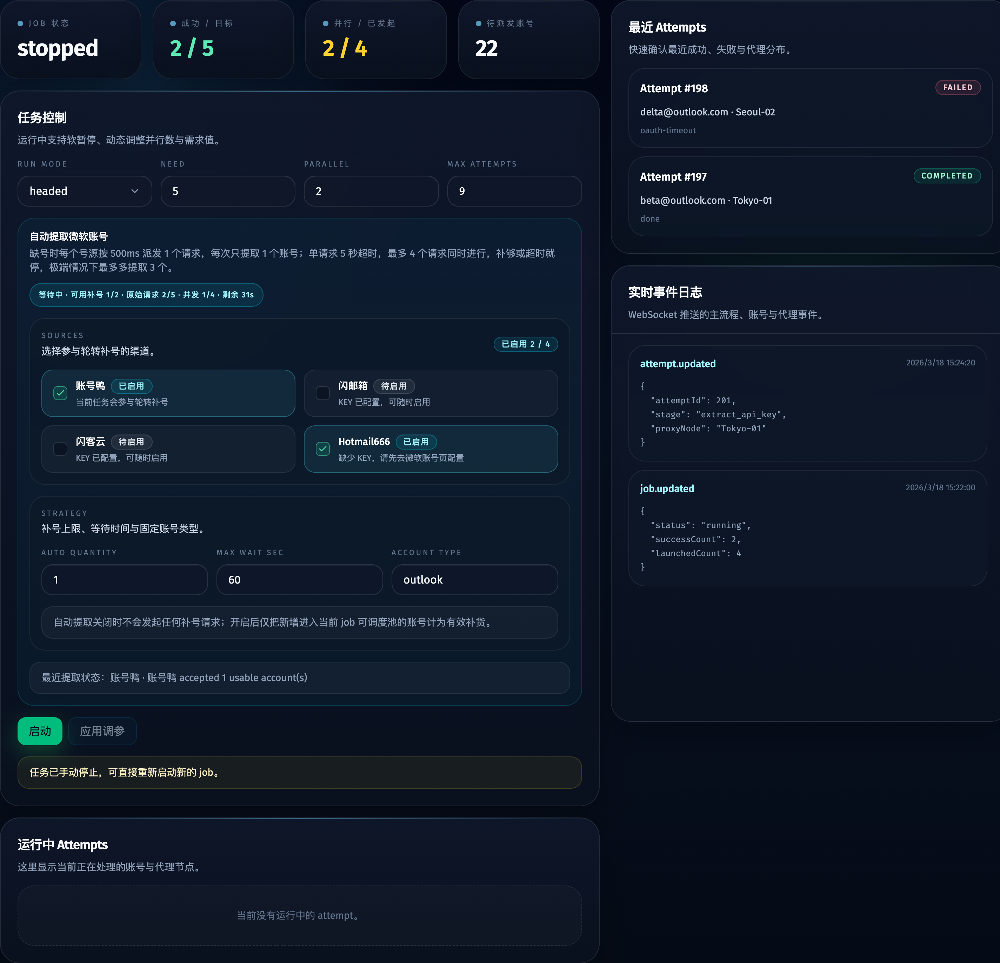

# 主流程停止控制重构（#r6h9s）

## 状态

- Status: 进行中
- Created: 2026-03-28
- Last: 2026-03-28

## 背景 / 问题陈述

- 现有 Web 主流程控制区同时暴露 `启动 / 暂停 / 恢复` 三颗按钮，状态映射分散，用户需要自己理解当前该点哪一颗。
- 调度器目前只能“暂停新派发”，缺少真正的手动停止语义；当用户需要结束进行中的 job 时，界面与后端都无法明确区分“自然失败”和“用户主动停止”。
- 自动补号请求与 worker 子进程各自运行，停止控制无法统一覆盖，导致“看起来停了，实际上还有请求在跑”的体验与统计歧义。

## 目标 / 非目标

### Goals

- 把 `启动 / 暂停 / 恢复` 收敛成一颗上下文主按钮，同时保留后端显式 `start / pause / resume` control action。
- 新增 `停止` 与 `强行停止` 两条停止语义：优雅停只阻断新派发并等待收尾，强停在二次确认后中断 active workers 与 in-flight 自动补号请求。
- 将手动停止从普通失败里拆出，新增 `stopped` 终态与 `stopping / force_stopping` 过渡态，并让前后端、数据库、attempt 序列化保持同一语义。
- 补齐 Dashboard Storybook 状态覆盖、交互验证和可复用的视觉证据来源。

### Non-goals

- 不改动四个补号源的业务协议与返回格式。
- 不重做非 Dashboard 页面的交互设计。
- 不借本次改动重写 worker 登录流程或代理检查逻辑。

## 接口与状态契约

### JobStatus

- `idle | running | paused | stopping | force_stopping | completing | completed | failed | stopped`
- `stopped` 是唯一的“用户主动结束任务”终态。
- `stopping` 与 `force_stopping` 只代表过渡态，属于 active job，但禁止新派发。

### AttemptStatus

- `running | succeeded | failed | stopped`
- 仅用户强停导致的 worker 退出写入 `stopped`。
- 优雅停期间自然结束的 attempt 仍保留真实 `succeeded / failed` 结果。

### Job Control API

- `POST /api/jobs/current/control`
- 保留：`start | pause | resume | update_limits`
- 新增：`stop | force_stop`
- `force_stop` 必须携带 `confirmForceStop=true`；服务端缺少该字段时直接拒绝。

## 行为规格

### 控制区

- 主按钮状态映射：
  - `idle / completed / failed / stopped` => `启动`
  - `running` => `暂停`
  - `paused` => `恢复`
  - `stopping / force_stopping` => disabled，并显示停止中语义
- `停止` 只在 `running / paused` 可用。
- `强行停止` 在 `running / paused / stopping` 可用；点击后先弹出确认对话框。
- 控制区状态徽标与提示文案需要明确区分 `停止中 / 强停中 / 已停止`。

### 调度器

- `stop` 触发后立刻阻断新 attempt 派发与新自动补号请求分发。
- `stop` 不杀死已启动 worker；当 active attempts 与 in-flight 自动补号请求全部归零后，job 进入 `stopped`。
- `force_stop` 允许从 `running / paused / stopping` 升级。
- `force_stop` 会中断 tracked 自动补号请求，并对 active workers 发送终止信号；被这条路径打断的 attempt 落到 `stopped`。
- 当 job 处于 stop 过渡态时，不允许再执行 `update_limits` 或启动新 job。

## 验收标准（Acceptance Criteria）

- Given job 为 `running`，When 用户点击上下文主按钮，Then 客户端发送 `pause`，scheduler 停止新派发但保留现有 attempt 继续运行。
- Given job 为 `paused`，When 用户点击上下文主按钮，Then 客户端发送 `resume`，调度循环与自动补号预算按当前 job 状态继续。
- Given job 为 `running` 或 `paused`，When 用户点击 `停止`，Then job 进入 `stopping`，不会再启动新的 attempt 或新的补号请求，并在现有工作收尾后进入 `stopped`。
- Given job 已在 `stopping`，When 用户确认 `强行停止`，Then scheduler 会中断 tracked 自动补号请求、终止 active workers，并最终把 job 标记为 `stopped`。
- Given `force_stop` 请求缺少 `confirmForceStop=true`，When 请求到达服务端，Then 服务端拒绝执行危险动作。
- Given attempt 是因强停退出，When 运行记录刷新，Then 该 attempt 显示 `stopped` 且不并入普通失败统计。
- Given Dashboard 渲染 `stopping / force_stopping / stopped`，When 用户查看主流程控制区，Then 能看到明确的禁用态主按钮、停止提示和次级操作文案。
- Given Storybook docs/canvas 覆盖新的控制区状态，When 在桌面与窄视口查看，Then 按钮组、确认弹窗、状态 badge 和帮助文案都不产生新的横向溢出。

## Visual Evidence

## 里程碑

- [x] M1: 冻结 stop/force-stop 状态机、API 契约与按钮映射
- [x] M2: 实现数据库、scheduler、attempt 序列化与 API 路由改造
- [x] M3: 完成 Dashboard 控制区重构、危险态确认与 Storybook 状态覆盖
- [x] M4: 完成构建验证、视觉证据落盘、spec sync 与本地收口

## 文档更新（Docs to Update）

- `docs/specs/README.md`
- `README.md`

## Change log

- 2026-03-28: 新增 stop/force-stop 增量 spec，冻结 Dashboard 控制区、调度器停止状态机、控制 API 与视觉证据要求。
- 2026-03-28: 完成 stop/force-stop UI 与 scheduler 实现，补齐 Storybook 状态覆盖、构建验证与本地视觉证据。
