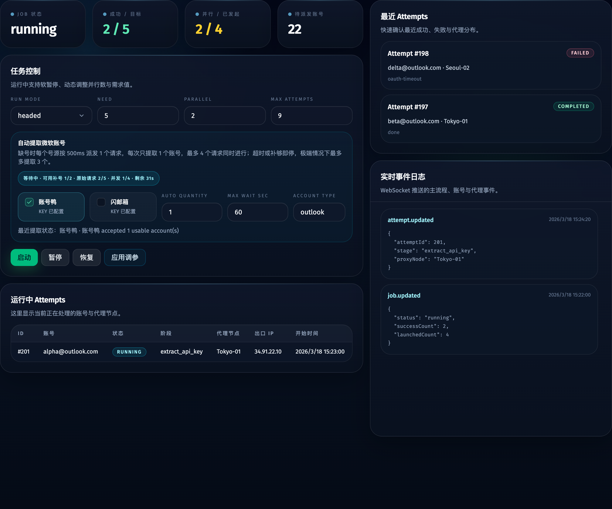
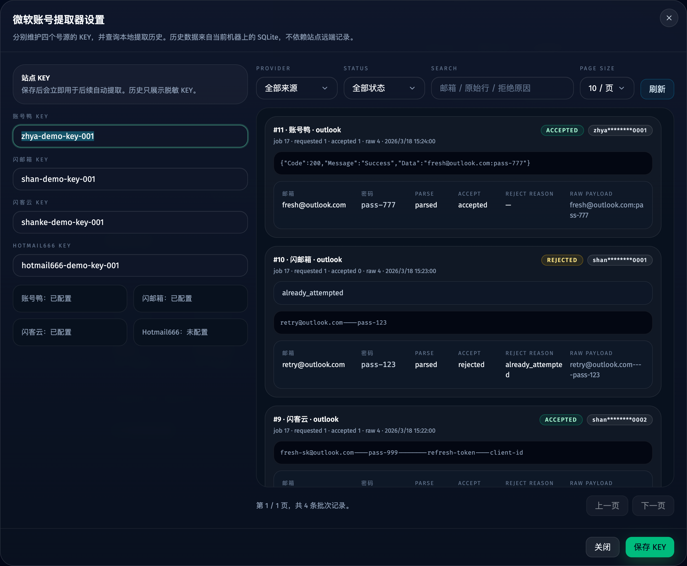

# 微软账号自动提取与本地历史接入（#svjx5）

## 状态

- Status: 已实现
- Created: 2026-03-25
- Last: 2026-03-26

## 背景 / 问题陈述

- 当前 Web 控制台只支持手工导入微软账号，主流程缺号时只能直接失败，无法从外部号源自动补池。
- 现有账号表仅保留导入来源，缺少更细的站点来源与原始响应留痕，遇到站点返回混杂内容或解析失败时难以追查漏号原因。
- 需求已经明确要求对接两个外部号源站点，并在主流程页和微软账号页提供自动提取控制、KEY 配置与本地历史查询能力。
- 账号鸭与闪邮箱都可能返回库存不足、无效账号、重复账号或当前 job 不可用账号，因此“站点返回数量”不能直接等同于“可用于当前任务的补货数量”。

## 目标 / 非目标

### Goals

- 对接 `https://www.zhanghaoya.com/store/ga` 与 `https://shanyouxiang.com/shanMail.html`，统一通过服务端提取适配层获取 `outlook` 微软账号。
- 在 SQLite 中扩展微软账号来源字段、原始数据字段，以及本地提取历史批次/明细表，保证成功与失败结果都可追溯。
- 在微软账号页新增提取器设置入口与弹窗，分别配置两个站点的 KEY，并查询本地历史。
- 在主流程页支持自动提取开关、多源多选、提取数量与最多等待时长配置，在缺号时自动补池。
- 调度器只把“新增进入当前 job 可调度池”的账号视为有效补货数量，且最终可用补货数不得超过当前任务剩余 `need`。

### Non-goals

- 不新增第三个号源。
- 不实现远端历史接口直查 UI。
- 不在本期暴露 `hotmail` 或 mixed 类型选择。
- 不改写 Microsoft 登录与 API key 提取主流程本体。

## 外部接口约束

### 账号鸭（Zhanghaoya）

- 兑换接口：`GET /store/ga/account?type=outlook&quantity=1&key=...`
- 余额接口：`GET /store/ga/balance?key=...`
- 历史接口存在，但本期 UI 不直接依赖远端历史。
- 成功响应为 `{ Code: 200, Data: "email:password..." }`；失败响应为 `{ Code: 1, Message: "..." }`。

### 闪邮箱（Shanyouxiang）

- 库存接口：`GET https://zizhu.shanyouxiang.com/kucun`
- 余额接口：`GET https://zizhu.shanyouxiang.com/yue?card=...`
- 提取接口：`GET https://zizhu.shanyouxiang.com/huoqu?shuliang=1&leixing=outlook&card=...`
- 返回体是 JSON 或纯文本风格字符串，成功内容以 `email----password` 为主；失败常见为 `{"status":-1,"msg":"库存不足！"}` 或卡密错误。

## 数据模型

### `app_settings`

- 新增：
  - `extractorZhanghaoyaKey`
  - `extractorShanyouxiangKey`
  - `defaultAutoExtractSources`
  - `defaultAutoExtractQuantity`
  - `defaultAutoExtractMaxWaitSec`
  - `defaultAutoExtractAccountType`

### `microsoft_accounts`

- 新增：
  - `account_source TEXT NOT NULL DEFAULT 'manual'`
  - `source_raw_payload TEXT`

### `account_extract_batches`

- `id`
- `job_id`
- `provider`
- `account_type`
- `requested_usable_count`
- `attempt_budget`
- `accepted_count`
- `status`
- `error_message`
- `raw_response`
- `masked_key`
- `started_at`
- `completed_at`

### `account_extract_items`

- `id`
- `batch_id`
- `provider`
- `raw_payload`
- `email`
- `password`
- `parse_status`
- `accept_status`
- `reject_reason`
- `imported_account_id`
- `created_at`

## API 合约

- 新增 `GET /api/account-extractors/settings`
- 新增 `POST /api/account-extractors/settings`
- 新增 `GET /api/account-extractors/history`
- 扩展 `GET /api/jobs/current`
- 扩展 `POST /api/jobs/current/control`
- 延续使用 `toast` / `job.updated` / `account.updated` 推送自动提取状态

## 行为规格

### 自动提取配置

- 默认账号类型固定为 `outlook`。
- 主流程支持同时启用一个或多个号源。
- `账号提取数量` 的语义是“当前缺口基础上的提取上限”，实际可用目标为 `min(当前缺口, 配置提取数量, 当前剩余 need)`。
- 单轮原始提取尝试预算为 `可用目标 + 3`，按每秒 1 个请求执行。
- 调度器使用单个 job 级别的总等待预算；暂停/恢复不会重置已消耗等待时间。

### 可用补货判定

- 只有新增导入后满足“未禁用、无 API key、未被当前 job 尝试过、当前可再次调度”的账号，才计入本轮有效补货数。
- 解析失败、重复账号、已有 API key、已被当前 job 用过、被标记不可用的账号，只记录到本地历史，不增加有效补货数。
- 即使站点原始返回数量更多，最终新增到当前任务可调度池的账号数也必须 `<=` 当前任务剩余 `need`。
- 账号后续在主流程 attempt 中失败，不回溯扣减“已补进池中的有效补货数”；是否最终成功仍由既有主流程结果决定。

### 账号页与历史

- 在微软账号页左侧现有空白区增加提取器设置入口。
- 设置弹窗分别维护两个站点的 KEY、默认源开关、默认提取数量与等待时长。
- 历史查询只读取本地 SQLite 的批次/明细记录，不依赖远端历史接口。
- 历史列表需要同时展示成功、失败、库存不足、KEY 无效、解析失败、重复/不可接纳等状态。

### 主流程页

- 在 `Need` 附近增加自动提取设置区，包含：
  - 号源多选开关
  - 账号提取数量
  - 最多等待时长
  - 当前自动提取状态提示
- 未配置 KEY 的号源在 UI 中必须有明确禁用或错误提示。
- 缺号但自动提取关闭时，保持现有失败语义。

## 验收标准（Acceptance Criteria）

- Given 旧库只有当前 Web 控制台 schema，When 服务端启动，Then 新列与新表自动迁移完成且旧数据仍可读。
- Given 账号鸭或闪邮箱返回混杂文本、重复账号或解析失败内容，When 服务端处理，Then 原始响应与逐项原始数据都被落库，失败项不丢失。
- Given 自动提取关闭，When 当前账号池不足，Then 调度器不发起任何提取请求并保持现有失败语义。
- Given 自动提取开启且至少一个已配置 KEY 的号源可用，When 当前 job 缺号，Then 调度器按每秒 1 个请求轮询补号。
- Given 站点返回了一部分不可用账号，When 本轮补号完成，Then 这些账号不会让当前任务新增的可调度账号数超过剩余 `need`。
- Given 本轮有效补货目标为 `N`，When 执行自动提取，Then 原始请求次数最多为 `N + 3`。
- Given 用户打开提取器设置弹窗，When 查询历史，Then 结果全部来自本地 SQLite 历史表。
- Given UI 改动完成，When 执行 `bun run typecheck`、`bun test`、`bun run web:build` 与 `bun run build-storybook`，Then 全部通过。

## Visual Evidence

- source_type: storybook_canvas
- target_program: mock-only
- capture_scope: element
- sensitive_exclusion: N/A
- submission_gate: pending-owner-approval
- story_id_or_title: Views/DashboardView/Running
- state: auto extract enabled
- evidence_note: 验证主流程控制区新增号源多选、数量与等待时长配置，以及运行中的自动提取状态提示。

- source_type: storybook_canvas
- target_program: mock-only
- capture_scope: element
- sensitive_exclusion: N/A
- submission_gate: pending-owner-approval
- story_id_or_title: Views/AccountsView/Extractor Settings Entry
- state: extractor settings dialog
- evidence_note: 验证微软账号页新增提取器设置入口、双站点 KEY 配置与本地提取历史查询结果。

## 里程碑

- [x] M1: 建立 spec 并冻结接口与数据模型
- [x] M2: 完成 SQLite migration、repository 与提取历史持久化
- [x] M3: 完成号源适配器、自动提取 API 与调度器补号逻辑
- [x] M4: 完成微软账号页与主流程页 UI
- [x] M5: 完成 Storybook、验证、视觉证据与 PR 收敛

## 文档更新（Docs to Update）

- `docs/specs/README.md`
- `README.md`
- `.env.example`

## Change log

- 2026-03-25: 初始化微软账号自动提取与本地历史接入规格，冻结两个号源接口、有效补货判定与主流程补号上限约束。
- 2026-03-26: 完成号源适配、自动补号调度、账号页提取器设置、本地历史查询、Storybook 证据与校验。
