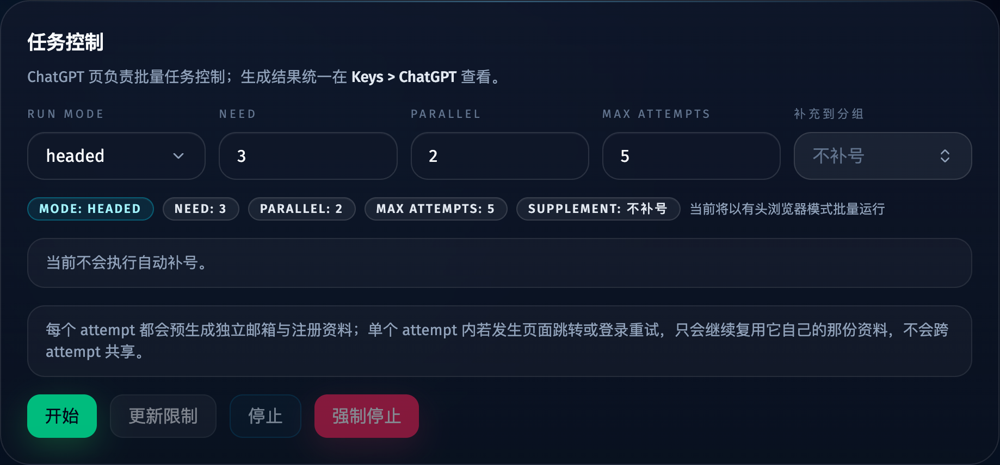
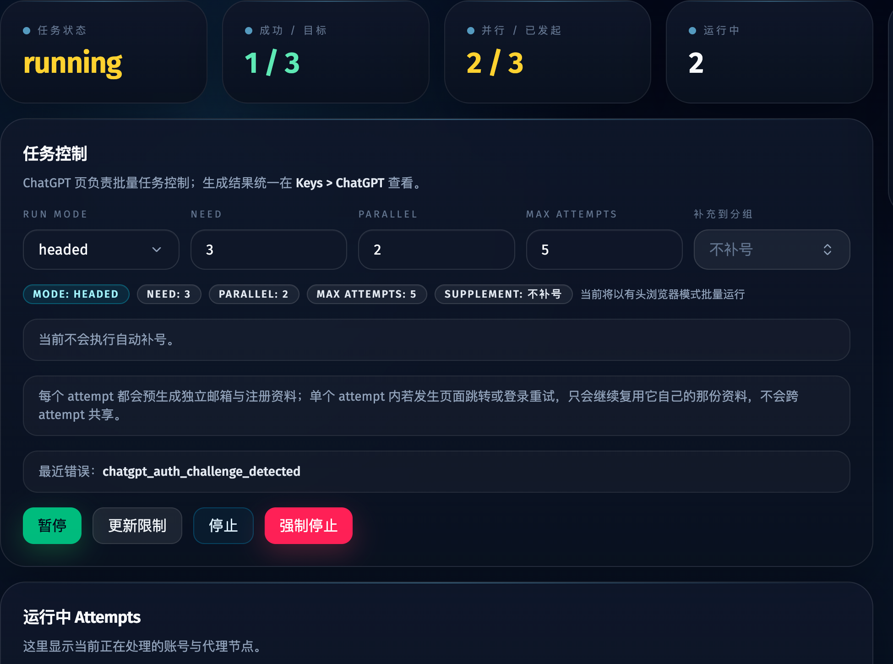
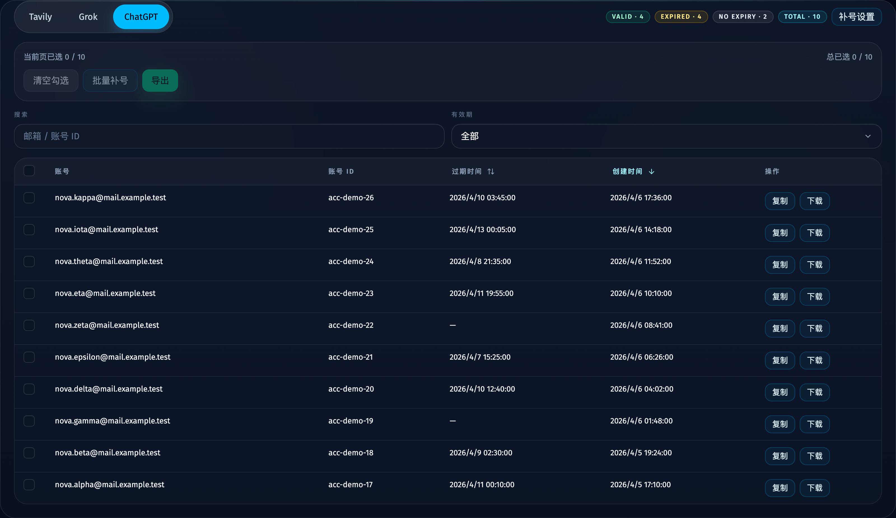
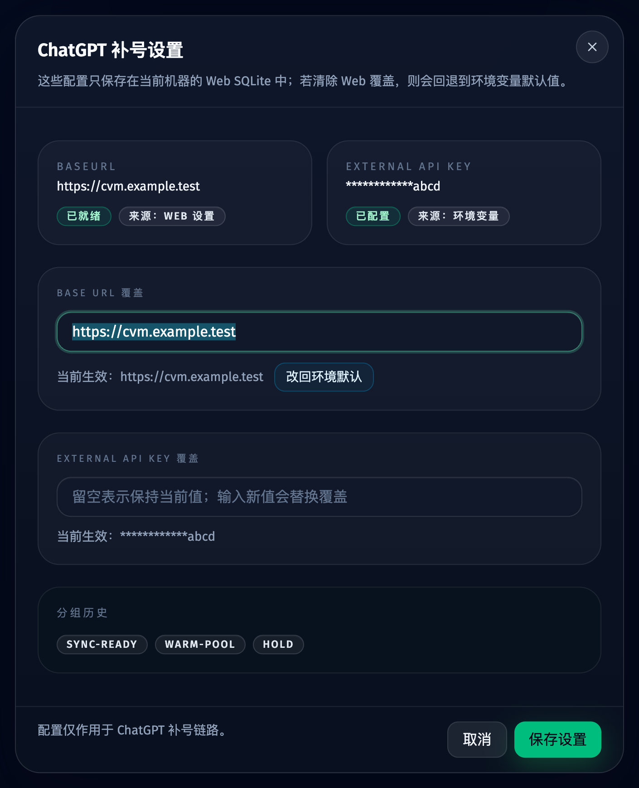
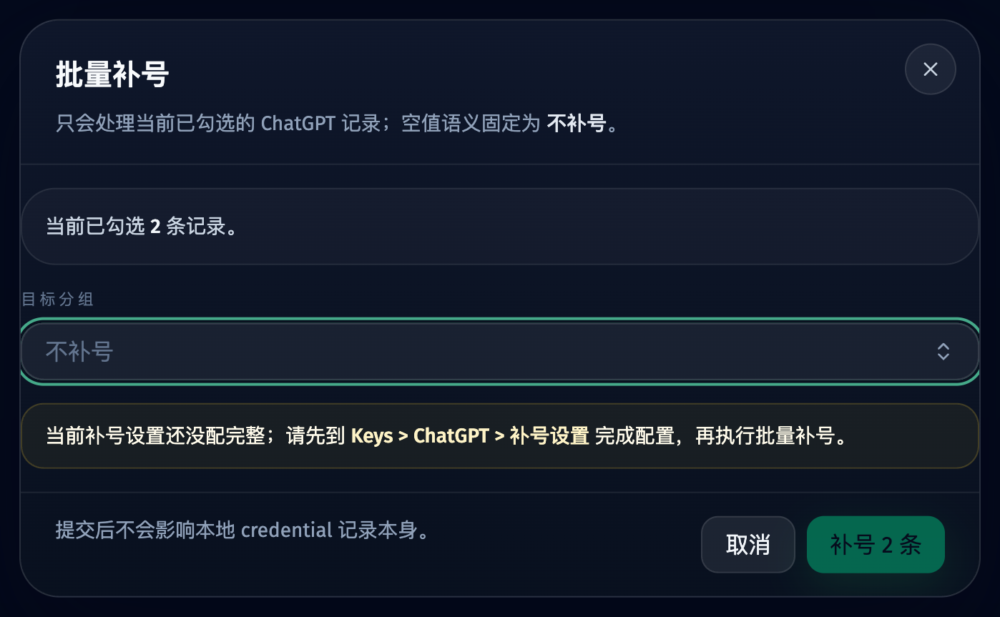

# ChatGPT 补号到 codex-vibe-monitor 分组（#vhvds）

## 状态

- Status: 已实现待评审
- Created: 2026-04-18
- Last: 2026-04-18

## 背景 / 问题陈述

- 当前 `/chatgpt` 任务控制只能设置运行参数，无法指定成功 credential 需要自动补充到哪个 `codex-vibe-monitor` 分组。
- 当前 `Keys > ChatGPT` 只能导出 / 复制 credential，缺少面向已选记录的“批量补号”入口。
- 浏览器无法稳定直连远端 external API，补号配置也缺少“Web 设置覆盖环境变量默认值”的统一口径。

## 目标 / 非目标

### Goals

- 在 `/chatgpt` 任务控制增加“补充到分组”选择器，唯一空值语义固定为 `不补号`，现场只调整目标分组。
- 在 `Keys > ChatGPT` 增加批量补号对话框，目标分组仅作用于当前勾选记录。
- 在 `Keys > ChatGPT` 的 tab 内增加“补号设置”入口，统一维护 `baseUrl`、external API key 与本地 `groupHistory`；运行时优先级为 `DB(Web 设置) > env default`。
- 成功保存 ChatGPT credential 后，若当前 job 已配置目标分组，则由后端自动调用远端 external API upsert。
- 通过 Storybook 与稳定视觉证据覆盖任务控制 selector、设置对话框、批量补号对话框。

### Non-goals

- 不修改远端 `codex-vibe-monitor` 代码或其 API 契约。
- 不新增远端分组列表查询接口。
- 不改变现有 ChatGPT credential 导出 JSON 结构。
- 不把远端补号失败回滚成本地 credential 保存失败。

## 约束与默认值

- owner-facing 空值文案只保留 `不补号`；界面中不再出现“清空选择”。
- `sourceAccountId` 固定使用 ChatGPT `accountId`；缺少 `accountId` 的记录自动/批量补号均直接失败。
- 远端分组选项来自本地 `groupHistory` 建议项，并允许手动新建。
- 自动补号失败只输出日志 / toast / 结果反馈，不影响本地成功统计。

## 接口与数据契约

### ChatGPT job payload

- `jobs.payloadJson.upstreamGroupName?: string`
- `POST /api/jobs/current/control`
  - `site=chatgpt` 的 `start` / `update_limits` 接受 `upstreamGroupName`
- `GET /api/jobs/current?site=chatgpt`
  - `job` 序列化增加 `upstreamGroupName`

### 补号设置 API

- `GET /api/chatgpt/upstream-settings`
  - 返回脱敏后的 `baseUrl`、`apiKeyMasked`、`groupHistory`、`configured` 与 source 元信息
- `POST /api/chatgpt/upstream-settings`
  - 支持设置/清除 Web 覆盖值；清除后回退到环境变量默认值

### 批量补号 API

- `POST /api/chatgpt/credentials/supplement`
  - 输入：`ids[]`、`groupName`
  - 输出：逐条 `success/failure` 结果与 summary

### 远端 external API

- `PUT /api/external/v1/upstream-accounts/oauth/{sourceAccountId}`
- Header：`Authorization: Bearer <external_api_key_secret>`
- Body：
  - `displayName`
  - `groupName`
  - `oauth: { email, accessToken, refreshToken, idToken, tokenType, expired }`

## 验收标准

- `/chatgpt` 任务控制在 idle / running / paused 均显示“补充到分组”选择器，空值文案始终只有 `不补号`，且现场不再承载补号设置入口。
- `Keys > ChatGPT` 的 tab header 提供“补号设置”入口；批量补号对话框仅作用于当前勾选记录，同样只使用 `不补号` 作为空值语义。
- `GET/POST /api/chatgpt/upstream-settings` 正确体现 `DB > env` 优先级；读取不回显明文 API key，清空 DB 覆盖后回退 env 默认值。
- ChatGPT attempt 成功时，本地 `chatgpt_credentials` 正常保存；若 `upstreamGroupName` 非空，则后台自动 upsert 到目标分组；失败仅记录 warning / toast。
- 至少通过 `bun run typecheck`、相关 `bun test`、`bun run build-storybook`，并为相关 Storybook 场景补齐视觉证据。

## Visual Evidence

- source_type: `storybook_canvas`
  story_id_or_title: `views-chatgptview--batch-ready`
  state: `task-control-with-group-selector-only`
  evidence_note: 验证 `/chatgpt` 任务控制仅保留“补充到分组”现场选择器，空值文案固定为 `不补号`，不再提供现场补号设置入口。
  image:
  

- source_type: `storybook_canvas`
  story_id_or_title: `views-chatgptview--running-staged-disable-supplement`
  state: `running-staged-disable-auto-supplement`
  evidence_note: 验证运行中把分组选择切回 `不补号` 后，摘要 badge 与辅助文案会立即显示“当前不会执行自动补号”，不会继续残留旧分组。
  image:
  

- source_type: `storybook_canvas`
  story_id_or_title: `views-keysview--chat-gpt-tab`
  state: `keys-chatgpt-settings-entry`
  evidence_note: 验证 `Keys > ChatGPT` tab header 提供独立“补号设置”入口，补号配置集中在这里维护。
  image:
  

- source_type: `storybook_canvas`
  story_id_or_title: `dialogs-chatgptupstreamsettingsdialog--default`
  state: `upstream-settings-dialog`
  evidence_note: 验证 ChatGPT 补号设置对话框集中展示 Base URL / API Key 脱敏状态、来源标记与分组历史。
  image:
  

- source_type: `storybook_canvas`
  story_id_or_title: `dialogs-chatgptbatchsupplementdialog--needs-configuration`
  state: `batch-supplement-dialog-needs-settings`
  evidence_note: 验证 `Keys > ChatGPT` 的批量补号对话框现场只选择分组；若未配置完整，则提示前往 `Keys > ChatGPT > 补号设置`。
  image:
  

## 里程碑

- [x] M1: 固化 spec、设置优先级与唯一空值文案 `不补号`
- [x] M2: 完成后端设置持久化、远端补号 helper 与自动补号接线
- [x] M3: 完成 ChatGPT 页面、Keys 页面、对话框与 Storybook 覆盖
- [x] M4: 完成测试、视觉证据、spec sync 与 PR-ready 收口
