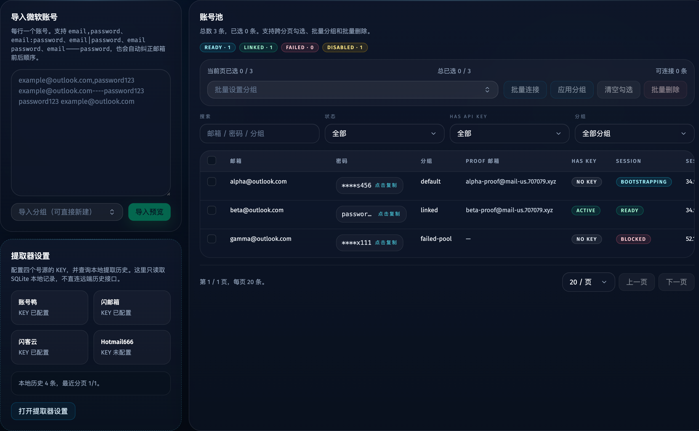
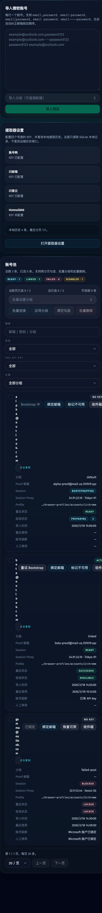

# 微软账号持久会话、代理复用与 Profile 落库改造（#wht6n）

## 状态

- Status: 已实现
- Created: 2026-03-31
- Last: 2026-03-31

## 背景 / 问题陈述

- 现有微软账号导入与自动提取只会把账号写入本地台账，并尝试一次性异步 Graph OAuth；浏览器 profile 不持久，账号与代理/IP 也没有一对一绑定。
- Tavily 主流程每个 attempt 都会创建临时 `run-*` profile，无法稳定复用已登录会话，也无法在账号重新使用时优先回到相同代理出口。
- 代理池当前只维护全局 selected/pinned node，没有 region 维度和 lease 时间，无法实现“同 IP -> 同地区 -> 全池 LRU”的复用策略。
- 不做这次改造的话，新增账号仍然会在登录态、代理归属、邮箱连接和 profile 资产上四处分裂，后续自动化链路也无法稳定复用同一会话。

## 目标 / 非目标

### Goals

- 为每个微软账号维护唯一的持久浏览器会话记录，保存 profile 绝对路径、代理节点/IP/地区快照与最近 bootstrap/使用时间。
- 手工导入与自动提取账号后立即进入 bootstrap 队列，只有 Tavily 登录 + Graph 邮箱连接成功后才标记为可调度。
- Tavily 主流程在账号已有 ready 会话时复用该 profile 和代理选择结果，不再创建新的账号级临时 profile。
- 代理选择遵循固定规则：同 IP 仍可用优先；否则同 `region` 内健康节点按 LRU；否则全池健康节点按 LRU。
- 在账号页展示最小可见的会话状态、代理/IP、profile 路径摘要和重试入口，并补齐 Storybook 与视觉证据。

### Non-goals

- 不实现跨项目共享会话服务。
- 不实现跨 worktree 的 profile 同步或迁移。
- 不新增独立的 Sessions 管理页面。
- 不迁移历史 `run-*` profile 内容；仅从首次成功 bootstrap 开始建立 canonical profile。

## 范围（Scope）

### In scope

- `account_browser_sessions` 数据模型、proxy region/LRU 扩展与相关 repository API
- 导入/自动提取后的统一 bootstrap 队列与状态机
- Tavily 登录 profile 持久化、Graph OAuth 自动连接、失败留痕与手动重试
- 调度器对 ready session 的准入控制与 profile/proxy 复用
- 账号页最小 UI、Storybook、视觉证据、README/spec 更新

### Out of scope

- 外部项目直接消费该 repo 的会话注册中心
- 旧 profile 资产清理/迁移工具
- 邮箱页、代理页的大改版

## 需求（Requirements）

### MUST

- 新导入或自动提取的账号必须创建/更新唯一 `account_browser_sessions.account_id` 记录。
- `browserSession.status != ready` 的账号不得进入 `leaseNextAccount` 调度池。
- bootstrap 必须记录 `profile_path` 绝对路径、`proxy_node/ip/country/region/city/timezone`、`last_bootstrapped_at`、`last_used_at` 与错误信息。
- 代理复用必须按“同 IP -> 同 region -> 全池 LRU”执行，且只在健康节点集合内选择。
- 持久 profile 必须固定在 `output/browser-profiles/accounts/<accountId>/chrome`。
- 账号页必须可见会话状态、当前代理/IP、profile 路径摘要与重试入口。

### SHOULD

- 自动 bootstrap 使用与后续调度一致的代理选择规则。
- 会话 bootstrap 和调度成功后都更新 proxy/session 的 lease 时间，避免 LRU 失真。
- Graph 设置缺失时把会话标记为 blocked，并允许后续手动重试恢复。

### COULD

- 未来为跨项目消费暴露稳定 API，但本次只保留仓库内可复用边界。

## 功能与行为规格（Functional/Behavior Spec）

### Core flows

- 手工导入账号：账号落库 -> ensure session row -> 进入 bootstrap 队列 -> 选代理 -> 用持久 profile 登录 Tavily Home -> 自动发起 Graph OAuth -> 成功后 `browserSession.status=ready`。
- 自动提取账号：候选账号先导入本地 -> 进入 bootstrap 队列 -> 只有 bootstrap 成功后才计入当前 job 的可调度账号池。
- 主流程调度：选到 ready session 的账号时，复用其持久 profile；若原 IP 不再可用，则按同 region / 全池 LRU 选择代理并继续复用同一 profile。
- 手动重试：账号页点击重试入口后重新排队 bootstrap，并刷新会话状态。

### Edge cases / errors

- Graph 设置缺失：会话标记为 `blocked`，不进入 ready；账号保留但不可调度。
- 代理池中找不到原 IP：按 `proxy_region` 匹配健康节点 LRU；仍找不到则退到全池健康节点 LRU。
- proxy inventory 不再包含历史 pinned/lease 节点时，必须自动清理陈旧引用。
- bootstrap 任一步失败时保留账号与 session 行，状态写入 `failed` 或 `blocked`，允许后续重试。

## 接口契约（Interfaces & Contracts）

### 接口清单（Inventory）

| 接口（Name） | 类型（Kind） | 范围（Scope） | 变更（Change） | 契约文档（Contract Doc） | 负责人（Owner） | 使用方（Consumers） | 备注（Notes） |
| --- | --- | --- | --- | --- | --- | --- | --- |
| `account_browser_sessions` | db | internal | New | ./contracts/db.md | server/storage | server/web/scheduler | 账号级持久会话 |
| `proxy_nodes.region + last_leased_at` | db | internal | Modify | ./contracts/db.md | server/storage | server/web/scheduler | 复用与 LRU |
| `proxy_checks.region` | db | internal | Modify | ./contracts/db.md | server/storage | proxy admin | 检查快照补 region |
| `AccountRecord.browserSession` | http-apis | internal | Modify | ./contracts/http-apis.md | server/web | React accounts view | 账号页最小可见状态 |
| `POST /api/accounts/:id/session/rebootstrap` | http-apis | internal | New | ./contracts/http-apis.md | server/web | React accounts view | 手动重试 bootstrap |
| `account.updated session_*` | events | internal | Modify | ./contracts/events.md | server/scheduler | web SSE client | 会话状态推送 |

### 契约文档（按 Kind 拆分）

- [contracts/README.md](./contracts/README.md)
- [contracts/http-apis.md](./contracts/http-apis.md)
- [contracts/events.md](./contracts/events.md)
- [contracts/db.md](./contracts/db.md)

## 验收标准（Acceptance Criteria）

- Given 手工导入或四源自动提取了新账号，When 导入完成，Then 数据库中对应账号存在唯一 `account_browser_sessions` 行，且该账号立即进入 bootstrap 队列。
- Given 会话状态不是 `ready`，When 调度器计算 eligible accounts，Then 该账号不会被 `leaseNextAccount` 选中。
- Given 账号上次成功代理 IP 仍存在于当前健康池，When 后续 bootstrap 或 Tavily attempt 启动，Then 必须优先复用该 IP 对应节点。
- Given 原 IP 不可用但同 `proxy_region` 仍有健康节点，When 选择代理，Then 必须在该 region 内按 `last_leased_at` 最久未使用节点优先。
- Given Graph 设置缺失，When 自动 bootstrap 触发，Then session 进入 `blocked`（或等价错误码）而不是 `ready`。
- Given 会话 bootstrap 成功，When 账号页刷新，Then 能看到会话状态、当前代理/IP 和 profile 路径摘要。
- Given UI 改动完成，When 执行 `bun run typecheck`、`bun test`、`bun run web:build` 与 `bun run build-storybook`，Then 全部通过。

## 实现前置条件（Definition of Ready / Preconditions）

- 目标/非目标、范围、准入规则已明确
- 代理复用优先级和 Graph 缺失时的 blocked 语义已确定
- HTTP / DB / event 契约在本 spec 中冻结
- 持久 profile 路径与 worktree 边界已固定

## 非功能性验收 / 质量门槛（Quality Gates）

### Testing

- Unit tests: `AppDatabase` session/proxy selection、`buildAttemptRuntimeSpec` 复用会话 profile、事件/endpoint 基本行为
- Integration tests: 导入/自动提取后 session 准入与重试入口
- E2E tests (if applicable): N/A

### UI / Storybook (if applicable)

- Stories to add/update: `web/src/components/accounts-view.stories.tsx`
- Docs pages / state galleries to add/update: account session state gallery（沿用 repo 现有 stories/docs 风格）
- `play` / interaction coverage to add/update: 重试入口/blocked 状态/ready 摘要交互
- Visual regression baseline changes (if any): 账号页会话列与操作区

### Quality checks

- Lint / typecheck / formatting: `bun run typecheck`
- Test/build: `bun test`、`bun run web:build`、`bun run build-storybook`

## 文档更新（Docs to Update）

- `docs/specs/README.md`: 新增 spec 索引并更新状态
- `README.md`: 补充持久 session/profile/代理复用说明

## 计划资产（Plan assets）

- Directory: `docs/specs/wht6n-persistent-account-browser-sessions/assets/`
- In-plan references: ``
- Visual evidence source: maintain `## Visual Evidence` in this spec when owner-facing or PR-facing screenshots are needed.

## Visual Evidence

- Storybook canvas：`Views/AccountsView / SessionBootstrapStates`
  - 证明账号页桌面态已展示 `bootstrapping / ready / blocked` 三态，以及代理/IP 与 profile 路径摘要。

- Storybook canvas：`Views/AccountsView / SessionBootstrapCompactCards`
  - 证明窄视口卡片态仍保留 session、proxy 与 profile 最小可见信息。

## 资产晋升（Asset promotion）

None

## 实现里程碑（Milestones / Delivery checklist）

- [ ] M1: 扩展数据库 schema、repository API 与代理 LRU 数据
- [ ] M2: 实现账号 bootstrap 队列、持久 profile、Graph/Tavily 串联 worker
- [ ] M3: 调度器改为消费 ready session 并复用 profile/proxy
- [ ] M4: 账号页、Storybook 与视觉证据完成
- [ ] M5: 验证、review 收敛与 PR-ready 收口

## 方案概述（Approach, high-level）

- 新增账号级 session 表作为账号、代理、持久 profile 的真相源。
- bootstrap 与调度都复用同一套代理选择规则，并通过 proxy node `last_leased_at` 保持 LRU。
- 通过统一 Node worker 串起 Tavily 登录与 Graph OAuth；主流程只消费 ready session，不感知 bootstrap 细节。
- UI 只暴露最小状态，不新增独立工作台。

## 风险 / 开放问题 / 假设（Risks, Open Questions, Assumptions）

- 风险：持久 profile 与旧临时 profile 的清理边界处理不当会误杀其他账号会话。
- 风险：自动提取场景若 bootstrap 过慢，会拖慢补号节奏，需要通过 waiting/ready 准入控制避免过量补号。
- 假设：Graph 设置完整是会话 ready 的必要条件。
- 假设：同账号不会并发启动多个使用同一持久 profile 的任务。

## 变更记录（Change log）

- 2026-03-31: 初版 spec，冻结账号持久会话、代理复用与 profile 落库改造范围。

## 参考（References）

- `docs/specs/svjx5-microsoft-account-auto-extractor/SPEC.md`
- `docs/specs/jg53e-microsoft-mail-inbox/SPEC.md`
- `docs/specs/9h2xd-macos-headless-chrome-launch/SPEC.md`
